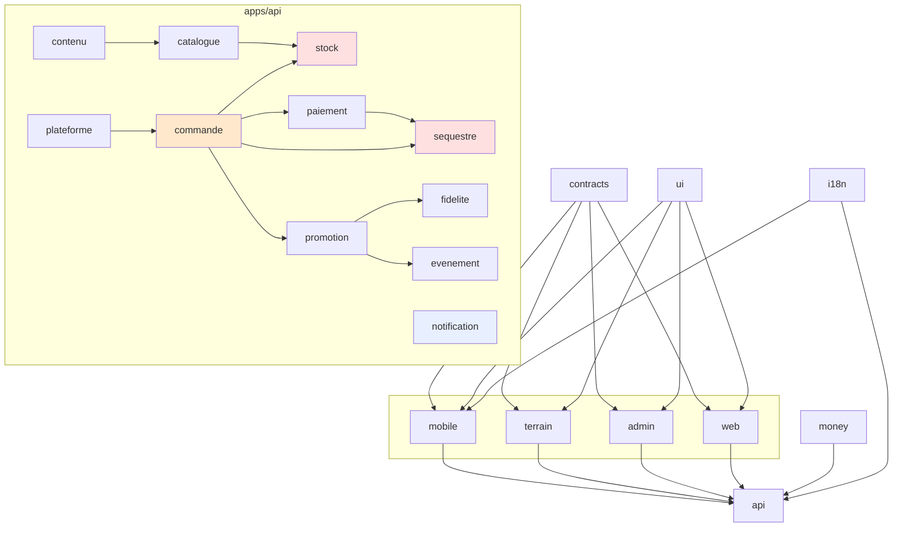

# Architecture du dépôt

> Ce que ce document donne : **où va chaque chose, et pourquoi elle ne va pas ailleurs.**
>
> Les décisions sont dans [JP_CONCEPTION_APP.md](JP_CONCEPTION_APP.md) et [plan/PLAN_SOCLE.md](plan/PLAN_SOCLE.md). Ici, la carte du terrain.

---

## L'arborescence

```
jp/
├─ apps/
│  ├─ api/                      Fastify · service unique modulaire
│  │  └─ src/
│  │     ├─ serveur.ts          l'inventaire : 16 modules, 6 files, 3 canaux
│  │     ├─ plateforme/         le transverse, écrit UNE fois
│  │     │  ├─ erreurs.ts       codes stables, enveloppe, traduction mg/fr
│  │     │  ├─ auth.ts          session, contexte, garde de route
│  │     │  ├─ permissions.ts   garde ET filtre de projection — les deux
│  │     │  ├─ idempotence.ts   Idempotency-Key, 24 h, rejeu ······· RB10
│  │     │  ├─ pagination.ts    curseur opaque, jamais de numéro de page
│  │     │  ├─ debit.ts         limitation par identité, adresse, route
│  │     │  ├─ audit.ts         journal_audit — ajout seul
│  │     │  └─ contexte.ts      identifiant de corrélation de bout en bout
│  │     ├─ modules/            16 domaines, mêmes 6 fichiers chacun
│  │     ├─ jobs/               BullMQ — 6 files
│  │     └─ temps-reel/         WebSocket — 3 canaux, resynchronisation
│  ├─ mobile/                   React Native · acheteuse, vendeuse, créatrice
│  │  └─ src/{features,navigation,noyau,design}/
│  ├─ terrain/                  React Native · livreur et point relais
│  ├─ admin/                    React + Vite · back-office JP
│  └─ web/                      React + Vite · vitrines, rendu serveur
├─ packages/
│  ├─ contracts/                Zod — source unique du contrat API
│  ├─ ui/                       jetons, primitives, les quatre états
│  ├─ money/                    l'Ariary en entiers ✅ écrit
│  └─ i18n/                     catalogues mg / fr
├─ prisma/                      schema.prisma + migrations
├─ plan/                        les mini-plans
├─ vp/                          le modèle UML
└─ scripts/                     outillage : issues, UML, vérifications
```

**152 fichiers TypeScript**, 9 espaces de travail. `pnpm verifier` → 27 tâches, 27 succès.

---

## La convention de module

Un domaine, un dossier, **toujours les mêmes six fichiers**. Un développeur qui ouvre un module qu'il ne connaît pas sait déjà où regarder.

```
apps/api/src/modules/<domaine>/
├─ index.ts        la façade — c'est par ici que les autres modules entrent
├─ routes.ts       déclaration, validation Zod · AUCUNE logique métier
├─ service.ts      la logique · transactions · invariants
├─ repository.ts   les seules requêtes SQL du domaine · INTERNE
├─ events.ts       ce que le module publie et ce qu'il écoute
└─ erreurs.ts      codes d'erreur stables
```

### Les seize domaines

| Module | Rôle | Ce qui s'y joue |
|---|---|---|
| `identite` | comptes, sessions, vérification | l'adresse électronique est l'identifiant, le téléphone un contact |
| `catalogue` | articles, variantes, vitrines | la fiche enrichie remplace le fait de toucher le vêtement |
| **`stock`** | quantités, réservations | **RB1** — ne dépend de rien, délibérément |
| **`commande`** | panier, commande, lignes | **le carrefour** : le seul endroit où l'argent et le stock se rencontrent |
| `paiement` | mobile money, carte, reprise | **RB10**, hérité de la plateforme |
| **`sequestre`** | retenue, libération, portefeuille | **RB2** — la promesse du produit tient ici |
| `livraison` | colis, relais, codes de retrait | statut partagé des deux côtés, toujours |
| `contenu` | clips, stories, unboxing | **RB5** — aucun contenu sans article |
| `createur` | affiliation, précommandes | **RB3** — remboursement automatique |
| `fidelite` | rang client, paliers | **par vendeur, jamais global** |
| `promotion` | promotions, codes, éligibilité | éligibilité vérifiée au calcul du panier |
| `evenement` | événements thématiques | annonce humaine, bascules par les dates |
| `litige` | signalement, arbitrage, avis | **RB4** — décision motivée, contrainte en base |
| `moderation` | signalements, sanctions, recours | **RB6** — recours instruit par quelqu'un d'autre |
| `notification` | push, courriel, SMS | **porte seul les plafonds** |
| `exploitation` | paramètres, audit, mesures | les paramètres sont la clé du pilote |

---

## Les quatre règles de dépendance

Elles ne sont pas des conventions : elles sont dans [eslint.config.mjs](eslint.config.mjs) et font échouer l'intégration continue.

**1. Un paquet partagé ne connaît aucune application.** La dépendance va dans l'autre sens, toujours.

**2. La plateforme ne dépend d'aucun module métier.** Si `plateforme/` importe `modules/`, ce n'est plus une plateforme.

**3. Un module n'entre pas dans les entrailles d'un autre.** On passe par son `index.ts`, ou par un événement. `repository.ts` et `routes.ts` sont internes.

**4. Aucun flottant hors de `@jp/money`.** `toFixed` et `parseFloat` sont interdits partout ailleurs. L'ariary est un entier.

### Elles sont mises à l'épreuve

```bash
pnpm archi
```

[scripts/check-architecture.mjs](scripts/check-architecture.mjs) écrit sept fichiers volontairement fautifs ou volontairement corrects, les passe à ESLint, et exige le bon verdict **dans les deux sens**.

| Cas | Attendu |
|---|---|
| un paquet partagé importe une application | refusé |
| un paquet partagé importe un autre paquet | **passe** |
| la plateforme importe un module métier | refusé |
| un module importe le dépôt d'un autre | refusé |
| un module importe la plateforme | **passe** |
| un flottant hors de `@jp/money` | refusé |
| un arrondi dans `@jp/money` | **passe** |

Les trois cas qui doivent passer sont là exprès : sans eux, une règle trop large paraîtrait correcte.

---

## Le graphe des dépendances



Trois choses à lire dans ce graphe :

- **`stock` ne dépend de rien.** C'est le plus critique *(RB1)* et le plus isolé. Ce n'est pas un hasard : moins il a de raisons de changer, moins il a d'occasions de casser.
- **`commande` orchestre.** Elle est le seul point où l'argent et le stock se rencontrent, donc le seul endroit où chercher quand les deux divergent.
- **`notification` est appelé par tous et n'appelle personne.** Il porte **seul** les plafonds : un plafond appliqué en trois endroits est un plafond contourné.

---

## Les conventions transverses

**Nommage** — français pour le domaine, anglais pour la technique. `reservation` et non `booking`, `sequestre` et non `escrow`. Un développeur qui lit `R-S6` doit retrouver le mot dans le code.

**Montants** — `@jp/money` uniquement. Entiers en Ariary. L'arrondi est nommé par son bénéficiaire : `commissionSur` arrondit vers le bas, `remiseSur` vers le haut, jamais vers JP.

**Erreurs** — code stable en majuscules, message traduit mg/fr, action possible indiquée. Jamais de message générique.

**Idempotence** — `Idempotency-Key` sur toute écriture financière, implémentée **une fois** dans `plateforme/idempotence.ts`.

**Pagination** — par curseur, jamais par numéro de page.

**Horodatages** — UTC en base, conversion à l'affichage.

**Journalisation** — identifiant de corrélation de bout en bout. **L'adresse électronique n'apparaît jamais en clair.**

**Migrations** — une par fonctionnalité, `<horodatage>_<fxx_y>_<intitule>`, réversible.

---

## Ce que la base garantit seule

Deux choses ne sont pas confiées au code, parce que le code se contourne.

```sql
-- L'argent ne se réécrit pas. Une correction est une écriture inverse.
REVOKE UPDATE, DELETE ON ecriture_financiere FROM jp_app;
REVOKE UPDATE, DELETE ON journal_audit       FROM jp_app;

-- Un litige résolu sans décision motivée est rejeté par PostgreSQL — RB4
ALTER TABLE litige ADD CONSTRAINT decision_motivee
  CHECK (statut <> 'resolu'
     OR (decision_texte IS NOT NULL AND decide_par_id IS NOT NULL));
```

Le détail est dans [JP_CONCEPTION_BDD.md](JP_CONCEPTION_BDD.md), avec les douze garanties structurelles et l'ordre des 32 migrations.

---

## État d'avancement

| Élément | État |
|---|---|
| `S1` monorepo, TypeScript strict, intégration continue | ✅ terminé, vérifié |
| Arborescence complète, 152 fichiers | ✅ en place, tout compile |
| `S2` `@jp/money` | ✅ 40 tests verts |
| `S2` `@jp/i18n`, `@jp/contracts` | coquilles posées |
| `S3` plateforme API | coquilles posées, à remplir |
| `S4` → `S10` | à faire — voir [plan/VAGUE0-socle.md](plan/VAGUE0-socle.md) |

```bash
pnpm verifier    # typage · style · tests · architecture
pnpm couverture  # le plan couvre-t-il encore le backlog ?
```
