# JP — Cas d'utilisation, acteurs et diagrammes de séquence

| | |
|---|---|
| **Objet** | Les cas d'utilisation de la plateforme, leurs acteurs, leurs scénarios et les diagrammes de séquence des parcours critiques |
| **Public** | Équipe produit, développement, recette |
| **Version** | 1.0 · Août 2026 |
| **Amont** | `JP_BACKLOG.md` (`Fxx.y`) · `JP_USER_STORIES.md` (`US-*`) · `JP_CAHIER_DES_CHARGES.md` (règles `R-xx`) · `JP_CDC_TECHNIQUE.md` |

> Les diagrammes sont en **Mermaid** : ils s'affichent directement dans GitHub, sans outil externe.
>
> Chaque cas d'utilisation porte : son **acteur principal**, ses **acteurs secondaires**, ses **préconditions**, son **scénario nominal**, ses **scénarios alternatifs** (numérotés depuis l'étape où ils divergent), ses **postconditions** et les **règles** qui le gouvernent.

---

# 1. Les acteurs

## 1.1 Acteurs humains

| Code | Acteur | Nature | Ce qu'il vient chercher |
|---|---|---|---|
| **AN** | Visiteur non inscrit | primaire | Regarder sans s'engager, comprendre à qui il a affaire |
| **A** | Acheteur | primaire | Ne pas perdre son argent, trouver sa taille |
| **P** | Vendeur particulier | primaire | Vendre trois vêtements sans monter un commerce |
| **V** | Vendeur professionnel | primaire | Ne plus perdre de ventes, être pris au sérieux |
| **VE** | Employé du vendeur | primaire | Voir les commandes à préparer sans toucher aux finances |
| **C** | Créatrice | primaire | Gagner de l'argent sans capital et sans stock |
| **D** | Donateur / diaspora | primaire | Offrir un objet précis, vérifié, livré, avec une preuve |
| **L** | Livreur | primaire | Une tournée claire, une preuve de remise |
| **PR** | Point relais | primaire | Recevoir, stocker, remettre contre code, être payé |
| **MO** | Modérateur JP | primaire | Protéger les créatrices, vite |
| **OP** | Opérateur JP | primaire | Traiter vite, avec des preuves |
| **PM** | Partenaire marque | primaire | Des campagnes mesurables |

## 1.2 Acteurs système

| Code | Acteur | Rôle |
|---|---|---|
| **SYS** | Plateforme JP | Exécute les règles, les minuteurs, les échéances, les calculs |
| **PSP** | Prestataire de paiement | MVola, Orange Money, Airtel Money, agrégateur carte |
| **VID** | Service vidéo | Ingest, transcodage, diffusion, enregistrement |
| **NOT** | Service de notification | Push, SMS, courriel |

## 1.3 Généralisation des acteurs

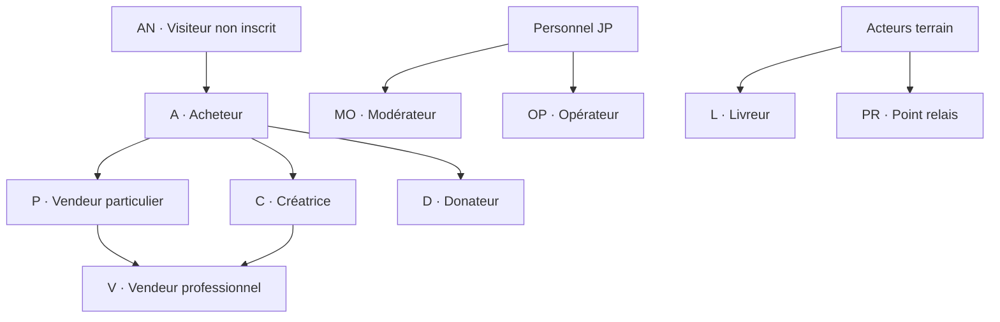
```mermaid
flowchart TD
    AN["AN · Visiteur non inscrit"] --> A["A · Acheteur"]
    A --> P["P · Vendeur particulier"]
    A --> C["C · Créatrice"]
    P --> V["V · Vendeur professionnel"]
    C --> V
    A --> D["D · Donateur"]
    OPS["Personnel JP"] --> MO["MO · Modérateur"]
    OPS --> OP["OP · Opérateur"]
    TERRAIN["Acteurs terrain"] --> L["L · Livreur"]
    TERRAIN --> PR["PR · Point relais"]
```

**Lecture** : un acheteur peut devenir vendeur particulier puis professionnel *(F0.4)*, ou créatrice *(F15.1)*. Les rôles se cumulent sur un même compte, mais **les portefeuilles restent séparés** *(CDC §3.1)*.

---

# 2. Vue d'ensemble des cas d'utilisation

```mermaid
flowchart LR
    subgraph ACTEURS
        AN(("AN"))
        A(("A"))
        V(("V"))
        C(("C"))
        D(("D"))
        L(("L"))
        PR(("PR"))
        OP(("OP"))
        MO(("MO"))
    end

    subgraph AUTH["Authentification"]
        UC01["UC-01 Créer un compte"]
        UC02["UC-02 Se connecter"]
        UC03["UC-03 Récupérer son compte"]
    end

    subgraph VENTE["Catalogue et vente"]
        UC10["UC-10 Publier un article"]
        UC11["UC-11 Déposer une annonce (particulier)"]
        UC12["UC-12 Acheter hors direct"]
        UC13["UC-13 Remplir un panier"]
    end

    subgraph DIRECT["Direct"]
        UC20["UC-20 Diffuser un direct"]
        UC21["UC-21 Acheter en direct"]
    end

    subgraph ARGENT["Paiement et argent"]
        UC30["UC-30 Payer une commande"]
        UC31["UC-31 Confirmer la réception"]
        UC32["UC-32 Retirer son argent"]
    end

    subgraph LOGI["Livraison"]
        UC40["UC-40 Préparer et expédier"]
        UC41["UC-41 Livrer un colis"]
        UC42["UC-42 Remettre au point relais"]
    end

    subgraph CONF["Confiance"]
        UC50["UC-50 Ouvrir un litige"]
        UC51["UC-51 Arbitrer un litige"]
        UC52["UC-52 Vérifier un vendeur"]
    end

    subgraph SOCIAL["Social et fidélité"]
        UC60["UC-60 Suivre une boutique"]
        UC61["UC-61 Publier un unboxing"]
        UC62["UC-62 Consulter ses clientes"]
    end

    subgraph PROMO["Promotions et événements"]
        UC70["UC-70 Lancer une promotion"]
        UC71["UC-71 Offrir une promo VIP"]
        UC72["UC-72 Créer un événement"]
        UC73["UC-73 Participer à un événement"]
    end

    subgraph CADEAU["Cadeau"]
        UC80["UC-80 Demander un panier en cadeau"]
        UC81["UC-81 Offrir un panier"]
    end

    subgraph MODER["Modération"]
        UC90["UC-90 Signaler un contenu"]
        UC91["UC-91 Traiter un signalement"]
    end

    AN --> UC01
    AN --> UC12
    A --> UC02
    A --> UC03
    A --> UC12
    A --> UC13
    A --> UC21
    A --> UC30
    A --> UC31
    A --> UC50
    A --> UC60
    A --> UC61
    A --> UC80
    A --> UC90
    A --> UC11
    V --> UC10
    V --> UC20
    V --> UC40
    V --> UC32
    V --> UC62
    V --> UC70
    V --> UC71
    V --> UC73
    C --> UC61
    C --> UC73
    D --> UC81
    L --> UC41
    PR --> UC42
    OP --> UC51
    OP --> UC52
    OP --> UC72
    MO --> UC91
```

**Inventaire** : 30 cas d'utilisation, regroupés en 9 paquetages. Les 12 marqués ★ portent un diagramme de séquence détaillé.

| ID | Cas d'utilisation | Acteur principal | Séq. |
|---|---|---|---|
| UC-01 | Créer un compte par code envoyé par courriel | AN | ★ |
| UC-02 | Se connecter | A | |
| UC-03 | Récupérer un compte inaccessible | A | ★ |
| UC-10 | Publier un article avec ses variantes | V | |
| UC-11 | Déposer une annonce de particulier | P | ★ |
| UC-12 | Acheter un article hors direct | A / AN | ★ |
| UC-13 | Remplir un panier et le payer en une fois | A | |
| UC-20 | Diffuser un direct et vendre | V | ★ |
| UC-21 | Acheter pendant un direct | A | ★ |
| UC-30 | Payer une commande en mobile money | A | ★ |
| UC-31 | Confirmer la réception et libérer les fonds | A | ★ |
| UC-32 | Retirer son argent | V | |
| UC-40 | Préparer et expédier une commande | V / VE | |
| UC-41 | Livrer un colis à domicile | L | ★ |
| UC-42 | Recevoir et remettre un colis au relais | PR | ★ |
| UC-50 | Ouvrir un litige sur une commande | A | ★ |
| UC-51 | Arbitrer un litige | OP | ★ |
| UC-52 | Vérifier l'identité d'un vendeur | OP | |
| UC-60 | Suivre une boutique et recevoir ses nouveautés | A | |
| UC-61 | Publier un unboxing | A | ★ |
| UC-62 | Consulter ses clientes et leur rang | V | |
| UC-70 | Lancer une promotion et notifier ses abonnés | V | ★ |
| UC-71 | Offrir une promotion réservée aux clientes VIP | V | |
| UC-72 | Créer un événement thématique | OP | |
| UC-73 | Participer à un événement | V / C | ★ |
| UC-80 | Demander un panier en cadeau | A | |
| UC-81 | Offrir un panier depuis l'étranger | D | ★ |
| UC-90 | Signaler un contenu ou une personne | A / C | |
| UC-91 | Traiter un signalement | MO | |
| UC-92 | Publier un contenu avec articles attachés | C / V / A | |

---

# 3. Paquetage Authentification

## UC-01 — Créer un compte par code envoyé par courriel ★

| | |
|---|---|
| **Acteur principal** | AN — visiteur non inscrit |
| **Acteurs secondaires** | SYS, NOT |
| **Fonctionnalités** | F0.1, F0.13, F0.14 · **Stories** US-AUTH-01, US-AUTH-02, US-AUTH-04 |
| **Règles** | R-C1 à R-C10 |
| **Préconditions** | Aucune. L'acteur a une adresse électronique accessible. |
| **Postconditions** | Un compte existe, une session longue est ouverte *(R-C2)*, aucun mot de passe n'a été créé. |

**Description.** Le parcours d'inscription et le parcours de connexion sont **indifférenciés** : la même saisie ouvre un compte existant ou en crée un *(R-C4)*. C'est ce qui interdit de savoir, depuis l'écran d'entrée, qui possède un compte *(R-C9)*.

**Scénario nominal**
1. L'acteur ouvre l'application et saisit son adresse électronique.
2. SYS vérifie le débit autorisé pour cette adresse et cette adresse IP *(R-C7)*.
3. SYS invalide tout code actif pour cette adresse, génère un code à 6 chiffres, le **hache** et l'enregistre avec une expiration à 10 minutes *(R-C5, R-C6)*.
4. SYS demande à NOT d'envoyer le code, **en asynchrone** — la réponse HTTP ne l'attend pas *(R-C9)*.
5. SYS répond de façon **identique** que le compte existe ou non.
6. L'acteur saisit le code ; la vérification part automatiquement au sixième chiffre.
7. SYS compare à temps constant, marque le code consommé, crée le compte s'il est inconnu, ouvre une session.
8. L'acteur choisit un prénom d'affichage.
9. SYS propose le quiz de style, **passable** *(F17.9)*.

**Scénarios alternatifs**
- **A1 — courriel non reçu** *(depuis 6)* : après 30 s, l'acteur demande un renvoi. Après deux renvois, SYS suggère de vérifier les indésirables et propose de changer d'adresse.
- **A2 — code erroné** *(depuis 6)* : SYS incrémente le compteur de tentatives ; à la cinquième, le code est **invalidé** et un nouveau doit être demandé *(R-C7)*.
- **A3 — code expiré** *(depuis 6)* : SYS refuse, aucune session n'est ouverte.
- **A4 — débit dépassé** *(depuis 2)* : SYS refuse en affichant **le délai restant en clair** *(R-C8)*.
- **A5 — connexion par Google** *(depuis 1)* : voir UC-02 alternative A2.
- **A6 — inscription déclenchée par un achat** *(depuis 1)* : la réservation est **déjà posée** et conservée pendant l'inscription *(F0.10, US-VENTE-08)*.

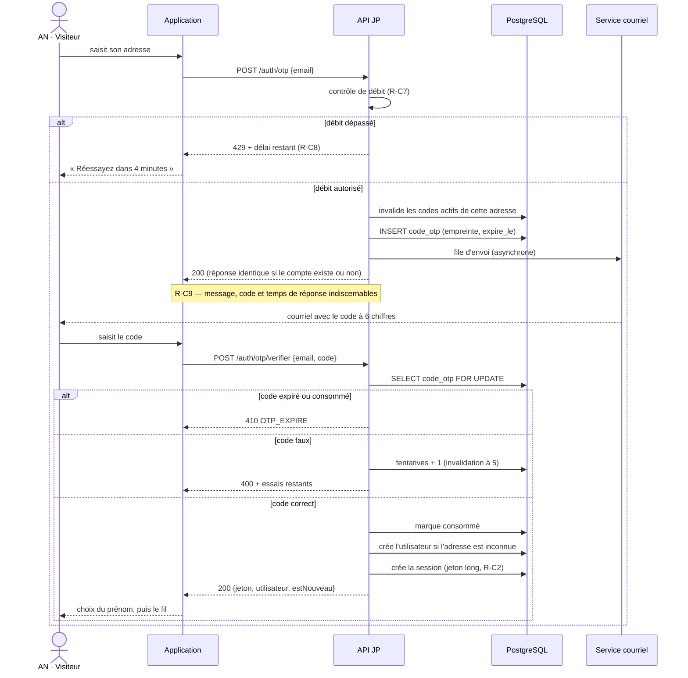
```mermaid
sequenceDiagram
    actor AN as AN · Visiteur
    participant APP as Application
    participant API as API JP
    participant DB as PostgreSQL
    participant NOT as Service courriel

    AN->>APP: saisit son adresse
    APP->>API: POST /auth/otp {email}
    API->>API: contrôle de débit (R-C7)
    alt débit dépassé
        API-->>APP: 429 + délai restant (R-C8)
        APP-->>AN: « Réessayez dans 4 minutes »
    else débit autorisé
        API->>DB: invalide les codes actifs de cette adresse
        API->>DB: INSERT code_otp (empreinte, expire_le)
        API->>NOT: file d'envoi (asynchrone)
        API-->>APP: 200 (réponse identique si le compte existe ou non)
        Note over API,APP: R-C9 — message, code et temps de réponse indiscernables
        NOT-->>AN: courriel avec le code à 6 chiffres
        AN->>APP: saisit le code
        APP->>API: POST /auth/otp/verifier {email, code}
        API->>DB: SELECT code_otp FOR UPDATE
        alt code expiré ou consommé
            API-->>APP: 410 OTP_EXPIRE
        else code faux
            API->>DB: tentatives + 1 (invalidation à 5)
            API-->>APP: 400 + essais restants
        else code correct
            API->>DB: marque consommé
            API->>DB: crée l'utilisateur si l'adresse est inconnue
            API->>DB: crée la session (jeton long, R-C2)
            API-->>APP: 200 {jeton, utilisateur, estNouveau}
            APP-->>AN: choix du prénom, puis le fil
        end
    end
```

---

## UC-02 — Se connecter

| | |
|---|---|
| **Acteur principal** | A |
| **Fonctionnalités** | F0.1, F0.2, F0.13 · **Règles** R-C2, R-C11, R-C12 |
| **Préconditions** | Un compte existe. |
| **Postconditions** | Session longue ouverte, appareil enregistré dans la liste des sessions. |

**Scénario nominal** — identique à UC-01, étapes 1 à 7. SYS reconnaît l'adresse et ouvre le compte existant sans créer de doublon.

**Scénarios alternatifs**
- **A1 — session encore valide** *(depuis 1)* : l'acteur n'a rien à saisir ; le jeton de rafraîchissement est renouvelé par rotation *(F0.2)*.
- **A2 — connexion Google** *(depuis 1)* : SYS vérifie le jeton d'identité côté serveur, refuse si l'adresse n'est pas déclarée vérifiée *(R-C11)*, et **rattache** l'identité au compte existant si l'adresse correspond *(R-C12)*.
- **A3 — jeton de rafraîchissement réutilisé** : SYS détecte la réutilisation et **révoque toute la famille de jetons** *(F0.2)*.

**Diagramme de séquence**

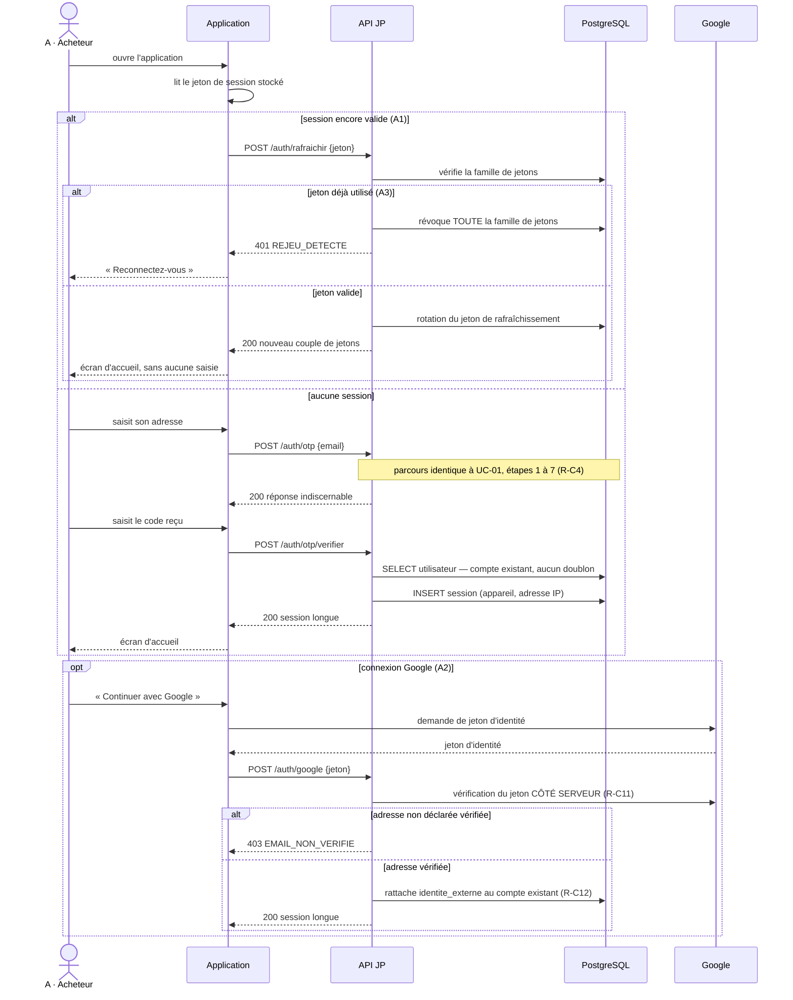
```mermaid
sequenceDiagram
    actor A as A · Acheteur
    participant APP as Application
    participant API as API JP
    participant DB as PostgreSQL
    participant GO as Google
    A->>APP: ouvre l'application
    APP->>APP: lit le jeton de session stocké
    alt session encore valide (A1)
        APP->>API: POST /auth/rafraichir {jeton}
        API->>DB: vérifie la famille de jetons
        alt jeton déjà utilisé (A3)
            API->>DB: révoque TOUTE la famille de jetons
            API-->>APP: 401 REJEU_DETECTE
            APP-->>A: « Reconnectez-vous »
        else jeton valide
            API->>DB: rotation du jeton de rafraîchissement
            API-->>APP: 200 nouveau couple de jetons
            APP-->>A: écran d'accueil, sans aucune saisie
        end
    else aucune session
        A->>APP: saisit son adresse
        APP->>API: POST /auth/otp {email}
        Note over API,DB: parcours identique à UC-01, étapes 1 à 7 (R-C4)
        API-->>APP: 200 réponse indiscernable
        A->>APP: saisit le code reçu
        APP->>API: POST /auth/otp/verifier
        API->>DB: SELECT utilisateur — compte existant, aucun doublon
        API->>DB: INSERT session (appareil, adresse IP)
        API-->>APP: 200 session longue
        APP-->>A: écran d'accueil
    end
    opt connexion Google (A2)
        A->>APP: « Continuer avec Google »
        APP->>GO: demande de jeton d'identité
        GO-->>APP: jeton d'identité
        APP->>API: POST /auth/google {jeton}
        API->>GO: vérification du jeton CÔTÉ SERVEUR (R-C11)
        alt adresse non déclarée vérifiée
            API-->>APP: 403 EMAIL_NON_VERIFIE
        else adresse vérifiée
            API->>DB: rattache identite_externe au compte existant (R-C12)
            API-->>APP: 200 session longue
        end
    end
```

---

## UC-03 — Récupérer un compte inaccessible ★

| | |
|---|---|
| **Acteur principal** | A |
| **Acteurs secondaires** | OP, SYS |
| **Fonctionnalités** | F0.3, F0.15 · **Story** US-AUTH-07 · **Règles** R-C13, R-C14 |
| **Préconditions** | L'acteur possède un compte dont il a perdu l'accès à l'adresse électronique. |
| **Postconditions** | Le compte est réattribué à une nouvelle adresse **vérifiée**, ou la demande est refusée avec un motif écrit. |

**Description.** Trois cas, un seul difficile. Boîte mail accessible : il n'y a rien à récupérer, un code suffit. Changement de carte SIM : sans effet sur le compte. **Accès perdu à la boîte mail** : instruction humaine, sous 24 h.

**Pourquoi une instruction humaine** : automatiser cette récupération créerait une porte d'entrée. Sur un produit qui conserve l'argent d'autrui, la lenteur est ici une fonctionnalité.

**Scénario nominal**
1. L'acteur déclare ne plus avoir accès à son adresse.
2. SYS présente un formulaire : prénom, dernière commande, montant approximatif, numéro de téléphone de livraison.
3. SYS enregistre la demande, attribue un numéro de dossier, et **gèle les retraits** si le compte porte un solde *(R-C14)*.
4. SYS répond **202 dans tous les cas**, même si l'adresse est inconnue *(R-C9)*.
5. OP ouvre le dossier et compare les déclarations à l'historique réel du compte visé.
6. OP valide ; SYS envoie un code à la nouvelle adresse.
7. L'acteur vérifie la nouvelle adresse ; SYS réattribue le compte, dégèle les retraits, journalise.

**Scénarios alternatifs**
- **A1 — refus** *(depuis 6)* : OP refuse avec un motif écrit ; **le compte reste inchangé** et le motif est notifié.
- **A2 — adresse accessible** *(depuis 1)* : l'acteur est réorienté vers UC-01, qui suffit.

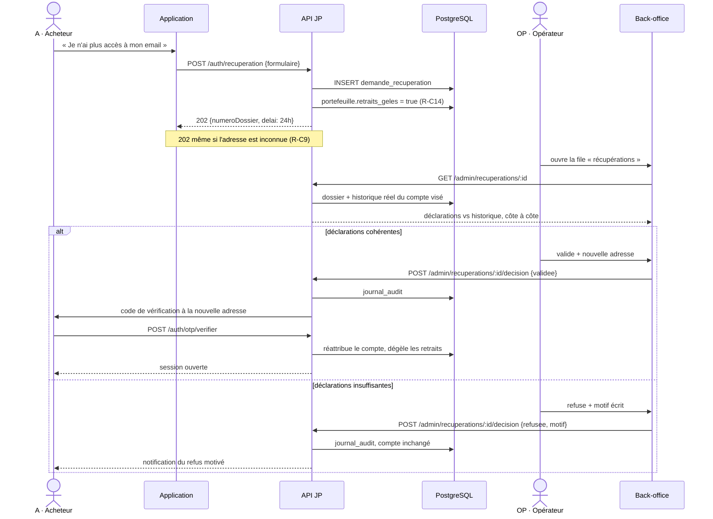
```mermaid
sequenceDiagram
    actor A as A · Acheteur
    participant APP as Application
    participant API as API JP
    participant DB as PostgreSQL
    actor OP as OP · Opérateur
    participant BO as Back-office

    A->>APP: « Je n'ai plus accès à mon email »
    APP->>API: POST /auth/recuperation {formulaire}
    API->>DB: INSERT demande_recuperation
    API->>DB: portefeuille.retraits_geles = true (R-C14)
    API-->>APP: 202 {numeroDossier, delai: 24h}
    Note over API,APP: 202 même si l'adresse est inconnue (R-C9)

    OP->>BO: ouvre la file « récupérations »
    BO->>API: GET /admin/recuperations/:id
    API->>DB: dossier + historique réel du compte visé
    API-->>BO: déclarations vs historique, côte à côte
    alt déclarations cohérentes
        OP->>BO: valide + nouvelle adresse
        BO->>API: POST /admin/recuperations/:id/decision {validee}
        API->>DB: journal_audit
        API->>A: code de vérification à la nouvelle adresse
        A->>API: POST /auth/otp/verifier
        API->>DB: réattribue le compte, dégèle les retraits
        API-->>A: session ouverte
    else déclarations insuffisantes
        OP->>BO: refuse + motif écrit
        BO->>API: POST /admin/recuperations/:id/decision {refusee, motif}
        API->>DB: journal_audit, compte inchangé
        API-->>A: notification du refus motivé
    end
```

---

# 4. Paquetage Catalogue et vente

## UC-10 — Publier un article avec ses variantes

| | |
|---|---|
| **Acteur principal** | V |
| **Acteurs secondaires** | VE (sans le prix), SYS |
| **Fonctionnalités** | F1.1, F1.2, F1.18, F1.7 · **Règles** R-A1 à R-A5, R-H4 |
| **Préconditions** | Compte vendeur créé. La vérification n'est **pas** requise pour créer un catalogue *(R-V1)*. |
| **Postconditions** | Article en ligne avec ses variantes et son stock, disponible à l'achat hors direct *(R-H7)*. |

**Scénario nominal**
1. V choisit 1 à 8 photos, les recadre.
2. V saisit nom, prix, catégorie.
3. V renseigne l'état et les mesures réelles *(R-H4)* — facultatif mais valorisé au tri.
4. V coche les tailles et saisit une quantité par taille ; couleurs si besoin.
5. SYS affiche la **commission simulée** avant publication *(R-G1)*.
6. V met en ligne. SYS crée l'article, les variantes, les mouvements de stock d'entrée.

**Scénarios alternatifs**
- **A1 — création express en direct** *(depuis 1)* : trois champs seulement — photo, prix, quantité *(R-A4)*. Le reste est complété après le direct.
- **A2 — employé** *(depuis 2)* : VE peut créer et modifier, **jamais le prix** *(matrice §3.2)*. Le champ est absent de son interface **et** refusé par l'API.
- **A3 — moins de 3 photos pour la vente hors direct** *(depuis 6)* : avertissement **non bloquant**.
- **A4 — mesures hors bornes** *(depuis 3)* : refus avec message explicite.
- **A5 — brouillon** *(depuis 6)* : l'article est enregistré sans être publié.

**Diagramme de séquence**

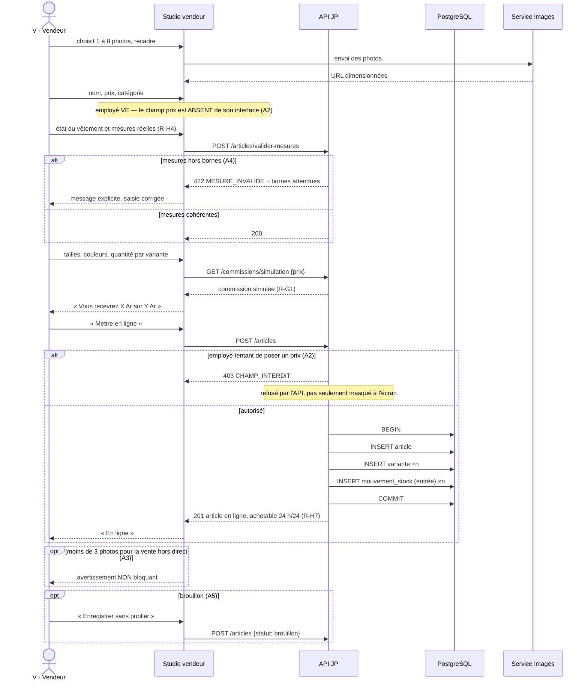
```mermaid
sequenceDiagram
    actor V as V · Vendeur
    participant APP as Studio vendeur
    participant API as API JP
    participant DB as PostgreSQL
    participant IMG as Service images
    V->>APP: choisit 1 à 8 photos, recadre
    APP->>IMG: envoi des photos
    IMG-->>APP: URL dimensionnées
    V->>APP: nom, prix, catégorie
    Note over APP: employé VE — le champ prix est ABSENT de son interface (A2)
    V->>APP: état du vêtement et mesures réelles (R-H4)
    APP->>API: POST /articles/valider-mesures
    alt mesures hors bornes (A4)
        API-->>APP: 422 MESURE_INVALIDE + bornes attendues
        APP-->>V: message explicite, saisie corrigée
    else mesures cohérentes
        API-->>APP: 200
    end
    V->>APP: tailles, couleurs, quantité par variante
    APP->>API: GET /commissions/simulation {prix}
    API-->>APP: commission simulée (R-G1)
    APP-->>V: « Vous recevrez X Ar sur Y Ar »
    V->>APP: « Mettre en ligne »
    APP->>API: POST /articles
    alt employé tentant de poser un prix (A2)
        API-->>APP: 403 CHAMP_INTERDIT
        Note over API: refusé par l'API, pas seulement masqué à l'écran
    else autorisé
        API->>DB: BEGIN
        API->>DB: INSERT article
        API->>DB: INSERT variante ×n
        API->>DB: INSERT mouvement_stock (entrée) ×n
        API->>DB: COMMIT
        API-->>APP: 201 article en ligne, achetable 24 h/24 (R-H7)
        APP-->>V: « En ligne »
    end
    opt moins de 3 photos pour la vente hors direct (A3)
        APP-->>V: avertissement NON bloquant
    end
    opt brouillon (A5)
        V->>APP: « Enregistrer sans publier »
        APP->>API: POST /articles {statut: brouillon}
    end
```

---

## UC-11 — Déposer une annonce de particulier ★

| | |
|---|---|
| **Acteur principal** | P — vendeur particulier |
| **Acteurs secondaires** | A (acheteuse), OP, SYS |
| **Fonctionnalités** | F1.17, F0.4 · **Story** US-VENTE-04 · **Règles** R-H5, R-H6, R-H10 |
| **Préconditions** | Compte acheteur existant. **Aucune vérification d'identité requise.** |
| **Postconditions** | Annonce en ligne, pièce unique, stock à 1. L'encaissement reste **bloqué** jusqu'à la vérification. |

**Description.** Le parcours qui ouvre JP à quelqu'un qui n'a pas de boutique. **Quatre champs : photos, prix, taille, état.** Aucun nom de boutique, aucun KYC — la vérification est exigée **au premier encaissement**, pas avant *(R-H5)*.

**Scénario nominal**
1. A choisit « Vendre un article que je ne porte plus ».
2. SYS crée un profil vendeur de type `particulier`, sans exiger de nom de boutique.
3. A remplit quatre champs et publie.
4. SYS met l'article en ligne : stock 1, pièce unique.
5. Une acheteuse commande et paie. SYS séquestre les fonds *(R-E1)*.
6. SYS notifie P : *« Vous avez été payée — vérifiez votre identité pour recevoir 38 000 Ar. »*
7. P effectue la vérification *(UC-52)*. OP valide.
8. SYS débloque l'encaissement ; les fonds deviennent libérables selon le parcours normal *(UC-31)*.

**Scénarios alternatifs**
- **A1 — refus de vérification** *(depuis 7)* : au terme du délai, SYS **annule la commande et rembourse intégralement** l'acheteuse, puis ferme le compte aux nouvelles commandes *(R-H10)*.
- **A2 — seuil de bascule franchi** *(depuis 4)* : SYS invite P à passer vendeur professionnel, **une seule fois**, sans bloquer la publication *(R-H11)*.
- **A3 — mise en vente depuis le dressing** *(depuis 3)* : la pièce est déjà photographiée, aucune photo à reprendre *(F17.10)*.

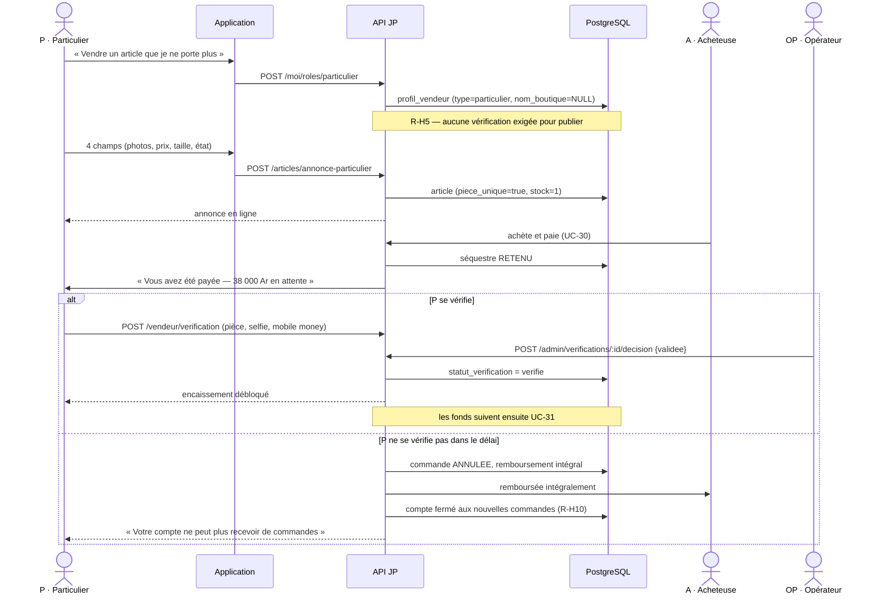
```mermaid
sequenceDiagram
    actor P as P · Particulier
    participant APP as Application
    participant API as API JP
    participant DB as PostgreSQL
    actor A as A · Acheteuse
    actor OP as OP · Opérateur

    P->>APP: « Vendre un article que je ne porte plus »
    APP->>API: POST /moi/roles/particulier
    API->>DB: profil_vendeur (type=particulier, nom_boutique=NULL)
    Note over API,DB: R-H5 — aucune vérification exigée pour publier
    P->>APP: 4 champs (photos, prix, taille, état)
    APP->>API: POST /articles/annonce-particulier
    API->>DB: article (piece_unique=true, stock=1)
    API-->>P: annonce en ligne

    A->>API: achète et paie (UC-30)
    API->>DB: séquestre RETENU
    API->>P: « Vous avez été payée — 38 000 Ar en attente »

    alt P se vérifie
        P->>API: POST /vendeur/verification (pièce, selfie, mobile money)
        OP->>API: POST /admin/verifications/:id/decision {validee}
        API->>DB: statut_verification = verifie
        API-->>P: encaissement débloqué
        Note over API,DB: les fonds suivent ensuite UC-31
    else P ne se vérifie pas dans le délai
        API->>DB: commande ANNULEE, remboursement intégral
        API->>A: remboursée intégralement
        API->>DB: compte fermé aux nouvelles commandes (R-H10)
        API-->>P: « Votre compte ne peut plus recevoir de commandes »
    end
```

---

## UC-12 — Acheter un article hors direct ★

| | |
|---|---|
| **Acteur principal** | A, ou AN qui s'inscrit en cours de parcours |
| **Acteurs secondaires** | V, SYS, PSP |
| **Fonctionnalités** | F1.15, F1.16, F3.14, F1.10 · **Stories** US-VENTE-01, US-VENTE-08, US-VENTE-09 |
| **Règles** | R-H1, R-H2, R-H3, R-S1 à R-S3 |
| **Préconditions** | Un article en ligne avec du stock disponible. |
| **Postconditions** | Commande créée avec `origine = catalogue`, suivant **la même machine à états** qu'une commande de direct *(R-H1)*. |

**Description.** Le parcours qui fait de JP une boutique et non une succession d'événements. **La seule différence avec l'achat en direct est la durée de réservation** *(R-H3)* et le délai d'acceptation du vendeur *(R-H8)*.

**Scénario nominal**
1. A ouvre une fiche article depuis le fil, la recherche, une vitrine ou un lien partagé.
2. SYS affiche photos, prix, tailles **disponibles** (les épuisées barrées, `R-A3`), état, mesures comparées à son profil, **délai d'expédition annoncé** *(F5.9)*, badge du vendeur.
3. A appuie sur « Je prends ».
4. SYS ouvre la feuille d'achat : taille présélectionnée depuis son profil, quantité, livraison au dernier choix mémorisé, **total avec frais affiché ici** *(RB7)*.
5. A valide. SYS pose une réservation atomique *(UC interne : réservation)* pour la **durée catalogue** *(R-H3)*.
6. A paie *(UC-30)*.

**Scénarios alternatifs**
- **A1 — visiteur non inscrit** *(depuis 3)* : SYS **pose la réservation**, puis déclenche l'inscription *(UC-01, A6)*, puis reprend à l'étape 4 sans rien perdre.
- **A2 — dernière pièce partie pendant le choix de la taille** *(depuis 5)* : SYS refuse avec `STOCK_INSUFFISANT`, propose la file d'attente *(F2.7)* et l'alerte de retour en stock *(F7.4)*.
- **A3 — ajouter au panier** *(depuis 5)* : la réservation est maintenue, A continue à naviguer et paie tout en une fois *(UC-13)*.
- **A4 — pièce unique** *(depuis 4)* : aucune quantité demandée *(F1.14)*.
- **A5 — vendeur non autorisé à encaisser** *(depuis 3)* : l'achat est refusé avec un motif clair *(R-V1)*.
- **A6 — réservation expirée avant paiement** *(depuis 6)* : SYS remet au stock, notifie **une seule fois**, propose « Reprendre » si le stock est là *(R-S6, F17.12)*.

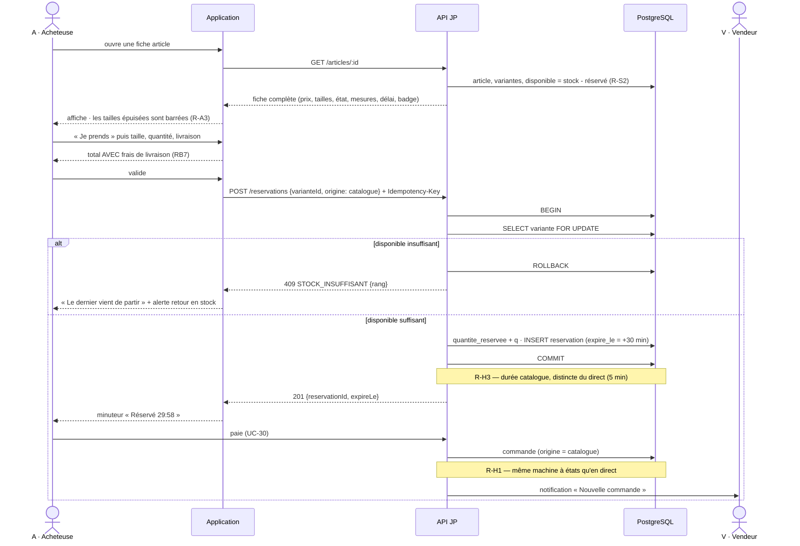
```mermaid
sequenceDiagram
    actor A as A · Acheteuse
    participant APP as Application
    participant API as API JP
    participant DB as PostgreSQL
    actor V as V · Vendeur

    A->>APP: ouvre une fiche article
    APP->>API: GET /articles/:id
    API->>DB: article, variantes, disponible = stock - réservé (R-S2)
    API-->>APP: fiche complète (prix, tailles, état, mesures, délai, badge)
    APP-->>A: affiche · les tailles épuisées sont barrées (R-A3)

    A->>APP: « Je prends » puis taille, quantité, livraison
    APP-->>A: total AVEC frais de livraison (RB7)
    A->>APP: valide
    APP->>API: POST /reservations {varianteId, origine: catalogue} + Idempotency-Key

    API->>DB: BEGIN
    API->>DB: SELECT variante FOR UPDATE
    alt disponible insuffisant
        API->>DB: ROLLBACK
        API-->>APP: 409 STOCK_INSUFFISANT {rang}
        APP-->>A: « Le dernier vient de partir » + alerte retour en stock
    else disponible suffisant
        API->>DB: quantite_reservee + q · INSERT reservation (expire_le = +30 min)
        API->>DB: COMMIT
        Note over API,DB: R-H3 — durée catalogue, distincte du direct (5 min)
        API-->>APP: 201 {reservationId, expireLe}
        APP-->>A: minuteur « Réservé 29:58 »
        A->>API: paie (UC-30)
        API->>DB: commande (origine = catalogue)
        Note over API,DB: R-H1 — même machine à états qu'en direct
        API->>V: notification « Nouvelle commande »
    end
```

---

## UC-13 — Remplir un panier et le payer en une fois

| | |
|---|---|
| **Acteur principal** | A |
| **Fonctionnalités** | F1.16, F3.1, F3.2, F3.15 · **Story** US-VENTE-02 |
| **Règles** | R-H3, R-U7, R-U8 |
| **Préconditions** | Au moins un article réservé. |
| **Postconditions** | Une commande par vendeur, un seul paiement, remises appliquées et nommées. |

**Scénario nominal**
1. A ajoute plusieurs articles au panier, de vendeurs différents.
2. SYS **regroupe par vendeur** : les frais de livraison et l'expédition sont par vendeur.
3. SYS calcule les remises éligibles et n'en retient **qu'une par ligne, la plus favorable** *(R-U7)*.
4. SYS affiche le récapitulatif : sous-total, remise **nommée**, frais par vendeur, total.
5. SYS propose « Regrouper au même point relais et économiser X Ar ».
6. A paie une fois *(UC-30)*.

**Scénarios alternatifs**
- **A1 — une réservation a expiré** *(depuis 4)* : la ligne est **signalée avant** toute tentative de paiement, avec un bouton « Reprendre ».
- **A2 — promotion expirée entre l'affichage et le paiement** *(depuis 6)* : SYS présente le nouveau total pour **confirmation explicite**. Jamais un prélèvement supérieur à ce qui a été vu *(US-PROMO-08 CA5)*.
- **A3 — palier perdu entre-temps** *(depuis 6)* : la remise est retirée avec un message clair, **la commande n'échoue pas** *(R-U5)*.

**Diagramme de séquence**

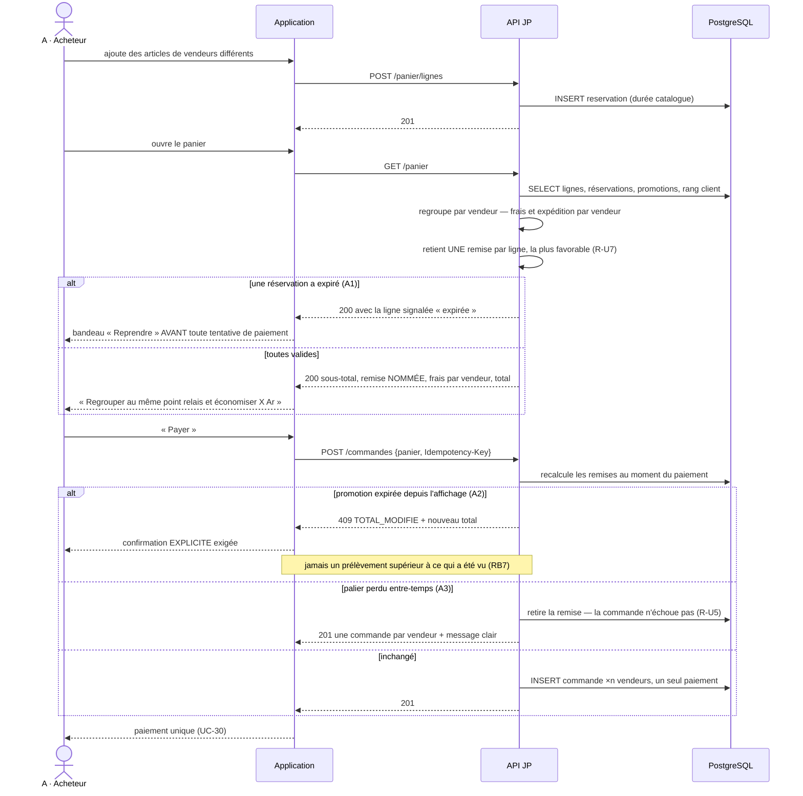
```mermaid
sequenceDiagram
    actor A as A · Acheteur
    participant APP as Application
    participant API as API JP
    participant DB as PostgreSQL
    A->>APP: ajoute des articles de vendeurs différents
    APP->>API: POST /panier/lignes
    API->>DB: INSERT reservation (durée catalogue)
    API-->>APP: 201
    A->>APP: ouvre le panier
    APP->>API: GET /panier
    API->>DB: SELECT lignes, réservations, promotions, rang client
    API->>API: regroupe par vendeur — frais et expédition par vendeur
    API->>API: retient UNE remise par ligne, la plus favorable (R-U7)
    alt une réservation a expiré (A1)
        API-->>APP: 200 avec la ligne signalée « expirée »
        APP-->>A: bandeau « Reprendre » AVANT toute tentative de paiement
    else toutes valides
        API-->>APP: 200 sous-total, remise NOMMÉE, frais par vendeur, total
        APP-->>A: « Regrouper au même point relais et économiser X Ar »
    end
    A->>APP: « Payer »
    APP->>API: POST /commandes {panier, Idempotency-Key}
    API->>DB: recalcule les remises au moment du paiement
    alt promotion expirée depuis l'affichage (A2)
        API-->>APP: 409 TOTAL_MODIFIE + nouveau total
        APP-->>A: confirmation EXPLICITE exigée
        Note over API,APP: jamais un prélèvement supérieur à ce qui a été vu (RB7)
    else palier perdu entre-temps (A3)
        API->>DB: retire la remise — la commande n'échoue pas (R-U5)
        API-->>APP: 201 une commande par vendeur + message clair
    else inchangé
        API->>DB: INSERT commande ×n vendeurs, un seul paiement
        API-->>APP: 201
    end
    APP-->>A: paiement unique (UC-30)
```

---

# 5. Paquetage Direct

## UC-20 — Diffuser un direct et vendre ★

| | |
|---|---|
| **Acteur principal** | V |
| **Acteurs secondaires** | VE (modération du chat), A, VID, SYS |
| **Fonctionnalités** | F2.3, F2.4, F2.5, F2.13, F2.14, F2.15 · **Règles** R-D1 à R-D7 |
| **Préconditions** | Vendeur **vérifié** *(R-V1)*, articles préparés (facultatif). |
| **Postconditions** | Direct enregistré, bilan produit, marqueurs de replay générés sans saisie *(F2.16)*. |

**Scénario nominal**
1. V saisit un titre et sélectionne ses articles de la soirée.
2. SYS mesure le débit montant et signale une connexion insuffisante.
3. V passe en direct ; SYS obtient des identifiants d'ingest auprès de VID et notifie les abonnés *(F2.2)*.
4. V sélectionne l'article « à l'écran » ; SYS horodate `a_lecran_le` — c'est cette donnée qui produira les marqueurs du replay.
5. SYS diffuse le bandeau : prix, tailles, **stock restant réel** *(R-S2, RB9)*.
6. Les acheteuses achètent *(UC-21)* ; SYS alimente le panneau vendeur en temps réel.
7. V arrête. SYS clôt le direct, produit le bilan et récupère l'enregistrement.

**Scénarios alternatifs**
- **A1 — coupure de connexion** *(depuis 5)* : SYS met le direct **en pause**, **suspend toutes les réservations en cours** *(R-S5)*, informe les spectateurs. Reprise sous 2 minutes → même direct, mêmes spectateurs, mêmes réservations, `expire_le` repoussé de la durée écoulée. Au-delà → clôture et bilan.
- **A2 — modification de prix en direct** *(depuis 4)* : autorisée ; **les réservations déjà posées conservent l'ancien prix** *(R-U9)*.
- **A3 — création express d'un article** *(depuis 4)* : trois champs *(R-A4)*.
- **A4 — signalement pendant le direct** *(depuis 5)* : MO peut **couper la diffusion** en quelques secondes *(F11.2)*.

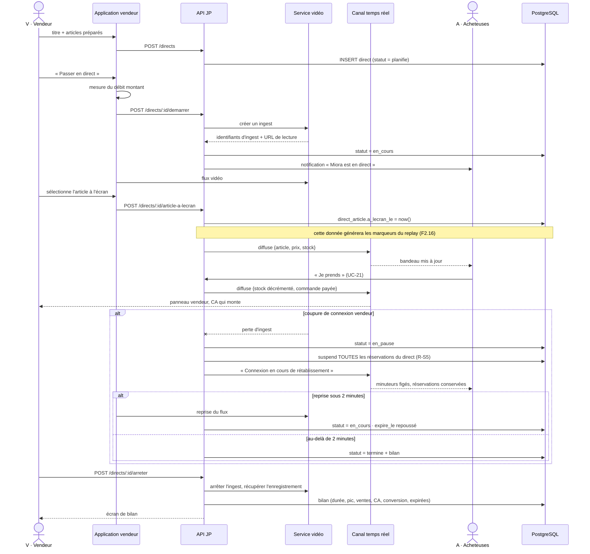
```mermaid
sequenceDiagram
    actor V as V · Vendeur
    participant APP as Application vendeur
    participant API as API JP
    participant VID as Service vidéo
    participant WS as Canal temps réel
    actor A as A · Acheteuses
    participant DB as PostgreSQL

    V->>APP: titre + articles préparés
    APP->>API: POST /directs
    API->>DB: INSERT direct (statut = planifie)
    V->>APP: « Passer en direct »
    APP->>APP: mesure du débit montant
    APP->>API: POST /directs/:id/demarrer
    API->>VID: créer un ingest
    VID-->>API: identifiants d'ingest + URL de lecture
    API->>DB: statut = en_cours
    API->>A: notification « Miora est en direct »
    APP->>VID: flux vidéo

    V->>APP: sélectionne l'article à l'écran
    APP->>API: POST /directs/:id/article-a-lecran
    API->>DB: direct_article.a_lecran_le = now()
    Note over API,DB: cette donnée générera les marqueurs du replay (F2.16)
    API->>WS: diffuse {article, prix, stock}
    WS-->>A: bandeau mis à jour

    A->>API: « Je prends » (UC-21)
    API->>WS: diffuse {stock décrémenté, commande payée}
    WS-->>V: panneau vendeur, CA qui monte

    alt coupure de connexion vendeur
        VID--xAPI: perte d'ingest
        API->>DB: statut = en_pause
        API->>DB: suspend TOUTES les réservations du direct (R-S5)
        API->>WS: « Connexion en cours de rétablissement »
        WS-->>A: minuteurs figés, réservations conservées
        alt reprise sous 2 minutes
            APP->>VID: reprise du flux
            API->>DB: statut = en_cours · expire_le repoussé
        else au-delà de 2 minutes
            API->>DB: statut = termine + bilan
        end
    end

    V->>API: POST /directs/:id/arreter
    API->>VID: arrêter l'ingest, récupérer l'enregistrement
    API->>DB: bilan (durée, pic, ventes, CA, conversion, expirées)
    API-->>V: écran de bilan
```

---

## UC-21 — Acheter pendant un direct ★

| | |
|---|---|
| **Acteur principal** | A |
| **Acteurs secondaires** | AN, V, SYS, PSP |
| **Fonctionnalités** | F2.6, F2.7, F2.8, F2.9 · **Règles** R-S1 à R-S7, RB1, RB7 |
| **Préconditions** | Un direct en cours avec un article à l'écran et du stock disponible. |
| **Postconditions** | Réservation puis commande, ou place dans la file d'attente. **Aucune survente possible** *(RB1)*. |

**Description.** Le parcours le plus important du produit. **Il doit tenir sous 30 secondes**, et la vidéo continue de jouer pendant tout le parcours.

**Scénario nominal** — identique à UC-12 étapes 3 à 6, avec trois différences : la vidéo reste visible au-dessus de la feuille, la durée de réservation est **courte** *(R-H3)*, et le vendeur voit la commande tomber avec le prénom de l'acheteuse.

**Scénarios alternatifs**
- **A1 — deux acheteuses sur la dernière pièce** : **l'horodatage serveur tranche** *(R-S7)*. La seconde est placée 2ᵉ dans la file et sera notifiée si la première ne paie pas.
- **A2 — ajouter au panier** : la réservation est maintenue, A continue le direct et paie tout à la fin — **chemin essentiel**, il augmente le panier et évite cinq paiements mobile money d'affilée.
- **A3 — visiteur non inscrit** : réservation posée **avant** l'inscription.

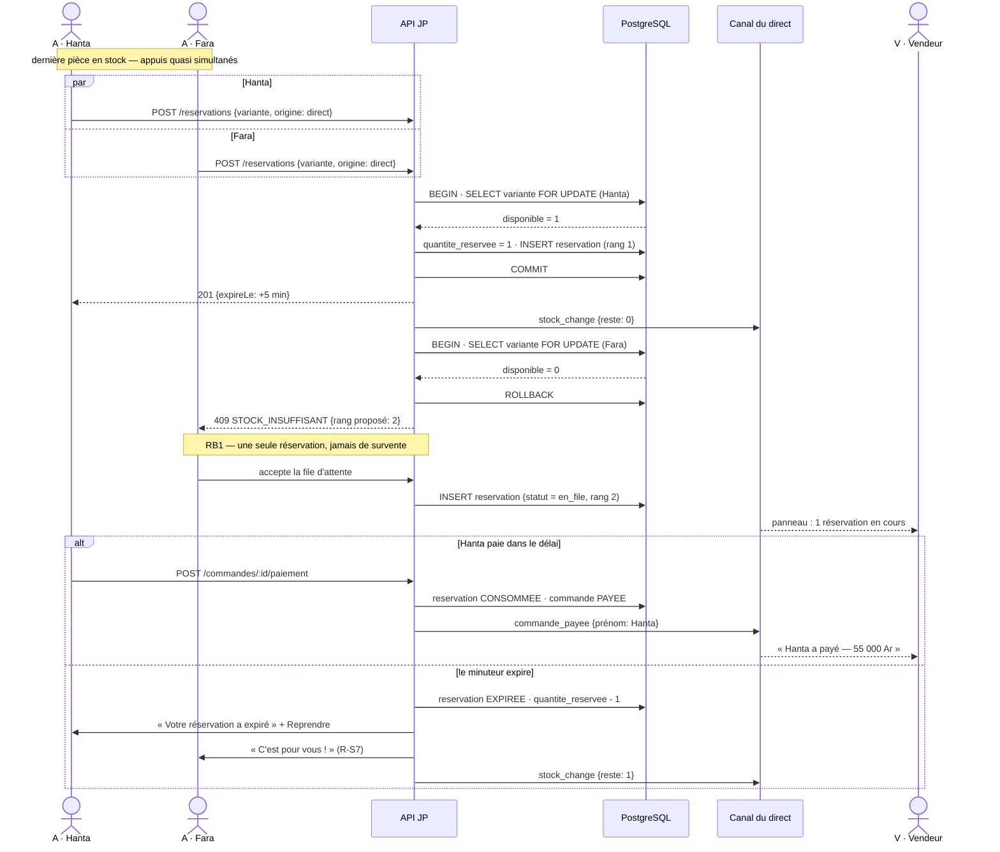
```mermaid
sequenceDiagram
    actor A1 as A · Hanta
    actor A2 as A · Fara
    participant API as API JP
    participant DB as PostgreSQL
    participant WS as Canal du direct
    actor V as V · Vendeur

    Note over A1,A2: dernière pièce en stock — appuis quasi simultanés

    par Hanta
        A1->>API: POST /reservations {variante, origine: direct}
    and Fara
        A2->>API: POST /reservations {variante, origine: direct}
    end

    API->>DB: BEGIN · SELECT variante FOR UPDATE (Hanta)
    DB-->>API: disponible = 1
    API->>DB: quantite_reservee = 1 · INSERT reservation (rang 1)
    API->>DB: COMMIT
    API-->>A1: 201 {expireLe: +5 min}
    API->>WS: stock_change {reste: 0}

    API->>DB: BEGIN · SELECT variante FOR UPDATE (Fara)
    DB-->>API: disponible = 0
    API->>DB: ROLLBACK
    API-->>A2: 409 STOCK_INSUFFISANT {rang proposé: 2}
    Note over API,A2: RB1 — une seule réservation, jamais de survente
    A2->>API: accepte la file d'attente
    API->>DB: INSERT reservation (statut = en_file, rang 2)

    WS-->>V: panneau : 1 réservation en cours

    alt Hanta paie dans le délai
        A1->>API: POST /commandes/:id/paiement
        API->>DB: reservation CONSOMMEE · commande PAYEE
        API->>WS: commande_payee {prénom: Hanta}
        WS-->>V: « Hanta a payé — 55 000 Ar »
    else le minuteur expire
        API->>DB: reservation EXPIREE · quantite_reservee - 1
        API->>A1: « Votre réservation a expiré » + Reprendre
        API->>A2: « C'est pour vous ! » (R-S7)
        API->>WS: stock_change {reste: 1}
    end
```

---

# 6. Paquetage Paiement et argent

## UC-30 — Payer une commande en mobile money ★

| | |
|---|---|
| **Acteur principal** | A |
| **Acteurs secondaires** | PSP, V, SYS |
| **Fonctionnalités** | F4.1, F4.4, F4.10 · **Règles** R-M1, R-M2, R-E1 · **Recette RB10** |
| **Préconditions** | Une commande en `EN_ATTENTE_PAIEMENT` avec une réservation active. |
| **Postconditions** | Paiement confirmé, fonds **séquestrés**, commission prélevée, facture émise, vendeur notifié du **montant net**. |

**Description.** Le point critique : pendant l'attente de confirmation opérateur (jusqu'à 60 s), l'écran ne doit **jamais** paraître figé, et le minuteur de réservation est **suspendu** *(R-S5)*. C'est là que l'acheteuse croit avoir perdu son argent.

**Scénario nominal**
1. A choisit son opérateur (le sien est présélectionné).
2. SYS crée un paiement avec une **clé d'idempotence** *(R-M2)*, suspend le minuteur, appelle PSP.
3. PSP envoie une demande de validation sur le téléphone de A.
4. SYS affiche un écran d'attente **animé**, avec le temps écoulé et la mention que la réservation est en pause.
5. A saisit son code sur son téléphone.
6. PSP confirme, par rappel asynchrone **et/ou** par réponse synchrone.
7. SYS, en une transaction : consomme la réservation, passe la commande en `PAYEE`, crée le **séquestre**, écrit les écritures financières, prélève la commission.
8. SYS émet la facture *(F4.11)*, notifie A et notifie V avec **le montant net, commission affichée** *(R-G1)*.

**Scénarios alternatifs**
- **A1 — rappel reçu deux fois** *(depuis 6)* : traité **une seule fois** *(R-M2)*.
- **A2 — rappel reçu avant la réponse synchrone** *(depuis 6)* : traité correctement, l'ordre d'arrivée n'a pas d'importance.
- **A3 — échec** *(depuis 6)* : SYS affiche **le motif réel** — solde insuffisant, code faux, délai dépassé, opérateur indisponible — conserve la réservation si le minuteur le permet, et propose de réessayer ou de changer de moyen *(F4.10)*.
- **A4 — coupure réseau** *(à toute étape)* : ni double prélèvement, ni commande perdue *(RB10)*. Au retour, l'acheteuse retrouve l'état réel.
- **A5 — paiement resté en attente** *(depuis 6)* : SYS **réinterroge activement** PSP au-delà d'un délai, jamais d'abandon silencieux.
- **A6 — paiement à la livraison** *(depuis 1)* : commande créée **sans** encaissement ni séquestre ; les espèces sont collectées à la remise *(UC-41, F4.3)*.

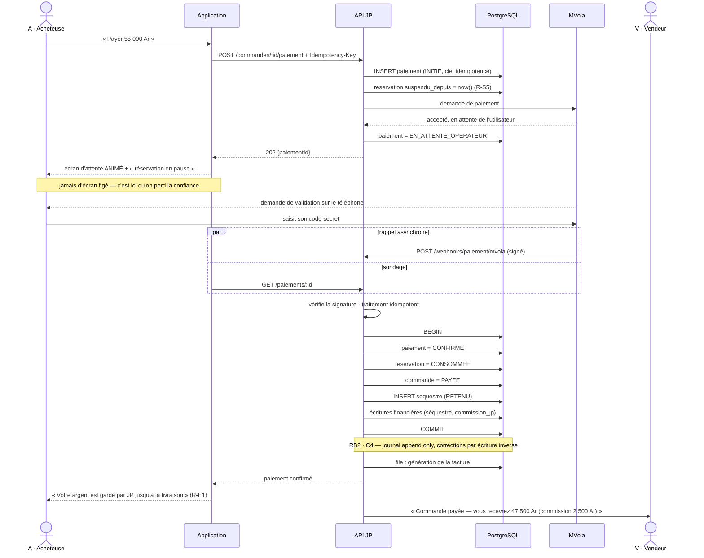
```mermaid
sequenceDiagram
    actor A as A · Acheteuse
    participant APP as Application
    participant API as API JP
    participant DB as PostgreSQL
    participant PSP as MVola
    actor V as V · Vendeur

    A->>APP: « Payer 55 000 Ar »
    APP->>API: POST /commandes/:id/paiement + Idempotency-Key
    API->>DB: INSERT paiement (INITIE, cle_idempotence)
    API->>DB: reservation.suspendu_depuis = now() (R-S5)
    API->>PSP: demande de paiement
    PSP-->>API: accepté, en attente de l'utilisateur
    API->>DB: paiement = EN_ATTENTE_OPERATEUR
    API-->>APP: 202 {paiementId}
    APP-->>A: écran d'attente ANIMÉ + « réservation en pause »
    Note over APP,A: jamais d'écran figé — c'est ici qu'on perd la confiance

    PSP-->>A: demande de validation sur le téléphone
    A->>PSP: saisit son code secret

    par rappel asynchrone
        PSP->>API: POST /webhooks/paiement/mvola (signé)
    and sondage
        APP->>API: GET /paiements/:id
    end

    API->>API: vérifie la signature · traitement idempotent
    API->>DB: BEGIN
    API->>DB: paiement = CONFIRME
    API->>DB: reservation = CONSOMMEE
    API->>DB: commande = PAYEE
    API->>DB: INSERT sequestre (RETENU)
    API->>DB: écritures financières (séquestre, commission_jp)
    API->>DB: COMMIT
    Note over API,DB: RB2 · C4 — journal append only, corrections par écriture inverse

    API->>DB: file : génération de la facture
    API-->>APP: paiement confirmé
    APP-->>A: « Votre argent est gardé par JP jusqu'à la livraison » (R-E1)
    API->>V: « Commande payée — vous recevrez 47 500 Ar (commission 2 500 Ar) »
```

---

## UC-31 — Confirmer la réception et libérer les fonds ★

| | |
|---|---|
| **Acteur principal** | A |
| **Acteurs secondaires** | V, SYS |
| **Fonctionnalités** | F4.5, F4.6, F14.7 · **Règles** R-E1 à R-E6 · **Recette RB2** |
| **Préconditions** | Colis remis *(UC-41 ou UC-42)*, séquestre en statut `retenu`. |
| **Postconditions** | Fonds libérés au portefeuille du vendeur en **solde disponible**, ou bloqués si un litige est ouvert. |

**Description.** Le mécanisme qui matérialise la promesse. **Quatre chemins de libération**, tous à tester *(RB2)* : confirmation manuelle, unboxing *(UC-61)*, délai automatique, décision d'arbitrage *(UC-51)*.

**Scénario nominal**
1. SYS notifie A : « Avez-vous bien reçu ? »
2. A répond « Oui, tout va bien ».
3. SYS libère le séquestre, écrit les écritures inverses, fait passer le montant du solde « en attente » au solde « disponible » du vendeur *(R-E6)*.
4. SYS invite A à laisser un avis *(F6.1)* et fait entrer l'article dans son dressing *(F17.10)*.
5. SYS écrit au **journal des ventes confirmées** *(R-R11)*, qui alimentera le rang client.

**Scénarios alternatifs**
- **A1 — unboxing** *(depuis 2)* : la publication d'une vidéo d'ouverture vaut confirmation, **et** produit un avis, du contenu et un crédit *(UC-61)*.
- **A2 — aucune réponse** *(depuis 2)* : au terme du délai *(R-E4, hypothèse 3 jours)*, SYS libère **automatiquement**. Sans cette règle, les vendeurs attendent indéfiniment et partent.
- **A3 — problème** *(depuis 2)* : A ouvre un litige *(UC-50)*. **Les fonds restent bloqués** et la libération automatique est **suspendue**.

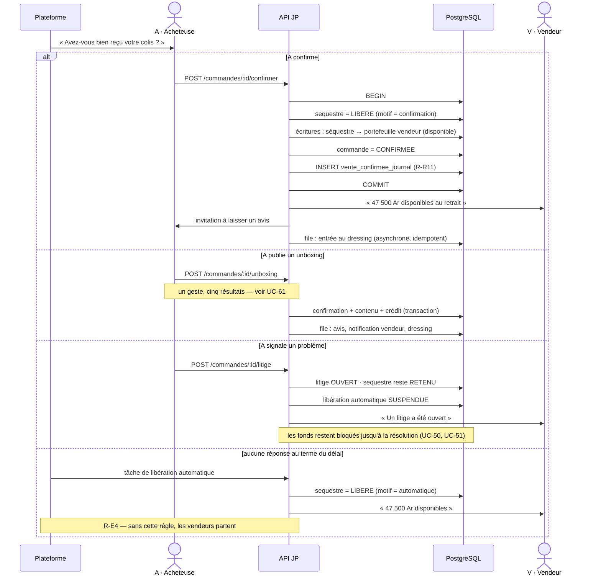
```mermaid
sequenceDiagram
    participant SYS as Plateforme
    actor A as A · Acheteuse
    participant API as API JP
    participant DB as PostgreSQL
    actor V as V · Vendeur

    SYS->>A: « Avez-vous bien reçu votre colis ? »

    alt A confirme
        A->>API: POST /commandes/:id/confirmer
        API->>DB: BEGIN
        API->>DB: sequestre = LIBERE (motif = confirmation)
        API->>DB: écritures : séquestre → portefeuille vendeur (disponible)
        API->>DB: commande = CONFIRMEE
        API->>DB: INSERT vente_confirmee_journal (R-R11)
        API->>DB: COMMIT
        API->>V: « 47 500 Ar disponibles au retrait »
        API->>A: invitation à laisser un avis
        API->>DB: file : entrée au dressing (asynchrone, idempotent)
    else A publie un unboxing
        A->>API: POST /commandes/:id/unboxing
        Note over A,API: un geste, cinq résultats — voir UC-61
        API->>DB: confirmation + contenu + crédit (transaction)
        API->>DB: file : avis, notification vendeur, dressing
    else A signale un problème
        A->>API: POST /commandes/:id/litige
        API->>DB: litige OUVERT · sequestre reste RETENU
        API->>DB: libération automatique SUSPENDUE
        API->>V: « Un litige a été ouvert »
        Note over API,DB: les fonds restent bloqués jusqu'à la résolution (UC-50, UC-51)
    else aucune réponse au terme du délai
        SYS->>API: tâche de libération automatique
        API->>DB: sequestre = LIBERE (motif = automatique)
        API->>V: « 47 500 Ar disponibles »
        Note over SYS,API: R-E4 — sans cette règle, les vendeurs partent
    end
```

---

## UC-32 — Retirer son argent

| | |
|---|---|
| **Acteur principal** | V, ou C pour son portefeuille de créatrice |
| **Fonctionnalités** | F4.8, F15.10 · **Règles** R-E6, R-E8 |
| **Préconditions** | Solde **disponible** non nul, numéro mobile money **vérifié**, retraits non gelés. |
| **Postconditions** | Virement exécuté vers le numéro vérifié, reçu émis, écritures cohérentes. |

**Scénario nominal**
1. V ouvre « Mon argent » et voit **deux soldes distincts** : en attente de confirmation, et disponible au retrait *(R-E6)*.
2. V saisit un montant et confirme.
3. SYS vérifie le solde, la destination et l'absence de gel, puis exécute le virement avec une clé d'idempotence.
4. SYS écrit les écritures et émet un reçu.

**Scénarios alternatifs**
- **A1 — destination différente du numéro vérifié** : refus. C'est la règle qui empêche un détournement de compte de devenir un détournement d'argent.
- **A2 — retraits gelés** *(récupération de compte en cours, `R-C14`)* : refus, avec le motif et le numéro de dossier.
- **A3 — échec du prestataire** : le montant est **remis au solde disponible**, jamais perdu.
- **A4 — frais** : gratuit une fois par semaine, payant au-delà *(paramétrable, `R-O1`)*.

**Diagramme de séquence**

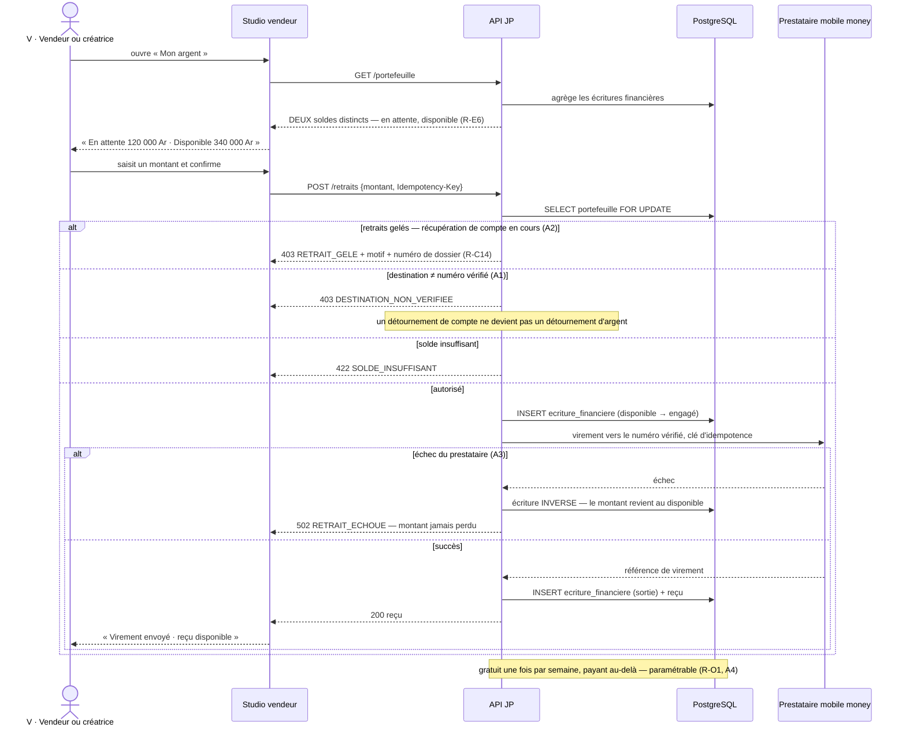
```mermaid
sequenceDiagram
    actor V as V · Vendeur ou créatrice
    participant APP as Studio vendeur
    participant API as API JP
    participant DB as PostgreSQL
    participant PSP as Prestataire mobile money
    V->>APP: ouvre « Mon argent »
    APP->>API: GET /portefeuille
    API->>DB: agrège les écritures financières
    API-->>APP: DEUX soldes distincts — en attente, disponible (R-E6)
    APP-->>V: « En attente 120 000 Ar · Disponible 340 000 Ar »
    V->>APP: saisit un montant et confirme
    APP->>API: POST /retraits {montant, Idempotency-Key}
    API->>DB: SELECT portefeuille FOR UPDATE
    alt retraits gelés — récupération de compte en cours (A2)
        API-->>APP: 403 RETRAIT_GELE + motif + numéro de dossier (R-C14)
    else destination ≠ numéro vérifié (A1)
        API-->>APP: 403 DESTINATION_NON_VERIFIEE
        Note over API: un détournement de compte ne devient pas un détournement d'argent
    else solde insuffisant
        API-->>APP: 422 SOLDE_INSUFFISANT
    else autorisé
        API->>DB: INSERT ecriture_financiere (disponible → engagé)
        API->>PSP: virement vers le numéro vérifié, clé d'idempotence
        alt échec du prestataire (A3)
            PSP-->>API: échec
            API->>DB: écriture INVERSE — le montant revient au disponible
            API-->>APP: 502 RETRAIT_ECHOUE — montant jamais perdu
        else succès
            PSP-->>API: référence de virement
            API->>DB: INSERT ecriture_financiere (sortie) + reçu
            API-->>APP: 200 reçu
            APP-->>V: « Virement envoyé · reçu disponible »
        end
    end
    Note over API,DB: gratuit une fois par semaine, payant au-delà — paramétrable (R-O1, A4)
```

---

# 7. Paquetage Livraison

## UC-40 — Préparer et expédier une commande

| | |
|---|---|
| **Acteur principal** | V, ou VE si le vendeur l'y autorise |
| **Fonctionnalités** | F5.1, F5.2, F5.6 · **Règles** R-L4, R-H8 |
| **Préconditions** | Commande `PAYEE`. |
| **Postconditions** | Colis `PRET`, bordereau émis, statut visible **des deux côtés** *(R-L4)*. |

**Scénario nominal**
1. V ouvre « À préparer » : une **file unique**, triée par échéance, avec un marqueur d'origine *(R-H2)*.
2. V ouvre le bordereau : articles, tailles, mode de livraison, destinataire, montant à encaisser si espèces, note de l'acheteuse.
3. V prépare le colis et marque « Prêt ».
4. SYS met le statut à jour des deux côtés et notifie A.

**Scénarios alternatifs**
- **A1 — refus par le vendeur** *(depuis 3)* : motif **obligatoire**, remboursement **automatique et intégral**, effet sur le score de confiance *(F3.9, F6.2)*.
- **A2 — délai d'acceptation dépassé** *(depuis 3)* : A est notifiée, la réservation est protégée, l'absence de réaction pèse sur le score *(R-H8)*.
- **A3 — plusieurs colis** *(depuis 3)* : regroupement pour un enlèvement en une seule validation *(F5.6)*.
- **A4 — employé** : VE prépare, **sans voir aucun montant** *(R-R8)*.

**Diagramme de séquence**

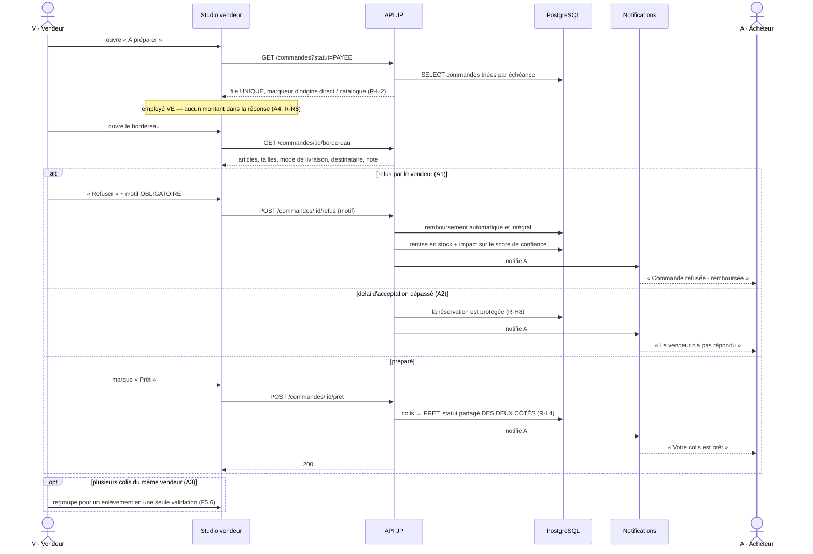
```mermaid
sequenceDiagram
    actor V as V · Vendeur
    participant APP as Studio vendeur
    participant API as API JP
    participant DB as PostgreSQL
    participant NOT as Notifications
    actor A as A · Acheteur
    V->>APP: ouvre « À préparer »
    APP->>API: GET /commandes?statut=PAYEE
    API->>DB: SELECT commandes triées par échéance
    API-->>APP: file UNIQUE, marqueur d'origine direct / catalogue (R-H2)
    Note over APP: employé VE — aucun montant dans la réponse (A4, R-R8)
    V->>APP: ouvre le bordereau
    APP->>API: GET /commandes/:id/bordereau
    API-->>APP: articles, tailles, mode de livraison, destinataire, note
    alt refus par le vendeur (A1)
        V->>APP: « Refuser » + motif OBLIGATOIRE
        APP->>API: POST /commandes/:id/refus {motif}
        API->>DB: remboursement automatique et intégral
        API->>DB: remise en stock + impact sur le score de confiance
        API->>NOT: notifie A
        NOT-->>A: « Commande refusée · remboursée »
    else délai d'acceptation dépassé (A2)
        API->>DB: la réservation est protégée (R-H8)
        API->>NOT: notifie A
        NOT-->>A: « Le vendeur n'a pas répondu »
    else préparé
        V->>APP: marque « Prêt »
        APP->>API: POST /commandes/:id/pret
        API->>DB: colis → PRET, statut partagé DES DEUX CÔTÉS (R-L4)
        API->>NOT: notifie A
        NOT-->>A: « Votre colis est prêt »
        API-->>APP: 200
    end
    opt plusieurs colis du même vendeur (A3)
        V->>APP: regroupe pour un enlèvement en une seule validation (F5.6)
    end
```

---

## UC-41 — Livrer un colis à domicile ★

| | |
|---|---|
| **Acteur principal** | L — livreur |
| **Acteurs secondaires** | A, V, SYS |
| **Fonctionnalités** | F5.5, F5.2, F5.7, F4.3 · **Règles** R-L2, R-L4 |
| **Préconditions** | Colis `ENLEVE`, tournée du jour téléchargée. |
| **Postconditions** | Colis `REMIS` avec **preuve**, espèces enregistrées si applicable, fenêtre de confirmation ouverte *(UC-31)*. |

**Description.** L'application livreur fonctionne **hors ligne par défaut** : la tournée est téléchargée, les actions sont enregistrées localement et synchronisées quand le réseau revient. Une application qui exige une connexion à chaque appui ne sera pas utilisée à moto.

**Scénario nominal**
1. L ouvre sa tournée : enlèvements d'abord, puis remises, dans l'ordre.
2. L arrive chez le vendeur, enlève les colis en **une seule validation** *(F5.6)*.
3. L arrive chez l'acheteuse et appuie sur « Arrivé ».
4. L produit la **preuve de remise** : photo du colis ou code de l'acheteuse.
5. Si paiement à la livraison, L saisit le montant encaissé.
6. SYS enregistre localement, puis synchronise : colis `REMIS`, événement horodaté et attribué, notification à A et à V, ouverture de la fenêtre de confirmation.

**Scénarios alternatifs**
- **A1 — hors réseau** *(à toute étape)* : les actions sont mises en file locale avec une clé d'idempotence ; la synchronisation d'une file rejouée **ne double rien**.
- **A2 — échec de livraison** *(depuis 3)* : motif — absente, refuse, adresse introuvable, injoignable — plus une photo. Le colis part en retour vendeur *(F5.7)* ou en nouvelle tentative.
- **A3 — montant encaissé différent du montant dû** *(depuis 5)* : l'écart est **signalé**, jamais absorbé silencieusement *(F11.5)*.

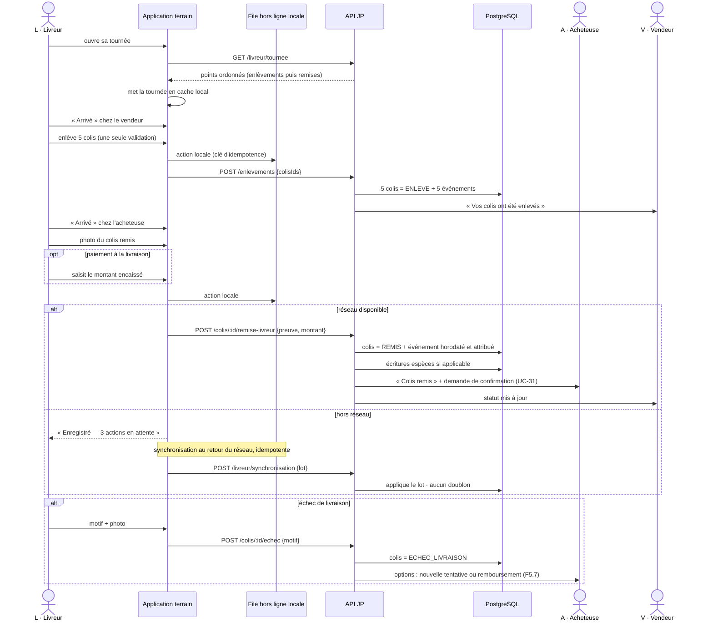
```mermaid
sequenceDiagram
    actor L as L · Livreur
    participant TER as Application terrain
    participant FILE as File hors ligne locale
    participant API as API JP
    participant DB as PostgreSQL
    actor A as A · Acheteuse
    actor V as V · Vendeur

    L->>TER: ouvre sa tournée
    TER->>API: GET /livreur/tournee
    API-->>TER: points ordonnés (enlèvements puis remises)
    TER->>TER: met la tournée en cache local

    L->>TER: « Arrivé » chez le vendeur
    L->>TER: enlève 5 colis (une seule validation)
    TER->>FILE: action locale (clé d'idempotence)
    TER->>API: POST /enlevements {colisIds}
    API->>DB: 5 colis = ENLEVE + 5 événements
    API->>V: « Vos colis ont été enlevés »

    L->>TER: « Arrivé » chez l'acheteuse
    L->>TER: photo du colis remis
    opt paiement à la livraison
        L->>TER: saisit le montant encaissé
    end
    TER->>FILE: action locale

    alt réseau disponible
        TER->>API: POST /colis/:id/remise-livreur {preuve, montant}
        API->>DB: colis = REMIS + événement horodaté et attribué
        API->>DB: écritures espèces si applicable
        API->>A: « Colis remis » + demande de confirmation (UC-31)
        API->>V: statut mis à jour
    else hors réseau
        TER-->>L: « Enregistré — 3 actions en attente »
        Note over TER,FILE: synchronisation au retour du réseau, idempotente
        TER->>API: POST /livreur/synchronisation {lot}
        API->>DB: applique le lot · aucun doublon
    end

    alt échec de livraison
        L->>TER: motif + photo
        TER->>API: POST /colis/:id/echec {motif}
        API->>DB: colis = ECHEC_LIVRAISON
        API->>A: options : nouvelle tentative ou remboursement (F5.7)
    end
```

---

## UC-42 — Recevoir et remettre un colis au point relais ★

| | |
|---|---|
| **Acteur principal** | PR — point relais |
| **Acteurs secondaires** | A, L, SYS, NOT |
| **Fonctionnalités** | F5.3, F5.4, F5.10 · **Règles** R-L5, R-L6, R-L7 |
| **Préconditions** | Colis déposé par le livreur, relais actif et non saturé. |
| **Postconditions** | Colis `REMIS` contre code à **usage unique**, ou retour vendeur au terme du délai de garde. |

**Description.** Le code de retrait est **la notification la plus critique du produit** : repli SMS obligatoire *(R-L6)* et consultation **hors ligne** *(F13.5)* — l'acheteuse est devant l'épicerie, souvent sans données.

**Scénario nominal**
1. PR reçoit les colis du livreur en **une seule validation**.
2. SYS génère un code à 6 chiffres, le **hache**, et l'envoie à A **par notification et par SMS**.
3. A se présente au relais quand elle veut et donne le code.
4. PR saisit le code ; SYS vérifie, marque le code consommé, passe le colis à `REMIS`.
5. SYS notifie A et V, et ouvre la fenêtre de confirmation *(UC-31)*.

**Scénarios alternatifs**
- **A1 — code déjà utilisé** *(depuis 4)* : refus, **avec la date de la première utilisation**.
- **A2 — code inconnu** *(depuis 4)* : refus explicite.
- **A3 — deux remises simultanées avec le même code** : une seule réussit *(transaction)*.
- **A4 — délai de garde dépassé** *(depuis 3)* : le colis repart chez le vendeur *(F5.7)*, A est notifiée.
- **A5 — relais saturé** *(depuis 1)* : le relais **n'apparaît plus** dans les choix de livraison, mais reste opérationnel pour les colis déjà présents *(F11.4)*.

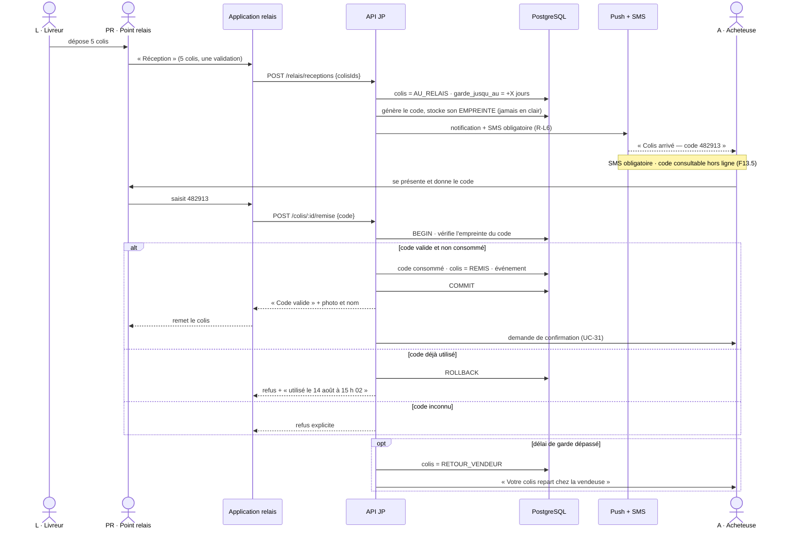
```mermaid
sequenceDiagram
    actor L as L · Livreur
    actor PR as PR · Point relais
    participant TER as Application relais
    participant API as API JP
    participant DB as PostgreSQL
    participant NOT as Push + SMS
    actor A as A · Acheteuse

    L->>PR: dépose 5 colis
    PR->>TER: « Réception » (5 colis, une validation)
    TER->>API: POST /relais/receptions {colisIds}
    API->>DB: colis = AU_RELAIS · garde_jusqu_au = +X jours
    API->>DB: génère le code, stocke son EMPREINTE (jamais en clair)
    API->>NOT: notification + SMS obligatoire (R-L6)
    NOT-->>A: « Colis arrivé — code 482913 »
    Note over NOT,A: SMS obligatoire · code consultable hors ligne (F13.5)

    A->>PR: se présente et donne le code
    PR->>TER: saisit 482913
    TER->>API: POST /colis/:id/remise {code}
    API->>DB: BEGIN · vérifie l'empreinte du code
    alt code valide et non consommé
        API->>DB: code consommé · colis = REMIS · événement
        API->>DB: COMMIT
        API-->>TER: « Code valide » + photo et nom
        TER-->>PR: remet le colis
        API->>A: demande de confirmation (UC-31)
    else code déjà utilisé
        API->>DB: ROLLBACK
        API-->>TER: refus + « utilisé le 14 août à 15 h 02 »
    else code inconnu
        API-->>TER: refus explicite
    end

    opt délai de garde dépassé
        API->>DB: colis = RETOUR_VENDEUR
        API->>A: « Votre colis repart chez la vendeuse »
    end
```

---

# 8. Paquetage Confiance

## UC-50 — Ouvrir un litige sur une commande ★

| | |
|---|---|
| **Acteur principal** | A |
| **Acteurs secondaires** | V, OP, SYS |
| **Fonctionnalités** | F6.3, F6.4 · **Règles** R-T1 à R-T4 · **Recette RB4** |
| **Préconditions** | Une commande livrée ou en cours, dont les fonds sont encore séquestrés. |
| **Postconditions** | Dossier ouvert, **fonds bloqués**, libération automatique suspendue. |

**Description.** Point culturel déterminant : **le litige se signale à JP, jamais en face à face avec le vendeur**. Cela évite la confrontation, socialement coûteuse, qui fait qu'on abandonne au lieu de réclamer.

**Scénario nominal**
1. A ouvre sa commande et choisit « Il y a un problème ».
2. A choisit un motif — non reçu, abîmé, pas conforme, mauvaise taille, autre — ajoute des photos et une description.
3. SYS ouvre le dossier, **bloque les fonds**, suspend la libération automatique, attribue un numéro.
4. SYS notifie V, qui voit le motif et les photos, et répond **dans le même fil**.
5. V propose une solution : renvoi, remboursement partiel, geste commercial.
6. A accepte : **le dossier se clôt sans arbitrage** et la solution est exécutée.

**Scénarios alternatifs**
- **A1 — pas d'accord sous 48 h** *(depuis 5)* : SYS escalade en arbitrage *(UC-51)*, une seule fois, et notifie les deux parties.
- **A2 — A refuse la proposition** *(depuis 6)* : la discussion continue jusqu'à l'échéance, puis arbitrage.
- **A3 — commande hors direct** : parcours **identique** *(R-H1)*.

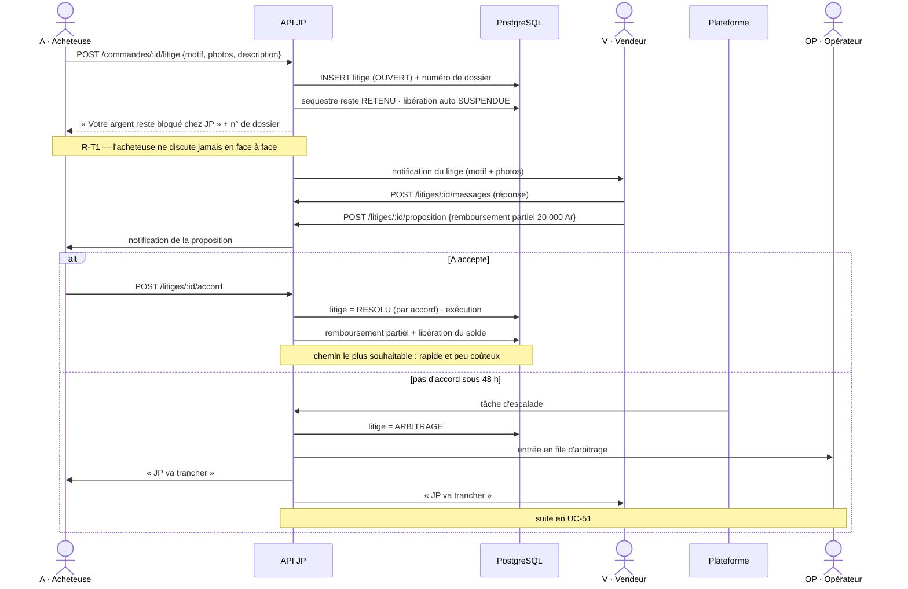
```mermaid
sequenceDiagram
    actor A as A · Acheteuse
    participant API as API JP
    participant DB as PostgreSQL
    actor V as V · Vendeur
    participant SYS as Plateforme
    actor OP as OP · Opérateur

    A->>API: POST /commandes/:id/litige {motif, photos, description}
    API->>DB: INSERT litige (OUVERT) + numéro de dossier
    API->>DB: sequestre reste RETENU · libération auto SUSPENDUE
    API-->>A: « Votre argent reste bloqué chez JP » + n° de dossier
    Note over API,A: R-T1 — l'acheteuse ne discute jamais en face à face

    API->>V: notification du litige (motif + photos)
    V->>API: POST /litiges/:id/messages (réponse)
    V->>API: POST /litiges/:id/proposition {remboursement partiel 20 000 Ar}
    API->>A: notification de la proposition

    alt A accepte
        A->>API: POST /litiges/:id/accord
        API->>DB: litige = RESOLU (par accord) · exécution
        API->>DB: remboursement partiel + libération du solde
        Note over API,DB: chemin le plus souhaitable : rapide et peu coûteux
    else pas d'accord sous 48 h
        SYS->>API: tâche d'escalade
        API->>DB: litige = ARBITRAGE
        API->>OP: entrée en file d'arbitrage
        API->>A: « JP va trancher »
        API->>V: « JP va trancher »
        Note over API,OP: suite en UC-51
    end
```

---

## UC-51 — Arbitrer un litige ★

| | |
|---|---|
| **Acteur principal** | OP |
| **Acteurs secondaires** | A, V, SYS |
| **Fonctionnalités** | F6.5, F6.6, F11.3 · **Règles** R-T2, R-T5 · **Recette RB4** |
| **Préconditions** | Litige en statut `arbitrage`. |
| **Postconditions** | **Décision écrite, motivée, notifiée aux deux parties**, exécutée automatiquement, archivée et versée aux scores. |

**Description.** Ce que l'épique 6 apporte, ce n'est pas la collecte de preuves — c'est leur **assemblage**. Le dossier d'instruction réunit ce que les autres modules ont déjà produit : événements de livraison horodatés et attribués, preuve de remise, journal financier, transcription du fil, historique des deux parties.

**Scénario nominal**
1. OP ouvre la file, triée par âge, urgences en tête.
2. OP s'attribue le dossier — **affectation exclusive**, pour éviter le double traitement.
3. SYS présente le dossier assemblé.
4. OP tranche et **rédige un motif** — obligatoire, refusé par la base sinon.
5. SYS exécute : remboursement total, partiel, ou libération des fonds au vendeur.
6. SYS notifie les deux parties avec la décision écrite, archive, et met à jour les scores *(F6.2)*.

**Scénarios alternatifs**
- **A1 — décision sans motif** *(depuis 4)* : **refusée par la contrainte de base** `decision_motivee`. La clôture silencieuse est impossible.
- **A2 — dossier approchant l'engagement** *(depuis 1)* : il remonte en tête de file et déclenche une alerte.
- **A3 — un second opérateur ouvre le même dossier** *(depuis 2)* : conflit d'affectation signalé.

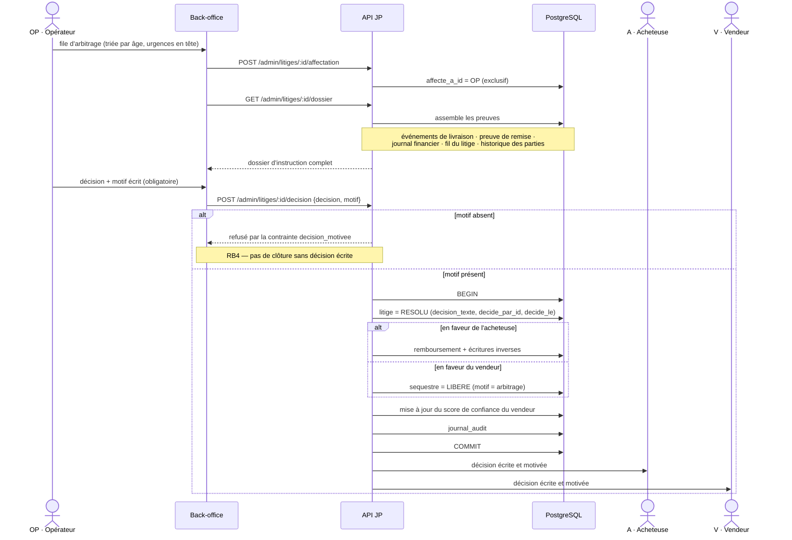
```mermaid
sequenceDiagram
    actor OP as OP · Opérateur
    participant BO as Back-office
    participant API as API JP
    participant DB as PostgreSQL
    actor A as A · Acheteuse
    actor V as V · Vendeur

    OP->>BO: file d'arbitrage (triée par âge, urgences en tête)
    BO->>API: POST /admin/litiges/:id/affectation
    API->>DB: affecte_a_id = OP (exclusif)
    BO->>API: GET /admin/litiges/:id/dossier
    API->>DB: assemble les preuves
    Note over API,DB: événements de livraison · preuve de remise ·<br/>journal financier · fil du litige · historique des parties
    API-->>BO: dossier d'instruction complet

    OP->>BO: décision + motif écrit (obligatoire)
    BO->>API: POST /admin/litiges/:id/decision {decision, motif}

    alt motif absent
        API-->>BO: refusé par la contrainte decision_motivee
        Note over API,BO: RB4 — pas de clôture sans décision écrite
    else motif présent
        API->>DB: BEGIN
        API->>DB: litige = RESOLU (decision_texte, decide_par_id, decide_le)
        alt en faveur de l'acheteuse
            API->>DB: remboursement + écritures inverses
        else en faveur du vendeur
            API->>DB: sequestre = LIBERE (motif = arbitrage)
        end
        API->>DB: mise à jour du score de confiance du vendeur
        API->>DB: journal_audit
        API->>DB: COMMIT
        API->>A: décision écrite et motivée
        API->>V: décision écrite et motivée
    end
```

---

## UC-52 — Vérifier l'identité d'un vendeur

| | |
|---|---|
| **Acteur principal** | OP |
| **Acteurs secondaires** | V, P, C, SYS |
| **Fonctionnalités** | F0.6, F11.1, F15.1 · **Règles** R-V1 à R-V6 · **Recette RB6** |
| **Préconditions** | Dossier soumis : pièce d'identité recto/verso ou NIF/STAT, selfie, numéro mobile money, adresse d'enlèvement. |
| **Postconditions** | Encaissement débloqué et badge attribué, ou refus **motivé et précis sur ce qui manque** *(R-V3)*. |

**Scénario nominal**
1. OP ouvre la file de vérification, triée par ancienneté, avec le délai d'engagement affiché.
2. OP compare **pièce, selfie et titulaire du compte mobile money** *(R-V2)* — chaque point à cocher explicitement.
3. SYS **journalise l'accès aux documents**, nominativement *(R-V5, N3.1)*.
4. OP valide. SYS débloque l'encaissement et attribue le badge *(F0.7)*.

**Scénarios alternatifs**
- **A1 — discordance de noms** *(depuis 2)* : refus *(R-V2)*.
- **A2 — pièce illisible** *(depuis 2)* : demande de pièce complémentaire, statut intermédiaire, notification.
- **A3 — mineur** *(depuis 2)* : refus **définitif** *(R-V6, RB6)*.
- **A4 — pendant l'instruction** : le vendeur **peut** préparer son catalogue, il ne peut ni publier, ni diffuser, ni encaisser *(R-V1)*.

**Diagramme de séquence**

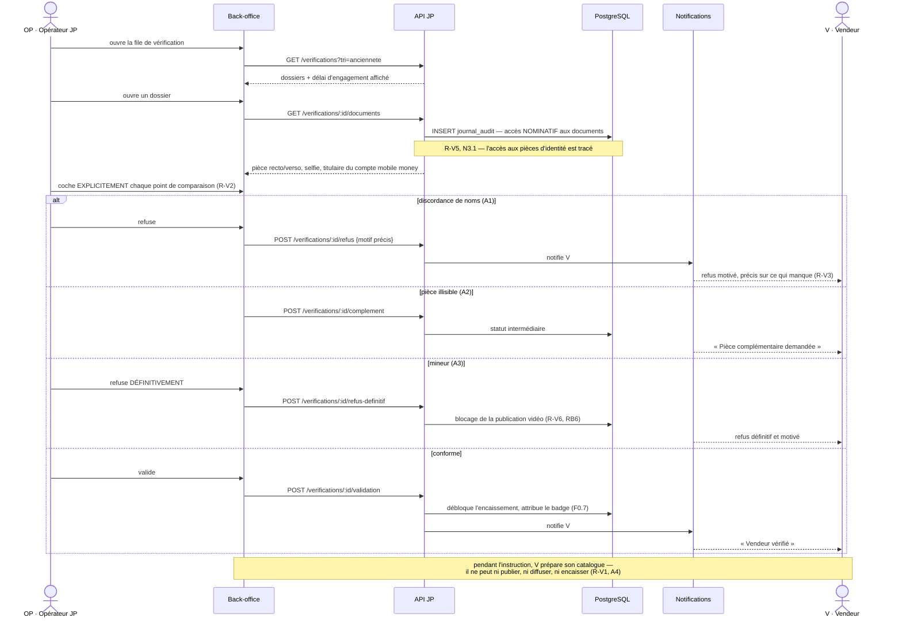
```mermaid
sequenceDiagram
    actor OP as OP · Opérateur JP
    participant BO as Back-office
    participant API as API JP
    participant DB as PostgreSQL
    participant NOT as Notifications
    actor V as V · Vendeur
    OP->>BO: ouvre la file de vérification
    BO->>API: GET /verifications?tri=anciennete
    API-->>BO: dossiers + délai d'engagement affiché
    OP->>BO: ouvre un dossier
    BO->>API: GET /verifications/:id/documents
    API->>DB: INSERT journal_audit — accès NOMINATIF aux documents
    Note over API,DB: R-V5, N3.1 — l'accès aux pièces d'identité est tracé
    API-->>BO: pièce recto/verso, selfie, titulaire du compte mobile money
    OP->>BO: coche EXPLICITEMENT chaque point de comparaison (R-V2)
    alt discordance de noms (A1)
        OP->>BO: refuse
        BO->>API: POST /verifications/:id/refus {motif précis}
        API->>NOT: notifie V
        NOT-->>V: refus motivé, précis sur ce qui manque (R-V3)
    else pièce illisible (A2)
        BO->>API: POST /verifications/:id/complement
        API->>DB: statut intermédiaire
        NOT-->>V: « Pièce complémentaire demandée »
    else mineur (A3)
        OP->>BO: refuse DÉFINITIVEMENT
        BO->>API: POST /verifications/:id/refus-definitif
        API->>DB: blocage de la publication vidéo (R-V6, RB6)
        NOT-->>V: refus définitif et motivé
    else conforme
        OP->>BO: valide
        BO->>API: POST /verifications/:id/validation
        API->>DB: débloque l'encaissement, attribue le badge (F0.7)
        API->>NOT: notifie V
        NOT-->>V: « Vendeur vérifié »
    end
    Note over V,BO: pendant l'instruction, V prépare son catalogue —<br/>il ne peut ni publier, ni diffuser, ni encaisser (R-V1, A4)
```

---

# 9. Paquetage Social, fidélité et contenu

## UC-60 — Suivre une boutique et recevoir ses nouveautés

| | |
|---|---|
| **Acteur principal** | A |
| **Fonctionnalités** | F7.1, F7.15, F7.17 · **Stories** US-SOCIAL-01, 02, 05 · **Règles** R-Q1 à R-Q6 |
| **Préconditions** | Aucune pour consulter ; un compte pour suivre. |
| **Postconditions** | Abonnement enregistré, fil « Abonnements » alimenté, réglage de notification par vendeur disponible. |

**Scénario nominal**
1. A appuie sur « Suivre » depuis une vitrine, une fiche, un direct, un clip ou une story — **un seul appui, aucune confirmation** *(R-Q1)*.
2. SYS enregistre l'abonnement et met à jour le compteur public *(R-Q2)*.
3. Le fil « Abonnements » de A contient désormais les directs, **les nouveautés catalogue**, les promotions et les événements de cette boutique *(R-Q5)*.
4. A peut **couper les notifications de promotion** de cette boutique sans se désabonner *(R-Q6)*.

**Scénarios alternatifs**
- **A1 — non connectée** *(depuis 1)* : l'inscription est déclenchée et **l'abonnement est posé après connexion**.
- **A2 — hors ligne** *(depuis 1)* : l'état s'affiche localement, se synchronise à la reconnexion, **sans doublon** (clé primaire composite).
- **A3 — vendeur suspendu** *(depuis 1)* : action indisponible, état expliqué.

**Diagramme de séquence**

```mermaid
sequenceDiagram
    actor A as A · Acheteur
    participant APP as Application
    participant API as API JP
    participant DB as PostgreSQL
    A->>APP: appuie sur « Suivre » (vitrine, fiche, direct, clip ou story)
    Note over APP: un seul appui, AUCUNE confirmation (R-Q1)
    alt non connectée (A1)
        APP-->>A: parcours d'inscription (UC-01)
        A->>APP: compte créé
        APP->>API: POST /abonnements — posé APRÈS la connexion
    else hors ligne (A2)
        APP->>APP: état affiché localement, mis en file
        APP->>API: synchronisation à la reconnexion
        API->>DB: INSERT abonnement — clé composite, AUCUN doublon
    else connectée
        APP->>API: POST /abonnements {vendeur}
    end
    alt vendeur suspendu (A3)
        API-->>APP: 409 VENDEUR_SUSPENDU
        APP-->>A: action indisponible, état expliqué
    else
        API->>DB: INSERT abonnement
        API->>DB: incrémente le compteur public (R-Q2)
        API-->>APP: 201
        APP-->>A: « Abonnée » + compteur à jour
    end
    A->>APP: ouvre le fil « Abonnements »
    APP->>API: GET /fil/abonnements
    API->>DB: directs + NOUVEAUTÉS CATALOGUE + promotions + événements (R-Q5)
    API-->>APP: 200 fil
    opt couper les notifications de promotion sans se désabonner (R-Q6)
        A->>APP: règle par vendeur
        APP->>API: PUT /abonnements/:id/notifications {promotions: false}
        API-->>APP: 200 — l'abonnement est conservé
    end
```

---

## UC-61 — Publier un unboxing ★

| | |
|---|---|
| **Acteur principal** | A |
| **Acteurs secondaires** | V, SYS |
| **Fonctionnalités** | F14.7, F4.5, F6.1, F17.13 · **Règles** R-K2, R-T7 |
| **Préconditions** | Une commande livrée, non encore confirmée. |
| **Postconditions** | **Cinq effets** : réception confirmée, avis vérifié créé, contenu publié, cagnotte créditée, preuve publique que JP livre. |

**Description.** Le geste le plus important de la couche sociale : **une action, cinq résultats**.

**Le point technique** : les cinq effets doivent être **atomiques du point de vue de l'utilisatrice** mais **résilients individuellement**. Si la création de l'avis échoue, la confirmation de réception ne doit pas être annulée — sinon un bogue d'avis bloque le paiement du vendeur.

**Scénario nominal**
1. SYS notifie A à l'arrivée du colis : *« Filmez l'ouverture et gagnez X Ar de crédit »*.
2. A enregistre une vidéo de 30 s ; **l'article de sa commande est attaché automatiquement** *(R-K2)*.
3. A indique si l'article taille bien et met une note.
4. SYS, **en transaction** : confirme la réception *(donc libère le séquestre)*, crée le contenu avec l'article attaché, crédite la cagnotte.
5. SYS, **en asynchrone idempotent** : crée l'avis vérifié, notifie le vendeur, fait entrer l'article au dressing.

**Scénarios alternatifs**
- **A1 — sans vidéo** *(depuis 1)* : la confirmation classique en un appui reste toujours disponible *(UC-31)*. **On n'oblige personne à se filmer** — et cette règle n'est pas négociable sur un produit qui expose de jeunes femmes.
- **A2 — échec de la création de l'avis** *(depuis 5)* : la confirmation et le crédit **sont conservés**, l'avis est rejoué.
- **A3 — contenu retiré par la modération** *(après 5)* : le crédit est **repris par écriture inverse**, l'avis est conservé s'il repose sur un achat réel *(F19.6)*.

```mermaid
sequenceDiagram
    participant SYS as Plateforme
    actor A as A · Acheteuse
    participant APP as Application
    participant API as API JP
    participant DB as PostgreSQL
    participant JOB as File asynchrone
    actor V as V · Vendeur

    SYS->>A: « Votre colis est arrivé — filmez et gagnez 2 000 Ar »
    A->>APP: enregistre 30 s
    Note over APP: l'article de la commande est attaché automatiquement (R-K2)
    A->>APP: note de taille + étoiles
    APP->>API: POST /commandes/:id/unboxing

    API->>DB: BEGIN
    API->>DB: 1 · commande = CONFIRMEE, sequestre = LIBERE
    API->>DB: 2 · INSERT contenu (type=unboxing) + contenu_article
    API->>DB: 3 · crédit de cagnotte (unique par commande)
    API->>DB: COMMIT
    API-->>A: « Merci ! » + les 4 résultats affichés

    API->>JOB: effets asynchrones
    JOB->>DB: 4 · INSERT avis vérifié (avec la note de taille)
    JOB->>V: 5 · « Hanta a publié son unboxing »
    JOB->>DB: entrée au dressing (F17.10)

    Note over JOB,DB: si un effet échoue, il est rejoué —<br/>la confirmation et le crédit ne sont jamais annulés

    alt chemin sans vidéo
        A->>API: POST /commandes/:id/confirmer
        API->>DB: confirmation seule, PAS de crédit
        Note over A,API: on n'oblige personne à se filmer
    end
```

---

## UC-62 — Consulter ses clientes et leur rang

| | |
|---|---|
| **Acteur principal** | V |
| **Acteurs secondaires** | VE (lecture, **sans les montants**), SYS |
| **Fonctionnalités** | F7.5, F7.6, F7.18, F7.19 · **Stories** US-FID-01 à 05 · **Règles** R-R1 à R-R11 |
| **Préconditions** | Au moins une commande confirmée. Fidélisation activée pour les paliers. |
| **Postconditions** | Liste ordonnée et **actionnable** : offrir une promo, envoyer un code. |

**Description.** Ce que le vendeur veut savoir : **à qui faire un geste**. Pas un tableau de bord analytique — une liste de noms, ordonnée, avec une action à côté de chaque ligne *(R-R7)*.

**Scénario nominal**
1. SYS recalcule le rang à chaque commande confirmée, **en asynchrone**, sur quatre composantes : montant cumulé, fréquence, récence avec décote, fiabilité *(R-R3)*.
2. V ouvre « Mes clientes » : liste ordonnée par rang, filtrable par palier et par inactivité.
3. V ouvre une fiche : historique, tailles achetées, articles préférés, litiges, **note privée**.
4. V agit : « Offrir une promo » *(UC-71)* ou « Envoyer un code » *(F7.9)*.

**Scénarios alternatifs**
- **A1 — moins de 5 clientes** *(depuis 2)* : la liste s'affiche **sans palmarès** *(R-R6)*. Un classement à trois lignes décrédibilise la fonctionnalité.
- **A2 — employé** *(depuis 2)* : lecture seule, **montants absents de la réponse** *(R-R8)*.
- **A3 — cliente ayant supprimé son compte** : ligne **anonymisée**, agrégats conservés pour la comptabilité.
- **A4 — cliente perdant un palier par décote** : elle est **informée avant** la bascule *(R-R10)*.

**Règle non négociable** *(R-R1)* : le rang est **par vendeur**, jamais global. Un vendeur n'a aucune raison de connaître les dépenses de sa cliente ailleurs — et **la garantie est structurelle** : aucun index, aucune vue ne permet l'agrégation inter-vendeurs.

**Diagramme de séquence**

```mermaid
sequenceDiagram
    participant JOB as Travailleur « rang client »
    participant DB as PostgreSQL
    actor V as V · Vendeur
    participant APP as Studio vendeur
    participant API as API JP
    Note over JOB,DB: à chaque commande confirmée, en ASYNCHRONE
    JOB->>DB: recalcule — montant cumulé, fréquence, récence décotée, fiabilité (R-R3)
    JOB->>DB: UPDATE rang_client (vendeur_id, utilisateur_id)
    Note over DB: par vendeur, JAMAIS global —<br/>aucun index, aucune vue inter-vendeurs (R-R1)
    V->>APP: ouvre « Mes clientes »
    APP->>API: GET /vendeurs/:id/clients
    API->>DB: SELECT rang_client ORDER BY score DESC
    alt moins de 5 clientes (A1)
        API-->>APP: liste SANS palmarès (R-R6)
        APP-->>V: liste simple
    else employé VE (A2)
        API-->>APP: lecture seule — montants ABSENTS de la réponse (R-R8)
    else
        API-->>APP: liste ordonnée, filtrable par palier et par inactivité
        APP-->>V: une liste de noms, une action par ligne (R-R7)
    end
    V->>APP: ouvre une fiche cliente
    APP->>API: GET /vendeurs/:id/clients/:uid
    API->>DB: historique, tailles, articles préférés, litiges, note privée
    alt cliente ayant supprimé son compte (A3)
        API-->>APP: ligne ANONYMISÉE, agrégats conservés pour la comptabilité
    else
        API-->>APP: 200 fiche
    end
    V->>APP: « Offrir une promo » (UC-71) ou « Envoyer un code » (F7.9)
    opt palier perdu par décote (A4)
        JOB->>DB: détecte la bascule à venir
        JOB->>DB: notifie la cliente AVANT la bascule (R-R10)
    end
```

---

## UC-92 — Publier un contenu avec articles attachés

| | |
|---|---|
| **Acteur principal** | C, V ou A selon le type |
| **Fonctionnalités** | F14.5, F14.1, F14.2, F14.6 · **Règles** R-K1 · **Recette RB5** |
| **Préconditions** | Selon le rôle : son catalogue pour V, tout catalogue autorisant l'affiliation pour C, **ses achats confirmés** pour A. |
| **Postconditions** | Contenu publié avec **au moins un article achetable**. |

**Scénario nominal**
1. L'acteur choisit un média et rédige une légende.
2. L'acteur attache un ou plusieurs articles, **selon le catalogue autorisé pour son rôle**.
3. SYS refuse la publication si aucun article n'est attaché — **côté client, côté API, et par contrainte différée en base** *(RB5)*.
4. SYS publie ; le contenu porte l'identifiant de la créatrice le cas échéant, ce qui rattache la vente *(F15.4)*.

**Scénarios alternatifs**
- **A1 — aucun article attaché** : `422 CONTENU_SANS_ARTICLE`. Le bouton est déjà inactif côté client, mais **le client n'est pas la garantie**.
- **A2 — créatrice, vendeur refusant l'affiliation** : attachement refusé *(R-N3)*.
- **A3 — acheteuse, article non acheté** : attachement refusé — impossible d'attacher ce qu'on n'a pas reçu.
- **A4 — contenu sponsorisé** : l'étiquette « Partenariat rémunéré » est **automatique et non retirable** *(F18.8)*.

**Diagramme de séquence**

```mermaid
sequenceDiagram
    actor U as C, V ou A selon le type
    participant APP as Application
    participant API as API JP
    participant DB as PostgreSQL
    U->>APP: choisit un média, rédige une légende
    U->>APP: attache un ou plusieurs articles
    APP->>API: GET /articles/attachables
    API->>DB: catalogue autorisé SELON LE RÔLE
    Note over API: V son catalogue · C tout catalogue affiliable ·<br/>A ses achats confirmés uniquement
    API-->>APP: liste filtrée
    alt créatrice, vendeur refusant l'affiliation (A2)
        API-->>APP: 403 AFFILIATION_REFUSEE (R-N3)
    else acheteuse, article non acheté (A3)
        API-->>APP: 403 ARTICLE_NON_ACHETE
    end
    U->>APP: « Publier »
    alt aucun article attaché (A1)
        APP-->>U: le bouton est déjà inactif
        APP->>API: POST /contenus {articles: []}
        API-->>APP: 422 CONTENU_SANS_ARTICLE
        Note over APP,API: le client n'est pas la garantie —<br/>l'API refuse, et la contrainte différée refuserait l'écriture (RB5)
    else au moins un article
        API->>DB: BEGIN
        API->>DB: INSERT contenu
        API->>DB: INSERT contenu_article ×n
        API->>DB: COMMIT — contrainte différée vérifiée au commit
        API-->>APP: 201 publié
    end
    opt contenu sponsorisé (A4)
        API->>DB: étiquette « Partenariat rémunéré », automatique et NON retirable (F18.8)
    end
    opt publication d'une créatrice
        API->>DB: identifiant de créatrice porté par le contenu — rattache la vente (F15.4)
    end
```

---

# 10. Paquetage Promotions et événements

## UC-70 — Lancer une promotion et notifier ses abonnés ★

| | |
|---|---|
| **Acteur principal** | V |
| **Acteurs secondaires** | A (abonnés), NOT, SYS |
| **Fonctionnalités** | F7.22, F7.23, F7.26, F7.8 · **Stories** US-PROMO-01, 02, 03, 07 |
| **Règles** | R-U1 à R-U4, R-U10 à R-U12 |
| **Préconditions** | Vendeur avec un catalogue. **L'employé n'y a pas accès** *(matrice §3.2)*. |
| **Postconditions** | Promotion active, prix barrés affichés, abonnés notifiés **dans la limite des plafonds**. |

**Scénario nominal**
1. V choisit type, valeur, période, périmètre et cible.
2. SYS détecte un éventuel **chevauchement** avec une promotion existante et rappelle la règle de non-cumul *(R-U7)*.
3. SYS affiche **le net qui restera au vendeur** sur un article représentatif, commission déduite *(R-U10)*.
4. SYS annonce le nombre d'abonnés qui seront notifiés, avec un interrupteur pour ne pas notifier.
5. V lance. SYS active la promotion, applique les prix barrés, et déclenche le fan-out de notification.
6. NOT applique, **pour chaque abonné** : réglage individuel, plafond par vendeur et par 24 h, seuil de regroupement *(R-U4)*.
7. SYS marque `notifiee_le` — **verrou d'idempotence** : après un incident, la promotion ne renotifie pas *(R-U3)*.
8. À la date de fin, SYS **rétablit automatiquement** les prix d'origine *(R-U11)*.

**Scénarios alternatifs**
- **A1 — programmée** *(depuis 5)* : statut `programmee`, bascule automatique à la date, notification **une seule fois**.
- **A2 — valeur rendant le prix nul ou négatif** *(depuis 1)* : refus *(R-U12)*. Au-delà d'un seuil élevé, confirmation explicite.
- **A3 — modification après le début** : **refusée**, sauf annulation *(machine à états)*. Les commandes passées conservent leur prix figé *(R-U9)*.
- **A4 — seconde promotion dans les 24 h** *(depuis 6)* : **aucune seconde notification**, et V est averti **avant** de valider.

```mermaid
sequenceDiagram
    actor V as V · Vendeur
    participant APP as Application
    participant API as API JP
    participant DB as PostgreSQL
    participant JOB as Tâche planifiée
    participant NOT as Service notification
    actor A1 as A · abonnée
    actor A2 as A · abonnée (promos coupées)

    V->>APP: type, valeur, période, périmètre, cible
    APP->>API: POST /vendeur/promotions
    API->>DB: détection de chevauchement (R-U7)
    API-->>APP: avertissement + règle « une seule remise, la plus favorable »
    API-->>APP: aperçu du net vendeur (R-U10)
    APP-->>V: « Robe 50 000 → 40 000 Ar · commission 2 000 · vous recevez 38 000 »
    APP-->>V: « Vos 1 240 abonnés seront prévenus » + interrupteur
    V->>APP: « Lancer la promotion »
    APP->>API: confirmation
    API->>DB: promotion ACTIVE (notifiee_le = NULL)

    API->>JOB: fan-out de notification par lots
    loop pour chaque abonné
        JOB->>NOT: envoyer(abonné, promo)
        NOT->>DB: réglage individuel ? (R-Q6)
        NOT->>DB: plafond vendeur / 24 h ? (R-U4)
        NOT->>DB: seuil de regroupement atteint ?
        alt autorisé
            NOT-->>A1: « Miora lance -20 % jusqu'à dimanche »
        else promos coupées par l'abonnée
            NOT--xA2: rien (elle reste abonnée)
        else plus de 3 promos ce jour
            NOT-->>A1: message groupé « 4 boutiques en promotion »
        end
    end
    JOB->>DB: promotion.notifiee_le = now()
    Note over JOB,DB: R-U3 — verrou d'idempotence : jamais deux notifications

    Note over JOB,DB: à la date de fin
    JOB->>DB: promotion TERMINEE · prix d'origine rétablis (R-U11)
```

---

## UC-71 — Offrir une promotion réservée aux clientes VIP

| | |
|---|---|
| **Acteur principal** | V |
| **Fonctionnalités** | F7.24, F7.9, F7.25 · **Story** US-PROMO-04 · **Règles** R-U5, R-R9 |
| **Préconditions** | Fidélisation activée, paliers définis, au moins une cliente au palier visé. |
| **Postconditions** | Promotion visible et applicable **seulement** par les clientes éligibles ; visible mais **grisée** pour les autres. |

**Scénario nominal**
1. V sélectionne un palier depuis « Mes clientes » *(UC-62)*.
2. V crée une promotion réservée à ce palier et aux palier supérieurs.
3. Les clientes éligibles la voient nommément : *« Offre réservée aux clientes VIP de Miora »*.
4. SYS vérifie l'éligibilité **côté serveur** au calcul du panier *(R-U5)*.

**Scénarios alternatifs**
- **A1 — cliente non éligible** : la promotion est **visible mais grisée**, avec la progression nécessaire *(décision F7.24)*. Un palier ne motive que si l'on sait ce qu'on y gagne.
- **A2 — perte du palier entre la réservation et le paiement** : la remise est retirée avec un message clair, **la commande n'échoue pas** *(R-U5)*.
- **A3 — code nominatif** : usage unique, refusé pour une autre personne ; **restitué si la commande est annulée** *(R-U6)*.

**Diagramme de séquence**

```mermaid
sequenceDiagram
    actor V as V · Vendeur
    participant APP as Studio vendeur
    participant API as API JP
    participant DB as PostgreSQL
    actor A as A · Cliente
    V->>APP: depuis « Mes clientes » (UC-62), sélectionne un palier
    V->>APP: crée une promotion réservée à ce palier et aux supérieurs
    APP->>API: POST /promotions {cible: palier, palier_min}
    API->>DB: INSERT promotion (cible = palier)
    API-->>APP: 201
    A->>APP: ouvre la boutique
    APP->>API: GET /promotions/mes-offres
    API->>DB: SELECT rang_client de A CHEZ CE VENDEUR
    alt cliente éligible
        API-->>APP: offre nommée « Offre réservée aux clientes VIP de Miora »
    else non éligible (A1)
        API-->>APP: offre VISIBLE mais grisée + progression restante
        Note over APP,A: un palier ne motive que si l'on sait ce qu'on y gagne
    end
    A->>APP: ajoute au panier et paie
    APP->>API: POST /commandes {Idempotency-Key}
    API->>DB: vérifie l'éligibilité CÔTÉ SERVEUR au calcul du panier (R-U5)
    alt palier perdu entre la réservation et le paiement (A2)
        API->>DB: retire la remise
        API-->>APP: 201 commande + message clair
        Note over API: la commande N'ÉCHOUE PAS (R-U5)
    else code nominatif présenté par une autre personne (A3)
        API-->>APP: 403 CODE_NOMINATIF
    else éligible
        API->>DB: applique la remise, trace promotion_id sur la ligne
        API-->>APP: 201
    end
    opt commande annulée
        API->>DB: le code nominatif est RESTITUÉ (R-U6)
    end
```

---

## UC-72 — Créer un événement thématique

| | |
|---|---|
| **Acteur principal** | OP |
| **Fonctionnalités** | F20.1, F20.4 · **Story** US-EVT-01 · **Règles** R-W1, R-W2, R-W12 |
| **Préconditions** | Aucune. |
| **Postconditions** | Événement en `brouillon` puis `annonce`, adresse publique partageable, transitions pilotées par les dates. |

**Scénario nominal**
1. OP renseigne nom, thème, dates, visuel, couleur, mot-dièse, présentation, règles de participation.
2. SYS génère un `slug` unique et enregistre en `brouillon`.
3. OP **annonce** l'événement — action humaine, volontairement.
4. SYS le rend visible dans le calendrier *(F20.9)* avec un compte à rebours et un bouton « Me prévenir ».
5. À la date de début, SYS passe en `en_cours` **et refuse automatiquement** les candidatures restées en attente, avec notification *(R-W4)*.
6. À la date de fin, SYS clôt et produit le bilan *(F20.8)*.

**Scénarios alternatifs**
- **A1 — dates incohérentes** *(depuis 1)* : refus avant enregistrement.
- **A2 — événement de boutique** : créé par V **sans validation**, portée limitée à sa vitrine et à ses abonnés, **absent du calendrier général** *(R-W8)*.
- **A3 — annulation** : possible depuis tout statut sauf `termine`.

**Diagramme de séquence**

```mermaid
sequenceDiagram
    actor OP as OP · Opérateur JP
    participant BO as Back-office
    participant API as API JP
    participant DB as PostgreSQL
    participant JOB as Ordonnanceur
    participant NOT as Notifications
    OP->>BO: nom, thème, dates, visuel, couleur, mot-dièse, règles de participation
    BO->>API: POST /evenements
    alt dates incohérentes (A1)
        API-->>BO: 422 DATES_INVALIDES — refus AVANT enregistrement
    else valide
        API->>DB: génère un slug unique, INSERT evenement (brouillon)
        API-->>BO: 201 brouillon
    end
    OP->>BO: « Annoncer » — action humaine, volontaire
    BO->>API: POST /evenements/:id/annonce
    API->>DB: statut → annonce
    API-->>BO: 200 adresse publique partageable
    Note over API,DB: visible au calendrier (F20.9), compte à rebours, « Me prévenir »
    JOB->>DB: à la date de début — statut → en_cours
    JOB->>DB: refuse AUTOMATIQUEMENT les candidatures restées en attente (R-W4)
    JOB->>NOT: notifie les candidats refusés
    NOT-->>OP: récapitulatif
    JOB->>DB: à la date de fin — statut → termine
    JOB->>DB: produit le bilan (F20.8)
    opt mini-événement de boutique (A2)
        Note over API,DB: créé par V SANS validation · portée limitée à sa vitrine<br/>et à ses abonnés · ABSENT du calendrier général (R-W8)
    end
    opt annulation (A3)
        OP->>BO: annule — possible depuis tout statut sauf termine
    end
```

---

## UC-73 — Participer à un événement ★

| | |
|---|---|
| **Acteur principal** | V, ou C |
| **Acteurs secondaires** | OP, A, SYS |
| **Fonctionnalités** | F20.2, F20.3, F20.4, F20.7 · **Story** US-EVT-02, 03 · **Règles** R-W3 à R-W7 |
| **Préconditions** | Vendeur **vérifié**, événement ouvert aux candidatures. |
| **Postconditions** | Articles et promotions visibles sur la page de l'événement, pastille sur les vignettes. |

**Description.** **La validation est ce qui fait la valeur de l'événement** *(R-W3)*. Sans elle, le premier événement de Noël se remplit de 400 articles hors sujet et la page ne vaut plus rien.

**Scénario nominal**
1. V voit les événements ouverts dans son studio.
2. V candidate en choisissant les articles et la promotion qu'il engage.
3. OP examine et accepte.
4. V rattache ses éléments : articles, promotion, clips avec le mot-dièse, direct programmé.
5. À l'ouverture, les éléments apparaissent sur la page publique, accessible **sans compte** *(R-W6)*.
6. Les vignettes des articles portent une **pastille** aux couleurs de l'événement, sans coût de données supplémentaire *(R-W7)*.

**Scénarios alternatifs**
- **A1 — vendeur non vérifié** *(depuis 2)* : refus **avec la condition manquante** et un lien vers la vérification.
- **A2 — refus éditorial** *(depuis 3)* : motif écrit **obligatoire**.
- **A3 — candidature sans réponse à l'ouverture** *(depuis 3)* : **refus automatique avec notification** *(R-W4)*. Le silence est le pire traitement.
- **A4 — article dans deux événements simultanés** *(depuis 4)* : autorisé, mais **une seule remise** *(R-U7)* et **une seule pastille**, celle de l'événement qui finit le plus tôt *(R-W7)*.
- **A5 — article épuisé pendant l'événement** : affiché **épuisé** avec l'alerte de retour en stock, pas masqué — la page doit rester crédible.

```mermaid
sequenceDiagram
    actor V as V · Vendeur
    participant APP as Studio
    participant API as API JP
    participant DB as PostgreSQL
    actor OP as OP · Opérateur
    participant JOB as Tâche planifiée
    actor AN as AN · Visiteur

    V->>APP: « Participer à Noël JP »
    APP->>API: POST /evenements/:id/participations {articles, promotion}
    API->>DB: vérifie statut_verification du vendeur
    alt vendeur non vérifié
        API-->>APP: 403 + condition manquante + lien vers la vérification
    else vendeur vérifié
        API->>DB: participation = CANDIDATE
        API-->>V: « Candidature envoyée · réponse sous 48 h »

        OP->>API: GET /admin/evenements/:id/candidatures
        API-->>OP: articles engagés, avec vignettes
        alt acceptée
            OP->>API: POST .../decision {acceptee}
            API->>DB: participation = ACCEPTEE
            API-->>V: « Candidature acceptée »
            V->>API: POST /evenements/:id/elements {articles, promo, clips, direct}
            API->>DB: INSERT evenement_element
        else refusée
            OP->>API: POST .../decision {refusee, motif}
            API-->>V: refus + motif écrit (R-W4)
        end
    end

    Note over JOB,DB: à la date d'ouverture
    JOB->>DB: evenement = EN_COURS
    JOB->>DB: candidatures restées CANDIDATE → REFUSEE_SANS_REPONSE
    JOB->>V: notification aux non-répondus (R-W4)

    AN->>API: GET /evenements/noel-2026 (public, sans compte)
    API->>DB: compose la page : directs, articles en promo, clips, boutiques
    API-->>AN: page événement + filtres (taille pré-remplie si connectée)
    Note over API,AN: R-W6 — page d'acquisition, accessible sans compte
```

---

# 11. Paquetage Cadeau

## UC-80 — Demander un panier en cadeau

| | |
|---|---|
| **Acteur principal** | A |
| **Fonctionnalités** | F16.1, F16.2 · **Règles** R-L8, RB8 |
| **Préconditions** | Un panier non vide. |
| **Postconditions** | Un lien public, à durée limitée, révocable, **portant un panier figé**. |

**Scénario nominal**
1. A compose son panier et choisit « Demander en cadeau ».
2. SYS **fige le panier** et génère un jeton opaque à durée limitée.
3. SYS présente un aperçu de ce que verra le destinataire, et rappelle que **son adresse ne sera jamais visible** *(RB8)*.
4. A partage le lien sur WhatsApp ou Messenger.

**Scénarios alternatifs**
- **A1 — panier modifié après création du lien** : **le lien reflète le panier figé**, pas le panier courant. Sinon le donateur paierait autre chose que ce qu'il a vu.
- **A2 — lien expiré ou révoqué** : page d'état explicite, jamais une erreur brute.

**Diagramme de séquence**

```mermaid
sequenceDiagram
    actor A as A · Acheteur
    participant APP as Application
    participant API as API JP
    participant DB as PostgreSQL
    actor D as D · Donateur
    A->>APP: compose son panier
    A->>APP: « Demander en cadeau »
    APP->>API: POST /cadeaux {panier}
    API->>DB: FIGE le panier — copie des lignes, des prix et des frais
    API->>DB: génère un jeton opaque à durée limitée, révocable
    API-->>APP: 201 lien public
    APP-->>A: aperçu de ce que verra le destinataire
    Note over APP,A: rappel — l'adresse de A ne sera JAMAIS visible (RB8)
    A->>APP: partage sur WhatsApp ou Messenger
    A-->>D: lien
    D->>API: GET /cadeaux/:jeton
    alt lien expiré ou révoqué (A2)
        API-->>D: page d'état explicite, JAMAIS une erreur brute
    else valide
        API->>DB: SELECT le panier FIGÉ
        API-->>D: articles, montant total — aucune adresse, aucun nom de rue
    end
    opt A modifie son panier après coup (A1)
        A->>APP: ajoute un article
        APP->>API: PUT /panier
        API->>DB: le cadeau reste sur la COPIE FIGÉE
        Note over API,D: sinon le donateur paierait autre chose que ce qu'il a vu
    end
```

---

## UC-81 — Offrir un panier depuis l'étranger ★

| | |
|---|---|
| **Acteur principal** | D — donateur, **sans compte et sans application** |
| **Acteurs secondaires** | A, PSP, SYS |
| **Fonctionnalités** | F16.3, F16.4, F16.10, F16.5, F16.6 · **Règles** RB7, RB8 |
| **Préconditions** | Un lien de panier cadeau valide. |
| **Postconditions** | Commande payée, parcours normal, **adresse jamais exposée au donateur**, suivi et preuve de remise accessibles par le lien. |

**Description.** Ce qui manque à un transfert d'argent classique : celui qui envoie ne sait jamais ce qui en est fait. Ici il choisit l'objet, voit la vendeuse vérifiée, suit la livraison et obtient une preuve.

**Scénario nominal**
1. D ouvre le lien dans son navigateur, **sans installer l'application**.
2. SYS détecte le pays, affiche le montant en Ariary **et une conversion indicative**, propose la **carte en premier**, et annonce **les frais de conversion à l'avance** *(RB7)*.
3. SYS affiche les articles, le total, les frais de livraison, le **badge de vendeur vérifié**, et le mode de livraison **agrégé** — sans quartier, sans repère, sans nom de relais, sans téléphone *(RB8)*.
4. D laisse un message et paie.
5. SYS crée la commande, séquestre les fonds, notifie A : *« Naina vous a offert votre panier »* avec le message.
6. La commande suit le parcours normal *(UC-40 à UC-42)*.
7. D suit la livraison **depuis son lien, sans compte**, et voit la preuve de remise.
8. À la réception, A publie son remerciement *(UC-61)* — **du contenu, donc de l'acquisition. La boucle se referme.**

**Scénarios alternatifs**
- **A1 — double paiement du même lien** : un seul encaissement *(idempotence)*.
- **A2 — taux de change indisponible** *(depuis 2)* : montant affiché en Ariary seul, **jamais un taux périmé sans mention**.
- **A3 — donateur local** : mobile money proposé en premier, aucune conversion affichée.

```mermaid
sequenceDiagram
    actor A as A · Hanta (Antananarivo)
    actor D as D · Naina (France, sans compte)
    participant WEB as Page web cadeau
    participant API as API JP
    participant DB as PostgreSQL
    participant PSP as Agrégateur carte

    A->>API: POST /commandes/:id/cadeau
    API->>DB: panier FIGÉ + jeton opaque à durée limitée
    API-->>A: lien partageable
    A->>D: envoie le lien par WhatsApp

    D->>WEB: ouvre le lien (navigateur, aucun compte)
    WEB->>API: GET /cadeau/:jeton
    API->>DB: projectionDonateur()
    Note over API,DB: RB8 — la projection NE CONTIENT AUCUN champ d'adresse
    API-->>WEB: articles, total, frais, vendeuse vérifiée,<br/>livraison « point relais à Antananarivo » (agrégé)
    WEB-->>D: 135 000 Ar ≈ 28,90 € · frais de conversion annoncés (RB7)

    D->>WEB: message + paiement par carte
    WEB->>API: POST /cadeau/:jeton/paiement + Idempotency-Key
    API->>PSP: débit carte
    PSP-->>API: confirmé
    API->>DB: commande PAYEE + sequestre RETENU + donateur_ref
    API->>A: « Naina vous a offert votre panier » + message

    Note over API,DB: la commande suit le parcours normal (UC-40 à UC-42)

    D->>WEB: suit la livraison depuis son lien
    WEB->>API: GET /cadeau/:jeton/suivi
    API-->>WEB: frise + preuve de remise, TOUJOURS sans adresse
    WEB-->>D: « Remis le 16 août à 14 h 20 » + photo du colis

    A->>API: publie son unboxing de remerciement (UC-61)
    API->>D: « Hanta a reçu votre cadeau » + vidéo
    Note over A,D: le remerciement est du contenu, donc de l'acquisition
```

---

# 12. Paquetage Modération

## UC-90 — Signaler un contenu ou une personne

| | |
|---|---|
| **Acteur principal** | A, C, V |
| **Fonctionnalités** | F19.3, F19.12, F6.7 · **Règles** R-X4, R-X5 |
| **Préconditions** | Un contenu, un commentaire, un message ou un profil visible. |
| **Postconditions** | Signalement enregistré, **anonyme pour la personne signalée**, avec un numéro et un délai d'engagement. |

**Scénario nominal**
1. L'acteur fait un appui long et choisit « Signaler ».
2. L'acteur choisit un motif dans une liste courte.
3. SYS enregistre, attribue un numéro et affiche le délai d'engagement.

**Scénarios alternatifs**
- **A1 — signalement d'urgence** *(depuis 2)* — harcèlement, menace, contenu sexuel non consenti, mineur : SYS le place **en tête de file**, alerte l'équipe, annonce un délai court, **et propose immédiatement de bloquer ou de masquer** *(F19.4)*. La personne doit pouvoir se protéger **sans attendre** la décision.
- **A2 — plusieurs signalements sur la même cible** : **regroupés** dans la file.

**Diagramme de séquence**

```mermaid
sequenceDiagram
    actor U as A, C ou V
    participant APP as Application
    participant API as API JP
    participant DB as PostgreSQL
    participant NOT as Notifications
    actor MO as MO · Modérateur
    U->>APP: appui long sur un contenu, un commentaire, un message ou un profil
    APP-->>U: « Signaler »
    U->>APP: choisit un motif dans une liste courte
    APP->>API: POST /signalements {cible, motif}
    API->>DB: INSERT signalement — ANONYME pour la personne signalée (R-X4)
    alt motif d'urgence (A1)
        Note over API: harcèlement, menace, contenu sexuel non consenti, mineur
        API->>DB: place le dossier EN TÊTE de file
        API->>NOT: alerte l'équipe
        NOT-->>MO: alerte immédiate
        API-->>APP: 201 + délai court annoncé
        APP-->>U: propose immédiatement « Bloquer » ou « Masquer » (F19.4)
        Note over APP,U: se protéger SANS ATTENDRE la décision
    else motif ordinaire
        API->>DB: file normale
        API-->>APP: 201 numéro de dossier + délai d'engagement
    end
    opt plusieurs signalements sur la même cible (A2)
        API->>DB: regroupe les signalements dans la file
    end
    APP-->>U: « Signalement n° 4821 · réponse sous 48 h »
```

---

## UC-91 — Traiter un signalement

| | |
|---|---|
| **Acteur principal** | MO — modérateur |
| **Fonctionnalités** | F19.6, F19.7, F19.8, F19.9, F11.2 · **Règles** R-X4, R-X6, R-X7 |
| **Préconditions** | Un signalement en file. |
| **Postconditions** | **Décision motivée notifiée à l'auteur et au signalant** *(R-X6)*, sanction graduée éventuelle, voie de recours ouverte. |

**Scénario nominal**
1. MO traite la file **par priorité**, urgences en tête.
2. MO s'attribue le dossier — affectation exclusive.
3. SYS présente le contenu, **l'historique de l'auteur** et ses signalements antérieurs, côte à côte.
4. MO retire, avertit, suspend, ou classe — **avec un motif obligatoire**.
5. SYS notifie **les deux** parties avec la décision écrite.

**Scénarios alternatifs**
- **A1 — direct en cours** *(depuis 4)* : MO peut **couper la diffusion** en quelques secondes *(F11.2)*.
- **A2 — contenu volé** *(depuis 3)* : panneau de comparaison des deux vidéos avec un score de proximité ; **aucun retrait automatique** — un faux positif bloquerait une créatrice légitime *(R-X7)*.
- **A3 — mineur détecté** : traitement prioritaire, retrait et blocage de la publication vidéo *(RB6)*.
- **A4 — contestation** : instruite par **une personne différente** de celle qui a sanctionné *(F19.9)*. Sinon ce n'est pas un recours, c'est une confirmation.
- **A5 — reprise d'un crédit** : si le contenu retiré avait déclenché un crédit d'unboxing, il est repris **par écriture inverse** *(F19.6)*.

**Diagramme de séquence**

```mermaid
sequenceDiagram
    actor MO as MO · Modérateur
    participant BO as Back-office
    participant API as API JP
    participant DB as PostgreSQL
    participant NOT as Notifications
    actor AU as Auteur du contenu
    actor SI as Signalant
    MO->>BO: ouvre la file, urgences en tête
    BO->>API: GET /signalements?tri=priorite
    API-->>BO: file priorisée
    MO->>BO: s'attribue le dossier
    BO->>API: POST /signalements/:id/affectation
    API->>DB: affectation EXCLUSIVE
    BO->>API: GET /signalements/:id
    API->>DB: contenu + historique de l'auteur + signalements antérieurs
    API-->>BO: les trois CÔTE À CÔTE
    opt direct en cours (A1)
        MO->>BO: « Couper la diffusion »
        BO->>API: POST /directs/:id/coupure
        API-->>BO: 200 en quelques secondes (F11.2)
    end
    opt suspicion de contenu volé (A2)
        API-->>BO: comparaison des deux vidéos + score de proximité
        Note over BO,MO: AUCUN retrait automatique — un faux positif<br/>bloquerait une créatrice légitime (R-X7)
    end
    MO->>BO: retire, avertit, suspend ou classe — motif OBLIGATOIRE
    BO->>API: POST /signalements/:id/decision {action, motif}
    API->>DB: INSERT decision + sanction graduée
    API->>NOT: notifie LES DEUX parties (R-X6)
    NOT-->>AU: décision écrite et motivée
    NOT-->>SI: décision écrite et motivée
    opt mineur détecté (A3)
        API->>DB: retrait + blocage de la publication vidéo (RB6)
    end
    opt crédit d'unboxing lié au contenu retiré (A5)
        API->>DB: écriture INVERSE — jamais de suppression (F19.6)
    end
    opt contestation (A4)
        AU->>BO: conteste la décision
        API->>DB: instruite par une personne DIFFÉRENTE (F19.9)
        Note over API,DB: sinon ce n'est pas un recours, c'est une confirmation
    end
```

---

# 13. Matrice cas d'utilisation × acteurs

| Cas d'utilisation | AN | A | P | V | VE | C | D | L | PR | MO | OP | PM |
|---|:-:|:-:|:-:|:-:|:-:|:-:|:-:|:-:|:-:|:-:|:-:|:-:|
| UC-01 Créer un compte | ● | | | | | | | | | | | |
| UC-02 Se connecter | | ● | ● | ● | ● | ● | | ● | ● | ● | ● | ● |
| UC-03 Récupérer son compte | | ● | ● | ● | | ● | | | | | ○ | |
| UC-10 Publier un article | | | ○ | ● | ○ | | | | | | | |
| UC-11 Déposer une annonce | | ● | ● | | | | | | | | ○ | |
| UC-12 Acheter hors direct | ○ | ● | | | | | | | | | | |
| UC-13 Remplir un panier | | ● | | | | | | | | | | |
| UC-20 Diffuser un direct | | | | ● | ○ | ○ | | | | ○ | | |
| UC-21 Acheter en direct | ○ | ● | | | | | | | | | | |
| UC-30 Payer une commande | | ● | | | | | ○ | | | | | |
| UC-31 Confirmer la réception | | ● | | ○ | | | | | | | | |
| UC-32 Retirer son argent | | | ● | ● | | ● | | | | | | |
| UC-40 Préparer et expédier | | | ● | ● | ● | | | | | | | |
| UC-41 Livrer un colis | | ○ | | ○ | | | | ● | | | | |
| UC-42 Remettre au relais | | ○ | | | | | | ○ | ● | | | |
| UC-50 Ouvrir un litige | | ● | | ○ | | | | | | | ○ | |
| UC-51 Arbitrer un litige | | ○ | | ○ | | | | | | | ● | |
| UC-52 Vérifier une identité | | | ○ | ○ | | ○ | | | | | ● | |
| UC-60 Suivre une boutique | | ● | | ○ | | ○ | | | | | | |
| UC-61 Publier un unboxing | | ● | | ○ | | | | | | | | |
| UC-62 Consulter ses clientes | | ○ | | ● | ○ | | | | | | | |
| UC-70 Lancer une promotion | | ○ | ● | ● | | | | | | | | |
| UC-71 Promo VIP | | ○ | | ● | | | | | | | | |
| UC-72 Créer un événement | | | | ○ | | | | | | | ● | |
| UC-73 Participer à un événement | | | | ● | | ● | | | | | ○ | |
| UC-80 Demander un cadeau | | ● | | | | | ○ | | | | | |
| UC-81 Offrir un panier | | ○ | | | | | ● | | | | | |
| UC-90 Signaler | ○ | ● | ● | ● | ● | ● | | | | | | |
| UC-91 Traiter un signalement | | ○ | | ○ | | ○ | | | | ● | ○ | |
| UC-92 Publier un contenu | | ● | ● | ● | | ● | | | | | | |

● acteur principal · ○ acteur secondaire ou destinataire

---

# 14. Cas d'utilisation et critères de recette bloquants

Chaque critère bloquant du cahier des charges est couvert par au moins un cas d'utilisation, ce qui donne le plan de recette.

| Critère | Cas d'utilisation à jouer | Vérification |
|---|---|---|
| **RB1** Aucune survente | UC-21 *(A1)*, UC-12 *(A2)* | Appuis simultanés sur `stock = 1`, **inter-canaux** |
| **RB2** Fonds correctement séquestrés et libérés | UC-30, UC-31 *(4 chemins)*, UC-51 | Jeu de scénarios complet, réconciliation à 100 % |
| **RB3** Remboursement automatique si seuil non atteint | Précommande *(F15.8)* | Bout en bout, **sans intervention humaine** |
| **RB4** 100 % des litiges décidés et motivés | UC-50, UC-51 *(A1)* | Contrainte de base + revue des dossiers |
| **RB5** Aucun contenu sans article attaché | UC-92 *(A1)* | Tentative sur chaque type de contenu |
| **RB6** Aucune publication vidéo par un mineur | UC-52 *(A3)*, UC-91 *(A3)* | Compte déclaré mineur **et** compte vérifié mineur |
| **RB7** Aucun frais découvert après l'engagement | UC-12 *(4)*, UC-13 *(A2)*, UC-81 *(2)* | Revue de tous les parcours d'achat |
| **RB8** Adresse jamais exposée au donateur | UC-81 *(3, 7)* | Assertion récursive sur les clés de la réponse |
| **RB9** Aucun affichage de rareté non réel | UC-20 *(5)*, UC-21 | Revue de tous les compteurs et minuteurs |
| **RB10** Paiement interrompu sans double prélèvement | UC-30 *(A1, A2, A4)* | Coupure provoquée à chaque étape |

---

*Conception de la base de données : `JP_CONCEPTION_BDD.md` · Conception de l'application : `JP_CONCEPTION_APP.md` · Plans de réalisation : `plan/`.*
