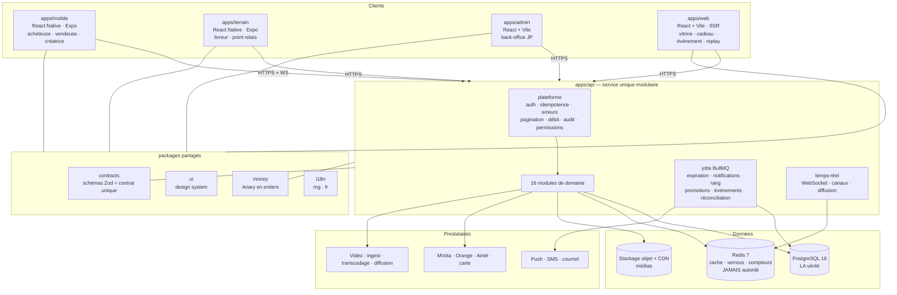
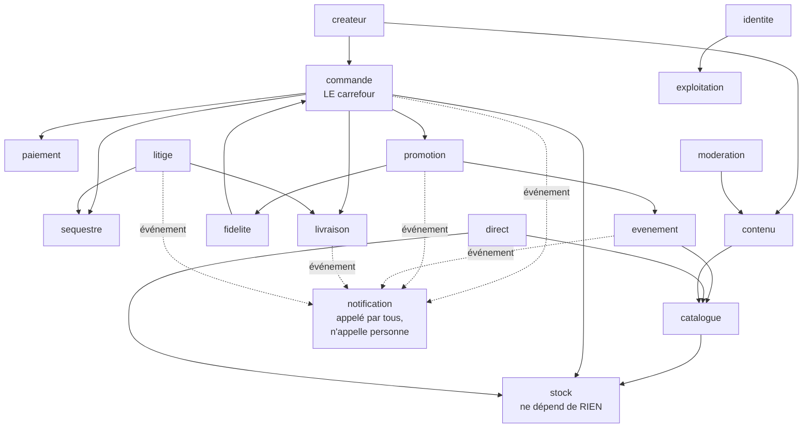
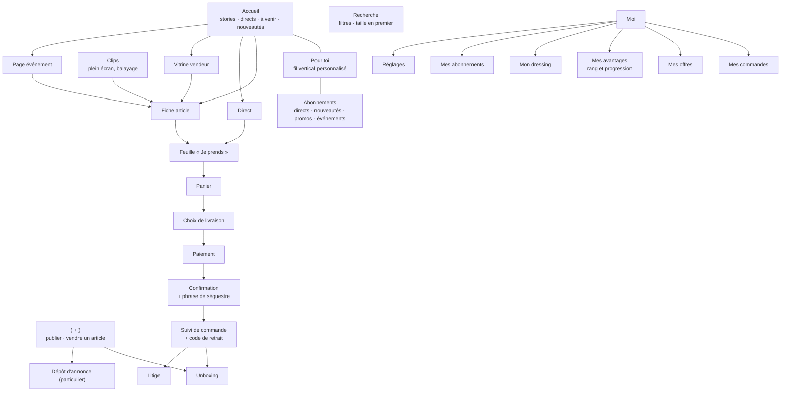
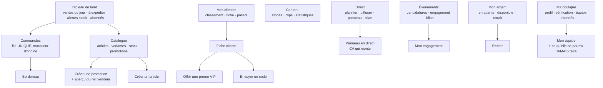

# JP — Conception de l'application

| | |
|---|---|
| **Objet** | Architecture logicielle, découpage en modules, navigation, écrans, design system |
| **Public** | Équipe de développement |
| **Version** | 1.0 · Août 2026 |
| **Pile** | Node.js 22 + TypeScript + Fastify · PostgreSQL 16 · Redis 7 · React Native (Expo) · React + Vite |
| **Amont** | `JP_CDC_TECHNIQUE.md` · `JP_CAS_UTILISATION.md` · `JP_CONCEPTION_BDD.md` · `plan/PLAN_SOCLE.md` |

---

# 1. Les cinq contraintes qui commandent l'architecture

Toute décision technique se justifie contre cette liste. Elle n'est pas décorative : c'est la grille de lecture de tout ce document.

| # | Contrainte | Conséquence architecturale |
|---|---|---|
| **C1** | Terminal d'entrée de gamme — peu de mémoire, peu de stockage | Application légère, listes recyclées, images dimensionnées serveur, lecteurs vidéo libérés hors écran |
| **C2** | Réseau lent, intermittent, **données payantes** | Charges utiles minimales, pagination par curseur, cache agressif, reprise automatique, file d'actions hors ligne |
| **C3** | **Intégrité du stock absolue** | Décrément atomique en base, jamais côté client. Redis n'est jamais autorité. |
| **C4** | Argent conservé pour compte de tiers | Journal financier inaltérable, idempotence de bout en bout, réconciliation quotidienne |
| **C5** | Pic du soir 18 h – 23 h | Dimensionnement sur le pic. Une indisponibilité à 20 h coûte une soirée de chiffre d'affaires. |

---

# 2. Vue d'ensemble



**Le choix structurant : un service unique modulaire, pas de micro-services.** À cette taille d'équipe, les micro-services coûtent plus qu'ils ne rapportent — et la transaction qui décrémente le stock, crée la commande et écrit au journal financier doit rester **une seule transaction** *(C3, C4)*. La distribuer serait la casser.

Le découpage en modules avec des règles de dépendance strictes préserve la possibilité de séparer plus tard, sans en payer le prix maintenant.

---

# 3. Découpage en modules

## 3.1 Les seize modules de domaine



**Quatre règles de dépendance, à tenir fermement.**

1. **`stock` ne dépend de rien.** C'est le module le plus critique *(RB1)* et le plus isolé. Il ne connaît ni les commandes, ni les prix, ni les promotions.
2. **`commande` orchestre.** C'est **le seul point où l'argent et le stock se rencontrent**. Aucun autre module ne crée de commande ni ne décrémente de stock.
3. **`notification` est appelé par tous et n'appelle personne.** Il porte **seul** les plafonds *(R-U4, R-W9)* : un plafond appliqué en trois endroits est un plafond contourné.
4. **Aucun module n'importe le dossier d'un autre.** Les échanges passent par le service exposé ou par un événement interne.

## 3.2 Convention de module

Un domaine = un dossier, toujours les mêmes fichiers. Cette uniformité est ce qui permet à quelqu'un d'ouvrir un module inconnu et de savoir où chercher.

```
apps/api/src/modules/<domaine>/
├─ routes.ts        déclaration des routes · validation Zod · AUCUNE logique métier
├─ service.ts       la logique métier · transactions · invariants
├─ repository.ts    accès Prisma · les seules requêtes SQL du domaine
├─ events.ts        événements émis et consommés
├─ erreurs.ts       codes d'erreur stables du domaine
└─ *.test.ts        au plus près du code testé
```

**Une exception documentée** : `litige/dossier.ts` lit largement chez les autres modules pour composer la vue d'instruction *(UC-51)*. C'est le seul endroit du dépôt où cela est autorisé, et c'est assumé — l'arbitrage a besoin de tout voir.

## 3.3 La plateforme, écrite une fois

```
apps/api/src/plateforme/
├─ session.ts        jeton court + rafraîchissement rotatif, détection de réutilisation
├─ debit.ts          fenêtre glissante Redis (Lua, atomique) — OTP, publication, signalement
├─ idempotence.ts    en-tête Idempotency-Key, clé conservée 24 h (R-M2)
├─ erreurs.ts        code stable → message mg/fr + action possible
├─ pagination.ts     curseur composite (cree_le, id) — jamais de numéro de page
├─ permissions.ts    garde de route ET filtre de projection (voir 3.4)
├─ chiffrement.ts    documents d'identité au repos
├─ accesDocument.ts  SEULE porte de déchiffrement, journalise avant de rendre
├─ correlation.ts    identifiant traversant API, jobs et WebSocket
├─ journal.ts        journaliseur structuré, champs interdits filtrés
└─ visibilite.ts     filtre de blocage appliqué à TOUTES les projections
```

**Trois de ces fichiers portent une garantie de sécurité et méritent une règle de lint** :
- `accesDocument.ts` — une règle interdit d'importer `chiffrement.ts` ailleurs ;
- `journal.ts` — filtre les champs sensibles à l'écriture, pour que la protection soit dans l'outil et non dans la discipline de chaque appelant *(R-C10)* ;
- `visibilite.ts` — le filtre de blocage est le point d'oubli le plus probable : une seule projection non filtrée rend le blocage inopérant.

## 3.4 Permissions : filtrer les projections, pas seulement les routes

**La décision la plus facile à rater de toute l'API.** Un montant masqué à l'affichage **reste dans la réponse réseau**. Pour l'employé du vendeur *(R-R8, F9.1, F10.4)*, les champs financiers doivent être **absents de la réponse**.

`plateforme/permissions.ts` expose donc deux outils, et les deux sont obligatoires :

```ts
// 1. garde de route — refuse l'accès
fastify.get('/vendeur/clients', { preHandler: exige('voir_commandes') }, ...)

// 2. filtre de projection — retire les champs
const reponse = projeter(clients, permissionsDe(acteur));
// employé sans permission financière → aucune clé `montantCumule` dans l'objet
```

Le test correspondant est une **assertion sur les clés de l'objet**, pas sur les valeurs.

---

# 4. Les quatre applications clientes

## 4.1 `apps/mobile` — acheteuse, vendeuse, créatrice

Une seule application, **trois rôles qui se cumulent sur un même compte** *(F0.4)*, avec un sélecteur de rôle. Les portefeuilles et tableaux de bord restent visuellement séparés — sinon l'utilisatrice ne sait plus d'où vient son argent.

```
apps/mobile/src/
├─ features/<domaine>/
│  ├─ ecrans/          un fichier par écran
│  ├─ composants/      propres au domaine
│  ├─ hooks/           requêtes, mutations, état local
│  └─ api/             appels typés depuis packages/contracts
├─ navigation/         onglets, piles, liens profonds
├─ noyau/
│  ├─ clientApi.ts     temps d'attente courts, reprises à recul exponentiel
│  ├─ session.ts       jeton en expo-secure-store, JAMAIS AsyncStorage
│  ├─ cache.ts         cache par écran, invalidation ciblée
│  ├─ fileHorsLigne.ts file d'actions persistée, clés d'idempotence locales
│  ├─ etatReseau.ts    détection, bandeau, bascule mode économie
│  ├─ roleActif.ts     sélecteur de rôle, portefeuilles séparés
│  └─ mesure.ts        événements d'usage, par lots, échec silencieux
└─ design/             ré-export de packages/ui + thème
```

**Le dossier partagé qui évite la divergence** : `features/achat/` porte la feuille « Je prends », **utilisée à l'identique par le direct et par le catalogue** *(F1.15, F2.6)*. Elle reçoit `{ article, variantes, origine }` et **ne connaît pas l'existence du direct**. Deux feuilles auraient divergé en trois semaines, et les frais de livraison auraient été calculés de deux façons.

## 4.2 `apps/terrain` — livreur et point relais

Une base, deux rôles. Ce sont les mêmes contraintes : un téléphone modeste, une main occupée, un réseau incertain, une preuve à produire.

**Hors ligne par défaut**, et ce n'est pas une option : la tournée est téléchargée au démarrage, les actions sont enregistrées localement avec une clé d'idempotence, et synchronisées au retour du réseau. Une application qui exige une connexion à chaque appui ne sera pas utilisée à moto.

Conception d'écran : **une seule action par écran**, boutons hauts, contraste maximal, pavé numérique large, indicateur de synchronisation **toujours visible**.

## 4.3 `apps/admin` — back-office JP

Application web séparée *(CDC §2.2)*, pas un écran caché de l'application mobile. Les métiers sont différents : comparer une pièce d'identité et un selfie, instruire un litige, réconcilier des espèces — ce sont des tâches d'écran large et de clavier.

**Le principe qui gouverne toutes ses files** : chaque file affiche **l'âge de ses éléments** et fait remonter ce qui approche d'un engagement. Une file sans notion d'ancienneté produit des dossiers oubliés, et un dossier oublié est une promesse rompue.

## 4.4 `apps/web` — pages publiques

Rendu **côté serveur** là où l'aperçu de lien décide de la conversion : article, vitrine, page cadeau, page événement, replay, profil créatrice.

**L'aperçu de lien est la moitié de la valeur d'acquisition** *(F7.11)*. Un lien partagé sur WhatsApp sans image ni titre ne se clique pas. C'est la seule raison pour laquelle ces pages existent en rendu serveur.

Périmètre volontairement restreint : consultation, panier, paiement. **Pas de direct, pas de publication, pas de studio vendeur** — le direct en navigateur sur un téléphone d'entrée de gamme est une mauvaise expérience qui abîmerait l'image du produit.

---

# 5. Navigation

## 5.1 Application acheteuse



## 5.2 Studio vendeur



**Deux choix de navigation qui ne sont pas neutres.**

**Une file de commandes unique**, avec un marqueur d'origine *(R-H2)*. Deux files — « direct » et « catalogue » — signifieraient deux logistiques à tenir, et le vendeur en oublierait une.

**« Mes clientes » est un onglet de premier niveau**, pas un sous-écran des statistiques. Ce n'est pas de l'analyse, c'est une liste d'action *(R-R7)*.

## 5.3 Back-office

```
Vérifications ─── file KYC · récupérations de compte
Modération ────── urgences EN TÊTE · contenus retirés · sanctions · recours
Litiges ───────── file par âge · dossier assemblé · décision motivée
Finance ───────── séquestre · retraits · commissions · espèces · réconciliation · écarts
Logistique ────── points relais · livreurs · tournées
Événements ────── créer · annoncer · candidatures · bilan
Paramètres ────── économiques · double validation · historique
Indicateurs ───── les 4 mesures fondatrices · hypothèses · ventes par origine
```

---

# 6. Contrat d'API

## 6.1 Une source unique

`packages/contracts` porte les schémas **Zod** et les types dérivés. Le serveur valide **avec** ; les clients appellent **avec**. Cela supprime une classe entière de défauts de contrat, et c'est la principale raison d'avoir choisi TypeScript des deux côtés.

```ts
// packages/contracts/src/promotion.ts
export const CreerPromotion = z.object({
  type: z.enum(['pourcentage', 'montant', 'livraison_offerte']),
  valeur: z.number().int().positive(),          // entier, jamais de flottant
  perimetre: z.enum(['boutique', 'categorie', 'selection']),
  cible: z.enum(['tous', 'abonnes', 'palier', 'clients_nommes']),
  debutLe: z.string().datetime(),
  finLe: z.string().datetime(),
  notifierAbonnes: z.boolean(),
});
export type CreerPromotion = z.infer<typeof CreerPromotion>;
```

## 6.2 Règles transversales

| Règle | Exigence |
|---|---|
| **Pagination** | Par **curseur composite** `(cree_le, id)`, jamais par numéro de page *(C2)*. Un curseur sur `cree_le` seul produit doublons ou trous. |
| **Charge utile** | Aucune réponse ne renvoie un champ non utilisé par l'écran appelant. |
| **Images** | Dimensions demandées par le client, redimensionnement serveur. **Jamais de pleine résolution dans une liste** *(C1, C2)*. |
| **Erreurs** | Code stable en majuscules, message traduit mg/fr, **action possible indiquée**. Jamais de message génériqueure. |
| **Idempotence** | Obligatoire sur toute écriture financière. Clé conservée 24 h *(R-M2, RB10)*. |
| **Horodatage** | UTC en base, conversion à l'affichage. |
| **Montants** | Entiers en Ariary. **Aucun flottant nulle part.** |
| **Versionnement** | Préfixe de version, compatibilité ascendante — **le parc ne se met pas à jour vite**. |

## 6.3 Temps réel

WebSocket avec repli par sondage long. Un canal par direct, un canal par utilisateur.

**Le client ne extrapole jamais** *(CDC §5.4)* : à la reconnexion, il **resynchronise** le stock et l'état du direct auprès du serveur. Un compteur extrapolé localement finit par afficher un stock faux, et un stock faux affiché est une survente promise.

```
WS /directs/:id/flux   → stock_change · article_a_lecran · prix_change
                          commande_payee · reservation_expiree · ca_soiree
                          chat_message · spectateurs
WS /moi/flux           → notification · commande_statut · reservation_expire_bientot
```

---

# 7. Travaux asynchrones

BullMQ sur Redis. **Tous les consommateurs sont idempotents** — c'est la règle unique de ce chapitre, et elle est non négociable : une file rejoue.

| Travail | Déclencheur | Point d'attention |
|---|---|---|
`expirationReservations` | périodique (secondes) | + **vérification paresseuse** à chaque lecture de disponibilité |
`transcodageVideo` | publication d'un média | reprise après échec, plusieurs qualités |
`expirationStories` | périodique | 24 h exactement |
`notificationPromotion` | promotion activée | **plafonds appliqués par abonné**, verrou `notifiee_le` |
`promotionsProgrammees` | périodique | bascule par date, **jamais deux démarrages** |
`evenementsPlanifies` | périodique | ouverture + **refus automatique des candidatures en attente** |
`recalculRang` | `commande.confirmee` | asynchrone, **ne ralentit jamais la confirmation** |
`liberationAutomatique` | périodique | délai après livraison *(R-E4)* |
`precommandesEcheances` | périodique | **remboursement automatique intégral** *(RB3)* |
`reconciliationQuotidienne` | quotidien | trois rapprochements, alerte sur écart |
`bilanEvenement` / `direct_bilan` | clôture | produit **même si le résultat est mauvais** |
`repliSms` | push non lu | seulement pour les types critiques |
`purgeRetention` | quotidien | applique **réellement** les durées annoncées |
`agregatsQuotidiens` | quotidien | mesures fondatrices, tableau de bord instantané |

**`commande.confirmee` est l'événement le plus écouté du système.** Il déclenche la libération du séquestre, le journal des ventes confirmées, le recalcul de rang, l'invitation à l'avis, l'entrée au dressing. **Aucun consommateur ne doit pouvoir bloquer la confirmation** : un bogue dans le calcul de rang ne peut pas empêcher un vendeur d'être payé.

---

# 8. Design system

## 8.1 Le contexte impose la forme

Téléphone Android d'entrée de gamme, écran de 5 pouces, lumière du jour, connexion intermittente et payante, utilisatrice bilingue dont le français n'est pas toujours la première langue.

| Règle | Valeur |
|---|---|
| Cibles tactiles | **48 dp minimum**, 8 dp d'écart |
| Action principale | **Bouton pleine largeur en bas d'écran**, toujours au même endroit |
| Contraste | 4,5:1 minimum sur le texte, **testé en extérieur** |
| Typographie | Deux graisses, trois tailles. Les **montants** sont toujours plus gros que les libellés |
| Montants | `50 000 Ar` — espace insécable, **jamais de décimale** |
| Images | Substitut basse définition d'abord, puis remplacement. **Jamais de saut de mise en page** |
| Animations | Réduites au minimum : elles coûtent en mémoire et en batterie |
| États obligatoires | **vide · chargement · erreur · hors ligne** — sur chaque écran, sans exception |
| Bilingue | Chaque libellé en mg et fr. **Le malgache est 30 % plus long** : prévoir la marge |
| Rareté | Un compteur n'est affiché **que s'il est vrai** *(RB9)* |
| Prix | Le prix affiché est le prix payé. **Aucun frais découvert plus tard** *(RB7)* |

## 8.2 Les composants partagés qui ne doivent jamais être réimplémentés

Sept composants vivent dans `packages/ui` parce qu'ils apparaissent partout et que des variantes divergentes détruiraient la cohérence ou une garantie du produit.

| Composant | Pourquoi partagé |
|---|---|
`BadgeVerifie` | 3 variantes (boutique, particulier, créatrice), 8 emplacements |
`BoutonSuivre` | 5 emplacements · **largeur identique dans les deux états**, sinon la mise en page saute |
`ScoreConfiance` | affichage public identique partout, un seul calcul |
`MinuteurReservation` | calé sur `expireLe` **serveur**, jamais sur une durée locale |
`PastilleEvenement` | **couleur + texte uniquement**, aucune image supplémentaire *(R-W7)* |
`EtiquetteSponsorise` | contraste et taille **imposés par le composant** — une mention illisible équivaut à une absence |
`FeuilleSignalement` | 6 emplacements · le geste de protection doit être identique partout |

## 8.3 Palette

Une couleur d'accent unique pour l'action, un vert de confirmation, un rouge d'alerte, quatre gris. Les événements introduisent une **couleur d'accent temporaire** *(R-W7)*, appliquée **par jeton** et non par image, pour ne pas peser sur le budget de données.

---

# 9. Stratégie de tests

| Niveau | Portée | Outil |
|---|---|---|
| Unitaire | Calculs purs : remise, score de rang, éligibilité, frais, commission | Vitest |
| Intégration | Un module avec **PostgreSQL réel** | Vitest + Testcontainers |
| API | Route de bout en bout, authentification et permissions comprises | Supertest |
| **Concurrence** | **`stock = 1`, N appuis simultanés, inter-canaux** | transactions parallèles réelles |
| Parcours mobile | « Je prends » → paiement → confirmation · inscription par code | Maestro |
| Terrain | Appareil d'entrée de gamme, réseau réel en heure de pointe | manuel, RT1→RT9 |

## 9.1 Les fonctions pures, et pourquoi elles comptent

Cinq calculs sont écrits comme des **fonctions pures** — sans accès base, sans horloge, la date de référence étant un paramètre. C'est ce qui rend leurs tables de cas exhaustives et vérifiables à la main :

`promotion/calcul.ts` (remise) · `fidelite/score.ts` (rang client) · `litige/score.ts` (confiance) · `paiement/commission.ts` · `livraison/tarifs.ts`

## 9.2 Les six familles de tests non négociables

Elles couvrent les critères bloquants, et une seule qui manque rend la livraison inacceptable.

1. **Concurrence de stock** *(RB1)* — 50 transactions parallèles sur `stock = 1`, **et inter-canaux** : un appui en direct et un appui sur catalogue.
2. **Chemins du séquestre** *(RB2)* — les quatre libérations, réconciliation à 100 % sur 1 000 commandes.
3. **Idempotence du paiement** *(RB10)* — rejeu, webhook doublé, webhook précoce, coupure à chaque étape.
4. **Absence de cumul de remises** *(R-U7)* — table de cas complète, plus une propriété vérifiée sur 1 000 paniers générés.
5. **Indiscernabilité de l'authentification** *(R-C9)* — corps, code **et écart de temps** sur 100 appels.
6. **Étanchéité des projections** — pour l'employé et pour le donateur, assertion **sur les clés** de la réponse, récursive : un champ absent ne peut pas fuir.

## 9.3 Le test de charge de référence

Rejoué avant chaque mise en production *(C5)* : plusieurs directs simultanés, pic de « Je prends » sur un même article, chat actif, navigation catalogue en parallèle.

---

# 10. Ce qui est construit avant tout mini-plan de domaine

Le socle *(`plan/PLAN_SOCLE.md` §9)*. Ces éléments sont référencés partout et ne sont replanifiés nulle part.

| # | Élément |
|---|---|
| S1 | Monorepo pnpm + Turborepo, TypeScript strict, ESLint, intégration continue |
| S2 | `packages/money`, `packages/i18n`, `packages/contracts` |
| S3 | Serveur Fastify, convention de module, plateforme complète |
| S4 | Prisma, base de développement, Testcontainers, migrations 1 à 2 |
| S5 | BullMQ, files, travailleur de référence, reprise sur incident |
| S6 | Registre WebSocket, canaux, diffusion, resynchronisation |
| S7 | `packages/ui` : jetons, primitives, les quatre états |
| S8 | Coquille Expo : navigation, session, client API, cache hors ligne, mode économie |
| S9 | Coquilles Vite pour `admin` et `web` |
| S10 | Observabilité : journaux corrélés, métriques, événements de mesure |

---

# 11. Environnements et livraison

| Environnement | Usage | Paiement |
|---|---|---|
| Développement | local | prestataires simulés |
| Recette | intégration | **bacs à sable des prestataires** — à obtenir en J0 |
| Pilote | vendeurs pilotes, **argent réel** | production, volume limité |
| Production | ouverture publique | production |

**Exigences.** Migrations versionnées, réversibles, jouées automatiquement · déploiement sans interruption, **jamais entre 18 h et 23 h** *(C5)* · sauvegardes quotidiennes avec **restauration testée**, pas seulement configurée · drapeaux de fonctionnalité pour livrer sans exposer · paramètres économiques modifiables **sans déploiement** *(R-O1)*.

---

# 12. Les risques techniques, nommés

| Risque | Pourquoi il est réel | Ce qui le contient |
|---|---|---|
| **Poids et mémoire de React Native** *(C1)* | moins de maîtrise qu'en natif ; le parc est bas de gamme | mesure de l'APK **en intégration continue**, profilage sur l'appareil de référence, seuil **bloquant** |
| **Coût et fiabilité de la vidéo** *(CDC §7)* | poste le plus incertain du budget | service géré en V1, **derrière une interface interne** dès le premier jour |
| **Survente** *(RB1)* | perte de confiance immédiate et irréparable | transaction `FOR UPDATE` + deux `CHECK` en base + tests de concurrence inter-canaux |
| **Écart de réconciliation** *(C4)* | argent d'autrui, risque réglementaire | journal `append only`, rapprochement quotidien, alerte au-delà de 48 h |
| **Saturation des notifications** | fait couper **toutes** les notifications, y compris le code de retrait | plafonds dans un **seul** module, `notification_coupee` suivi comme signal d'alerte |
| **Filtrage en malgache** *(R-X1)* | les modèles couvrent mal la langue | listes constituées avec des locuteurs, enrichies par les signalements traités — **travail continu**, pas une livraison |
| **File de modération sous-dimensionnée** *(décision n° 13)* | ligne de coût d'exploitation permanente | délais d'engagement **paramétrés** et affichés : on n'annonce pas 2 h si l'organisation en permet 12 |

---

*Cas d'utilisation : `JP_CAS_UTILISATION.md` · Conception BDD : `JP_CONCEPTION_BDD.md` · Socle de réalisation : `plan/PLAN_SOCLE.md` · Mini-plans : `plan/PLAN_INDEX.md`.*
