# JP — Cas d'utilisation, acteurs et diagrammes de séquence

| | |
|---|---|
| **Objet** | Les cas d'utilisation de la plateforme, leurs acteurs, leurs scénarios et les diagrammes de séquence des parcours critiques |
| **Public** | Équipe produit, développement, recette |
| **Version** | 1.0 · Août 2026 |
| **Amont** | `JP_BACKLOG.md` (`Fxx.y`) · `JP_USER_STORIES.md` (`US-*`) · `JP_CAHIER_DES_CHARGES.md` (règles `R-xx`) · `JP_CDC_TECHNIQUE.md` |

> Les diagrammes sont en **Mermaid** : ils s'affichent directement dans GitHub, sans outil externe.
>
> Chaque cas d'utilisation porte : son **acteur principal**, ses **acteurs secondaires**, ses **préconditions**, son **scénario nominal**, ses **scénarios alternatifs** (numérotés depuis l'étape où ils divergent), ses **postconditions** et les **règles** qui le gouvernent.

---

# 1. Les acteurs

> **Amont normatif** : [`JP_DECISIONS_PRODUIT.md`](JP_DECISIONS_PRODUIT.md).
> Six acteurs ont été retirés du produit *(`DP-01`)*, et **les rôles ne se
> cumulent plus** *(`DP-02`)*.

## 1.1 Acteurs humains

| Code | Acteur | Nature | Ce qu'il vient chercher |
|---|---|---|---|
| **AN** | Visiteur non inscrit | primaire | Regarder sans s'engager, comprendre à qui il a affaire |
| **A** | Acheteur | primaire | Savoir à qui il paie, trouver sa taille |
| **B** | **Boutique** | primaire | Ne plus perdre de ventes, être prise au sérieux |
| **C** | Créatrice | primaire | Gagner de l'argent sans capital et sans stock |
| **D** | Donateur / diaspora | primaire | Offrir un objet précis à quelqu'un de nommé |
| **PM** | Partenaire marque | primaire | Des campagnes mesurables *(phase 3)* |

> **Six acteurs retirés** *(`DP-01`)* : **P** vendeur particulier · **VE**
> employé du vendeur · **L** livreur · **PR** point relais · **MO** modérateur JP
> · **OP** opérateur JP.

## 1.2 Acteurs système

| Code | Acteur | Rôle |
|---|---|---|
| **SYS** | Plateforme JP | Exécute les règles, les minuteurs, les échéances, les calculs — **et depuis `DP-05`, les vérifications, les sanctions et le traitement des signalements** |
| **PSP** | Prestataire de paiement | MVola, Orange Money, Airtel Money, agrégateur carte |
| **VID** | Service vidéo | Ingest, transcodage, diffusion, enregistrement |
| **NOT** | Service de notification | Push, SMS, courriel |

> **`SYS` a hérité de deux acteurs humains.** Ce qui était instruit par le
> modérateur et l'opérateur est exécuté par des règles. **Aucune décision de la
> plateforme n'est plus explicable par un humain** — d'où l'obligation, pour
> chaque décision automatique, d'être motivée par écrit *(`R-T2`, `R-V7`)*.

## 1.3 Il n'y a pas de généralisation des acteurs

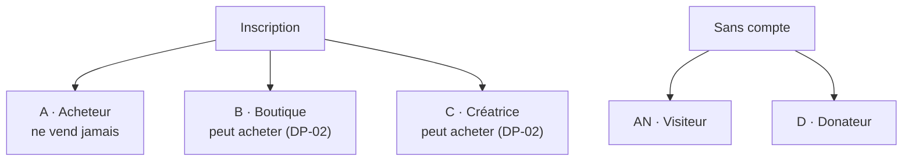
```mermaid
flowchart TD
    INSC["Inscription"] --> A["A · Acheteur<br/>ne vend jamais"]
    INSC --> B["B · Boutique<br/>peut acheter (DP-02)"]
    INSC --> C["C · Créatrice<br/>peut acheter (DP-02)"]
    SANS["Sans compte"] --> AN["AN · Visiteur"]
    SANS --> D["D · Donateur"]
```

**Lecture** : **un compte a un type, et un seul, choisi à l'inscription. Il n'en
change jamais** *(`DP-02`)*. Il n'existe aucun écran de bascule, aucune montée en
grade, aucune procédure de support pour changer de type.

Une boutique et une créatrice **peuvent acheter** — commodité, pas cumul de
rôles : parcours acheteur strictement identique, aucun droit supplémentaire,
et **jamais chez soi-même**. **La réciproque est fermée** : un acheteur n'a
aucun chemin vers la vente.

**`F0.4` — la bascule de rôle — est supprimée.**

---

# 2. Vue d'ensemble des cas d'utilisation

```mermaid
flowchart LR
    subgraph ACTEURS
        AN(("AN"))
        A(("A"))
        B(("B"))
        C(("C"))
        D(("D"))
    end

    subgraph AUTH["Authentification"]
        UC01["UC-01 Créer un compte"]
        UC02["UC-02 Se connecter"]
        UC03["UC-03 Récupérer son compte"]
    end

    subgraph VENTE["Catalogue et vente"]
        UC10["UC-10 Publier un article"]
        UC12["UC-12 Acheter hors direct"]
        UC13["UC-13 Remplir un panier"]
    end

    subgraph DIRECT["Direct"]
        UC20["UC-20 Diffuser un direct"]
        UC21["UC-21 Acheter en direct"]
    end

    subgraph ARGENT["Paiement"]
        UC30["UC-30 Payer une commande"]
        UC31["UC-31 Confirmer la réception"]
        UC33["UC-33 Gérer son abonnement"]
    end

    subgraph LOGI["Livraison"]
        UC40["UC-40 Préparer et expédier"]
        UC43["UC-43 Convenir du point de remise"]
    end

    subgraph CONF["Confiance"]
        UC50["UC-50 Signaler un problème"]
        UC52["UC-52 Se faire vérifier"]
    end

    subgraph SOCIAL["Social et fidélité"]
        UC60["UC-60 Suivre une boutique"]
        UC62["UC-62 Consulter ses clientes"]
        UC63["UC-63 Partager un lien d'affiliation"]
    end

    subgraph PROMO["Promotions et événements"]
        UC70["UC-70 Lancer une promotion"]
        UC71["UC-71 Offrir une promo VIP"]
        UC72["UC-72 Créer un événement de boutique"]
        UC73["UC-73 Participer à un événement"]
    end

    subgraph CADEAU["Cadeau"]
        UC80["UC-80 Demander un article en cadeau"]
        UC81["UC-81 Offrir un article"]
    end

    subgraph MODER["Modération"]
        UC90["UC-90 Signaler un contenu"]
    end

    AN --> UC01
    AN --> UC12
    A --> UC02
    A --> UC03
    A --> UC12
    A --> UC13
    A --> UC21
    A --> UC30
    A --> UC31
    A --> UC43
    A --> UC50
    A --> UC60
    A --> UC80
    A --> UC90
    B --> UC10
    B --> UC20
    B --> UC33
    B --> UC40
    B --> UC43
    B --> UC52
    B --> UC62
    B --> UC70
    B --> UC71
    B --> UC72
    B --> UC73
    C --> UC52
    C --> UC63
    C --> UC72
    C --> UC73
    D --> UC81
```

**Inventaire** : ~~30~~ **26 cas d'utilisation**, regroupés en 9 paquetages. Les
marqués ★ portent un diagramme de séquence détaillé.

| ID | Cas d'utilisation | Acteur principal | Séq. |
|---|---|---|---|
| UC-01 | Créer un compte par code envoyé par courriel | AN | ★ |
| UC-02 | Se connecter | A | |
| UC-03 | Récupérer un compte inaccessible | A | ★ |
| UC-10 | Publier un article avec ses variantes | B | |
| UC-12 | Acheter un article hors direct | A / AN | ★ |
| UC-13 | Remplir un panier et le payer en une fois | A | |
| UC-20 | Diffuser un direct et vendre | B | ★ |
| UC-21 | Acheter pendant un direct | A | ★ |
| UC-30 | Payer une commande en mobile money | A | ★ |
| UC-31 | Confirmer la réception | A | ★ |
| **UC-33** | 🆕 **Gérer son abonnement** *(`DP-08`)* | B | |
| UC-40 | Préparer et expédier une commande | B | |
| **UC-43** | 🆕 **Convenir du point de remise** *(`DP-10`)* | A + B | |
| UC-50 | Signaler un problème sur une commande | A | ★ |
| UC-52 | Se faire vérifier | B / C | |
| UC-60 | Suivre une boutique et recevoir ses nouveautés | A | |
| UC-62 | Consulter ses clientes et leur rang | B | |
| **UC-63** | 🆕 **Partager un lien d'affiliation** *(`DP-09`)* | C | |
| UC-70 | Lancer une promotion et notifier ses abonnés | B | ★ |
| UC-71 | Offrir une promotion réservée aux clientes VIP | B | |
| UC-72 | Créer un événement de boutique | B / C | |
| UC-73 | Participer à un événement | B / C | ★ |
| UC-80 | Demander un article en cadeau | A | |
| UC-81 | Offrir un article à un compte JP nommé | D | ★ |
| UC-90 | Signaler un contenu ou une personne | A / C | |
| UC-92 | Publier un contenu avec articles attachés | C | |

> ### Sept cas d'utilisation supprimés
>
> | Cas | Motif |
> |---|---|
> | `UC-11` Déposer une annonce de particulier | `DP-01` — l'acteur `P` n'existe plus |
> | `UC-32` Retirer son argent | `DP-07` — l'argent arrive directement |
> | `UC-41` Livrer à domicile · `UC-42` Remettre au relais | `DP-04` — JP n'opère plus de logistique |
> | `UC-51` Arbitrer un litige | `DP-05` + `DP-07` — plus d'arbitre, plus d'argent à trancher |
> | `UC-91` Traiter un signalement | `DP-05` — exécuté par `SYS` |
> | `UC-61` Publier un unboxing | `DP-17` — le geste filmé est retiré ; la confirmation en un appui *(`UC-31`)* devient le seul chemin |
>
> **Les numéros libérés ne sont pas réattribués** : ils sont cités dans
> `JP_ACTEURS_WORKFLOWS.md`, `JP_BACKLOG.md` et `JP_USER_STORIES.md`. Un trou se
> voit ; un décalage silencieux, non.

---

# 3. Paquetage Authentification

## UC-01 — Créer un compte par code envoyé par courriel ★

| | |
|---|---|
| **Acteur principal** | AN — visiteur non inscrit |
| **Acteurs secondaires** | SYS, NOT |
| **Fonctionnalités** | F0.1, F0.13, F0.14 · **Stories** US-AUTH-01, US-AUTH-02, US-AUTH-04 |
| **Règles** | R-C1 à R-C10 |
| **Préconditions** | Aucune. L'acteur a une adresse électronique accessible. |
| **Postconditions** | Un compte existe, une session longue est ouverte *(R-C2)*, aucun mot de passe n'a été créé. |

**Description.** Le parcours d'inscription et le parcours de connexion sont **indifférenciés** : la même saisie ouvre un compte existant ou en crée un *(R-C4)*. C'est ce qui interdit de savoir, depuis l'écran d'entrée, qui possède un compte *(R-C9)*.

**Scénario nominal**
1. L'acteur ouvre l'application et saisit son adresse électronique.
2. SYS vérifie le débit autorisé pour cette adresse et cette adresse IP *(R-C7)*.
3. SYS invalide tout code actif pour cette adresse, génère un code à 6 chiffres, le **hache** et l'enregistre avec une expiration à 10 minutes *(R-C5, R-C6)*.
4. SYS demande à NOT d'envoyer le code, **en asynchrone** — la réponse HTTP ne l'attend pas *(R-C9)*.
5. SYS répond de façon **identique** que le compte existe ou non.
6. L'acteur saisit le code ; la vérification part automatiquement au sixième chiffre.
7. SYS compare à temps constant, marque le code consommé, crée le compte s'il est inconnu, ouvre une session.
8. L'acteur choisit un prénom d'affichage.
9. SYS propose le quiz de style, **passable** *(F17.9)*.

**Scénarios alternatifs**
- **A1 — courriel non reçu** *(depuis 6)* : après 30 s, l'acteur demande un renvoi. Après deux renvois, SYS suggère de vérifier les indésirables et propose de changer d'adresse.
- **A2 — code erroné** *(depuis 6)* : SYS incrémente le compteur de tentatives ; à la cinquième, le code est **invalidé** et un nouveau doit être demandé *(R-C7)*.
- **A3 — code expiré** *(depuis 6)* : SYS refuse, aucune session n'est ouverte.
- **A4 — débit dépassé** *(depuis 2)* : SYS refuse en affichant **le délai restant en clair** *(R-C8)*.
- **A5 — connexion par Google** *(depuis 1)* : voir UC-02 alternative A2.
- **A6 — inscription déclenchée par un achat** *(depuis 1)* : la réservation est **déjà posée** et conservée pendant l'inscription *(F0.10, US-VENTE-08)*.

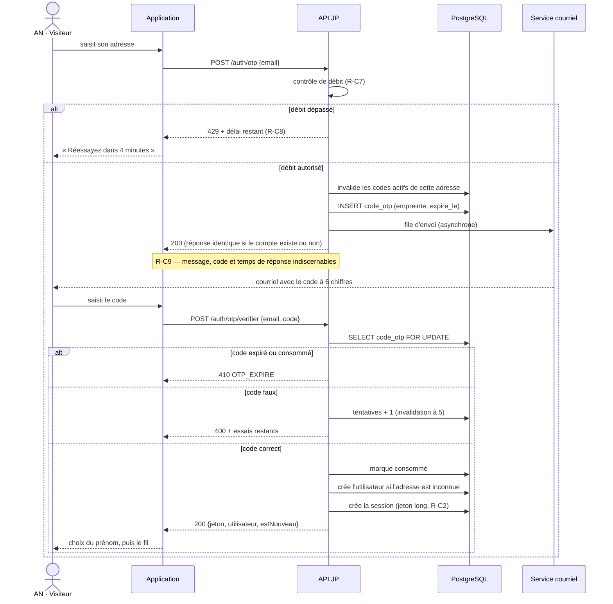
```mermaid
sequenceDiagram
    actor AN as AN · Visiteur
    participant APP as Application
    participant API as API JP
    participant DB as PostgreSQL
    participant NOT as Service courriel

    AN->>APP: saisit son adresse
    APP->>API: POST /auth/otp {email}
    API->>API: contrôle de débit (R-C7)
    alt débit dépassé
        API-->>APP: 429 + délai restant (R-C8)
        APP-->>AN: « Réessayez dans 4 minutes »
    else débit autorisé
        API->>DB: invalide les codes actifs de cette adresse
        API->>DB: INSERT code_otp (empreinte, expire_le)
        API->>NOT: file d'envoi (asynchrone)
        API-->>APP: 200 (réponse identique si le compte existe ou non)
        Note over API,APP: R-C9 — message, code et temps de réponse indiscernables
        NOT-->>AN: courriel avec le code à 6 chiffres
        AN->>APP: saisit le code
        APP->>API: POST /auth/otp/verifier {email, code}
        API->>DB: SELECT code_otp FOR UPDATE
        alt code expiré ou consommé
            API-->>APP: 410 OTP_EXPIRE
        else code faux
            API->>DB: tentatives + 1 (invalidation à 5)
            API-->>APP: 400 + essais restants
        else code correct
            API->>DB: marque consommé
            API->>DB: crée l'utilisateur si l'adresse est inconnue
            API->>DB: crée la session (jeton long, R-C2)
            API-->>APP: 200 {jeton, utilisateur, estNouveau}
            APP-->>AN: choix du prénom, puis le fil
        end
    end
```

---

## UC-02 — Se connecter

| | |
|---|---|
| **Acteur principal** | A |
| **Fonctionnalités** | F0.1, F0.2, F0.13 · **Règles** R-C2, R-C11, R-C12 |
| **Préconditions** | Un compte existe. |
| **Postconditions** | Session longue ouverte, appareil enregistré dans la liste des sessions. |

**Scénario nominal** — identique à UC-01, étapes 1 à 7. SYS reconnaît l'adresse et ouvre le compte existant sans créer de doublon.

**Scénarios alternatifs**
- **A1 — session encore valide** *(depuis 1)* : l'acteur n'a rien à saisir ; le jeton de rafraîchissement est renouvelé par rotation *(F0.2)*.
- **A2 — connexion Google** *(depuis 1)* : SYS vérifie le jeton d'identité côté serveur, refuse si l'adresse n'est pas déclarée vérifiée *(R-C11)*, et **rattache** l'identité au compte existant si l'adresse correspond *(R-C12)*.
- **A3 — jeton de rafraîchissement réutilisé** : SYS détecte la réutilisation et **révoque toute la famille de jetons** *(F0.2)*.

**Diagramme de séquence**

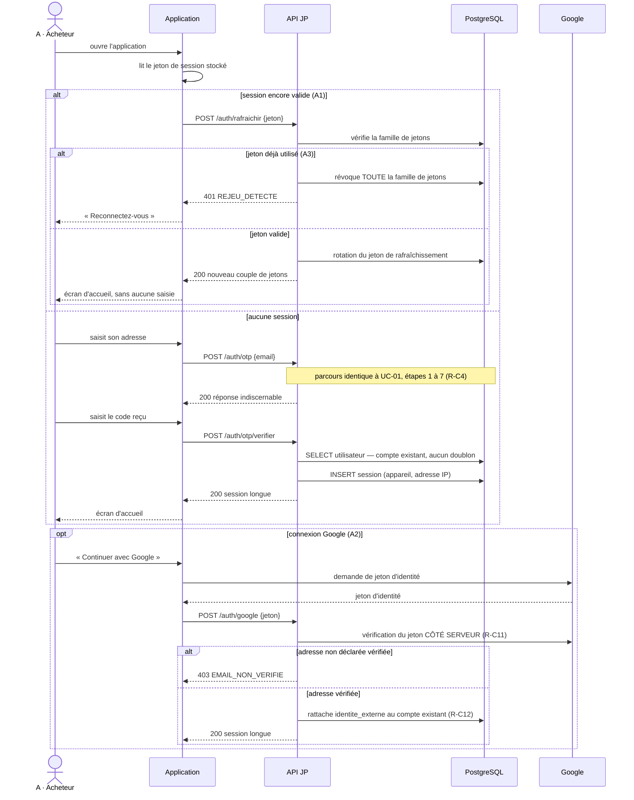
```mermaid
sequenceDiagram
    actor A as A · Acheteur
    participant APP as Application
    participant API as API JP
    participant DB as PostgreSQL
    participant GO as Google
    A->>APP: ouvre l'application
    APP->>APP: lit le jeton de session stocké
    alt session encore valide (A1)
        APP->>API: POST /auth/rafraichir {jeton}
        API->>DB: vérifie la famille de jetons
        alt jeton déjà utilisé (A3)
            API->>DB: révoque TOUTE la famille de jetons
            API-->>APP: 401 REJEU_DETECTE
            APP-->>A: « Reconnectez-vous »
        else jeton valide
            API->>DB: rotation du jeton de rafraîchissement
            API-->>APP: 200 nouveau couple de jetons
            APP-->>A: écran d'accueil, sans aucune saisie
        end
    else aucune session
        A->>APP: saisit son adresse
        APP->>API: POST /auth/otp {email}
        Note over API,DB: parcours identique à UC-01, étapes 1 à 7 (R-C4)
        API-->>APP: 200 réponse indiscernable
        A->>APP: saisit le code reçu
        APP->>API: POST /auth/otp/verifier
        API->>DB: SELECT utilisateur — compte existant, aucun doublon
        API->>DB: INSERT session (appareil, adresse IP)
        API-->>APP: 200 session longue
        APP-->>A: écran d'accueil
    end
    opt connexion Google (A2)
        A->>APP: « Continuer avec Google »
        APP->>GO: demande de jeton d'identité
        GO-->>APP: jeton d'identité
        APP->>API: POST /auth/google {jeton}
        API->>GO: vérification du jeton CÔTÉ SERVEUR (R-C11)
        alt adresse non déclarée vérifiée
            API-->>APP: 403 EMAIL_NON_VERIFIE
        else adresse vérifiée
            API->>DB: rattache identite_externe au compte existant (R-C12)
            API-->>APP: 200 session longue
        end
    end
```

---

## UC-03 — Récupérer un compte inaccessible ★

| | |
|---|---|
| **Acteur principal** | A |
| **Acteurs secondaires** | SYS |
| **Fonctionnalités** | F0.3, F0.15 · **Story** US-AUTH-07 · **Règles** R-C13, R-C14 |
| **Préconditions** | L'acteur possède un compte dont il a perdu l'accès à l'adresse électronique. |
| **Postconditions** | Le compte est réattribué à une nouvelle adresse **vérifiée**, ou la demande est refusée avec un motif écrit. |

**Description.** Trois cas, un seul difficile. Boîte mail accessible : il n'y a rien à récupérer, un code suffit. Changement de carte SIM : sans effet sur le compte. **Accès perdu à la boîte mail** : instruction humaine, sous 24 h.

**Pourquoi une instruction humaine** : automatiser cette récupération créerait une porte d'entrée. Sur un produit qui conserve l'argent d'autrui, la lenteur est ici une fonctionnalité.

**Scénario nominal**
1. L'acteur déclare ne plus avoir accès à son adresse.
2. SYS présente un formulaire : prénom, dernière commande, montant approximatif, numéro de téléphone de livraison.
3. SYS enregistre la demande, attribue un numéro de dossier, et **gèle les retraits** si le compte porte un solde *(R-C14)*.
4. SYS répond **202 dans tous les cas**, même si l'adresse est inconnue *(R-C9)*.
5. **SYS** compare les déclarations à l'historique réel du compte visé et décide **sur seuil de concordance**, avec les points concordants journalisés *(`DP-05`)*.
6. Concordance suffisante : SYS envoie un code à la nouvelle adresse.
7. L'acteur vérifie la nouvelle adresse ; SYS réattribue le compte, dégèle les retraits, journalise.

**Scénarios alternatifs**
- **A1 — refus** *(depuis 6)* : ⚠️ **SYS** refuse avec un motif écrit. **Il n'y a personne à qui faire appel** *(`DP-05`)* — c'est le point où cette décision coûte le plus cher. **Le compte reste inchangé** et le motif est notifié.
- **A2 — adresse accessible** *(depuis 1)* : l'acteur est réorienté vers UC-01, qui suffit.

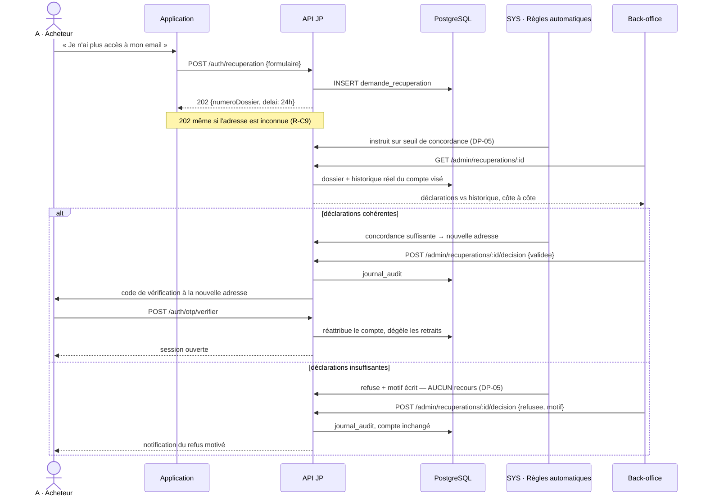
```mermaid
sequenceDiagram
    actor A as A · Acheteur
    participant APP as Application
    participant API as API JP
    participant DB as PostgreSQL
    participant SYS as SYS · Règles automatiques
    participant BO as Back-office

    A->>APP: « Je n'ai plus accès à mon email »
    APP->>API: POST /auth/recuperation {formulaire}
    API->>DB: INSERT demande_recuperation
    API-->>APP: 202 {numeroDossier, delai: 24h}
    Note over API,APP: 202 même si l'adresse est inconnue (R-C9)

    SYS->>API: instruit sur seuil de concordance (DP-05)
    BO->>API: GET /admin/recuperations/:id
    API->>DB: dossier + historique réel du compte visé
    API-->>BO: déclarations vs historique, côte à côte
    alt déclarations cohérentes
        SYS->>API: concordance suffisante → nouvelle adresse
        BO->>API: POST /admin/recuperations/:id/decision {validee}
        API->>DB: journal_audit
        API->>A: code de vérification à la nouvelle adresse
        A->>API: POST /auth/otp/verifier
        API->>DB: réattribue le compte, dégèle les retraits
        API-->>A: session ouverte
    else déclarations insuffisantes
        SYS->>API: refuse + motif écrit — AUCUN recours (DP-05)
        BO->>API: POST /admin/recuperations/:id/decision {refusee, motif}
        API->>DB: journal_audit, compte inchangé
        API-->>A: notification du refus motivé
    end
```

---

# 4. Paquetage Catalogue et vente

## UC-10 — Publier un article avec ses variantes

| | |
|---|---|
| **Acteur principal** | V |
| **Acteurs secondaires** | SYS |
| **Fonctionnalités** | F1.1, F1.2, F1.18, F1.7 · **Règles** R-A1 à R-A5, R-H4 |
| **Préconditions** | Compte boutique créé. La vérification n'est **pas** requise pour créer un catalogue *(R-V1)*. |
| **Postconditions** | Article en ligne avec ses variantes et son stock, disponible à l'achat hors direct *(R-H7)*. |

**Scénario nominal**
1. V choisit 1 à 8 photos, les recadre.
2. V saisit nom, prix, catégorie.
3. V renseigne l'état et les mesures réelles *(R-H4)* — facultatif mais valorisé au tri.
4. V coche les tailles et saisit une quantité par taille ; couleurs si besoin.
5. SYS affiche la **commission simulée** avant publication *(R-G1)*.
6. V met en ligne. SYS crée l'article, les variantes, les mouvements de stock d'entrée.

**Scénarios alternatifs**
- **A1 — création express en direct** *(depuis 1)* : trois champs seulement — photo, prix, quantité *(R-A4)*. Le reste est complété après le direct.
- **A2** — ~~employé~~ **supprimé** *(`DP-01`)* : l'acteur `VE` n'existe plus. Le champ est absent de son interface **et** refusé par l'API.
- **A3 — moins de 3 photos pour la vente hors direct** *(depuis 6)* : avertissement **non bloquant**.
- **A4 — mesures hors bornes** *(depuis 3)* : refus avec message explicite.
- **A5 — brouillon** *(depuis 6)* : l'article est enregistré sans être publié.

**Diagramme de séquence**

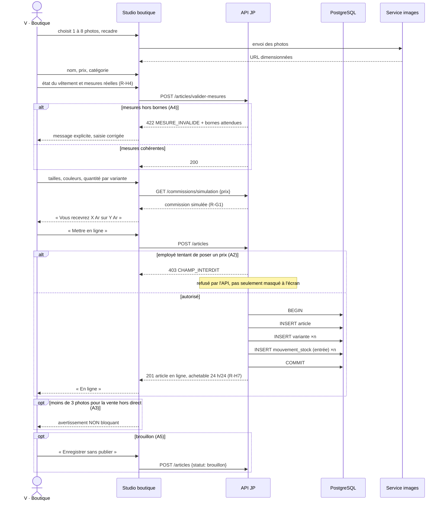
```mermaid
sequenceDiagram
    actor V as V · Boutique
    participant APP as Studio boutique
    participant API as API JP
    participant DB as PostgreSQL
    participant IMG as Service images
    V->>APP: choisit 1 à 8 photos, recadre
    APP->>IMG: envoi des photos
    IMG-->>APP: URL dimensionnées
    V->>APP: nom, prix, catégorie
    V->>APP: état du vêtement et mesures réelles (R-H4)
    APP->>API: POST /articles/valider-mesures
    alt mesures hors bornes (A4)
        API-->>APP: 422 MESURE_INVALIDE + bornes attendues
        APP-->>V: message explicite, saisie corrigée
    else mesures cohérentes
        API-->>APP: 200
    end
    V->>APP: tailles, couleurs, quantité par variante
    APP->>API: GET /commissions/simulation {prix}
    API-->>APP: commission simulée (R-G1)
    APP-->>V: « Vous recevrez X Ar sur Y Ar »
    V->>APP: « Mettre en ligne »
    APP->>API: POST /articles
    alt employé tentant de poser un prix (A2)
        API-->>APP: 403 CHAMP_INTERDIT
        Note over API: refusé par l'API, pas seulement masqué à l'écran
    else autorisé
        API->>DB: BEGIN
        API->>DB: INSERT article
        API->>DB: INSERT variante ×n
        API->>DB: INSERT mouvement_stock (entrée) ×n
        API->>DB: COMMIT
        API-->>APP: 201 article en ligne, achetable 24 h/24 (R-H7)
        APP-->>V: « En ligne »
    end
    opt moins de 3 photos pour la vente hors direct (A3)
        APP-->>V: avertissement NON bloquant
    end
    opt brouillon (A5)
        V->>APP: « Enregistrer sans publier »
        APP->>API: POST /articles {statut: brouillon}
    end
```

---

## UC-12 — Acheter un article hors direct ★

| | |
|---|---|
| **Acteur principal** | A, ou AN qui s'inscrit en cours de parcours |
| **Acteurs secondaires** | V, SYS, PSP |
| **Fonctionnalités** | F1.15, F1.16, F3.14, F1.10 · **Stories** US-VENTE-01, US-VENTE-08, US-VENTE-09 |
| **Règles** | R-H1, R-H2, R-H3, R-S1 à R-S3 |
| **Préconditions** | Un article en ligne avec du stock disponible. |
| **Postconditions** | Commande créée avec `origine = catalogue`, suivant **la même machine à états** qu'une commande de direct *(R-H1)*. |

**Description.** Le parcours qui fait de JP une boutique et non une succession d'événements. **La seule différence avec l'achat en direct est la durée de réservation** *(R-H3)* et le délai d'acceptation de la boutique *(R-H8)*.

**Scénario nominal**
1. A ouvre une fiche article depuis le fil, la recherche, une vitrine ou un lien partagé.
2. SYS affiche photos, prix, tailles **disponibles** (les épuisées barrées, `R-A3`), état, mesures comparées à son profil, **délai d'expédition annoncé** *(F5.9)*, badge de la boutique.
3. A appuie sur « Je prends ».
4. SYS ouvre la feuille d'achat : taille présélectionnée depuis son profil, quantité, livraison au dernier choix mémorisé, **total avec frais affiché ici** *(RB7)*.
5. A valide. SYS pose une réservation atomique *(UC interne : réservation)* pour la **durée catalogue** *(R-H3)*.
6. A paie *(UC-30)*.

**Scénarios alternatifs**
- **A1 — visiteur non inscrit** *(depuis 3)* : SYS **pose la réservation**, puis déclenche l'inscription *(UC-01, A6)*, puis reprend à l'étape 4 sans rien perdre.
- **A2 — dernière pièce partie pendant le choix de la taille** *(depuis 5)* : SYS refuse avec `STOCK_INSUFFISANT`, propose la file d'attente *(F2.7)* et l'alerte de retour en stock *(F7.4)*.
- **A3 — ajouter au panier** *(depuis 5)* : la réservation est maintenue, A continue à naviguer et paie tout en une fois *(UC-13)*.
- **A4 — pièce unique** *(depuis 4)* : aucune quantité demandée *(F1.14)*.
- **A5 — boutique non autorisée à encaisser** *(depuis 3)* : l'achat est refusé avec un motif clair *(R-V1)*.
- **A6 — réservation expirée avant paiement** *(depuis 6)* : SYS remet au stock, notifie **une seule fois**, propose « Reprendre » si le stock est là *(R-S6, F17.12)*.

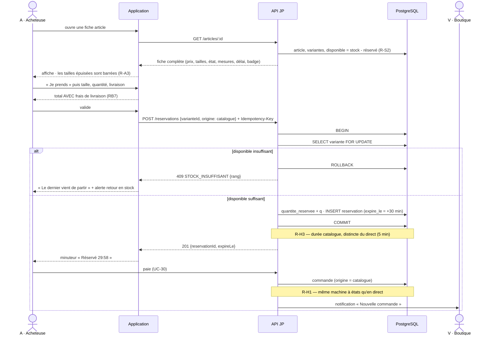
```mermaid
sequenceDiagram
    actor A as A · Acheteuse
    participant APP as Application
    participant API as API JP
    participant DB as PostgreSQL
    actor V as V · Boutique

    A->>APP: ouvre une fiche article
    APP->>API: GET /articles/:id
    API->>DB: article, variantes, disponible = stock - réservé (R-S2)
    API-->>APP: fiche complète (prix, tailles, état, mesures, délai, badge)
    APP-->>A: affiche · les tailles épuisées sont barrées (R-A3)

    A->>APP: « Je prends » puis taille, quantité, livraison
    APP-->>A: total AVEC frais de livraison (RB7)
    A->>APP: valide
    APP->>API: POST /reservations {varianteId, origine: catalogue} + Idempotency-Key

    API->>DB: BEGIN
    API->>DB: SELECT variante FOR UPDATE
    alt disponible insuffisant
        API->>DB: ROLLBACK
        API-->>APP: 409 STOCK_INSUFFISANT {rang}
        APP-->>A: « Le dernier vient de partir » + alerte retour en stock
    else disponible suffisant
        API->>DB: quantite_reservee + q · INSERT reservation (expire_le = +30 min)
        API->>DB: COMMIT
        Note over API,DB: R-H3 — durée catalogue, distincte du direct (5 min)
        API-->>APP: 201 {reservationId, expireLe}
        APP-->>A: minuteur « Réservé 29:58 »
        A->>API: paie (UC-30)
        API->>DB: commande (origine = catalogue)
        Note over API,DB: R-H1 — même machine à états qu'en direct
        API->>V: notification « Nouvelle commande »
    end
```

---

## UC-13 — Remplir un panier et le payer en une fois

| | |
|---|---|
| **Acteur principal** | A |
| **Fonctionnalités** | F1.16, F3.1, F3.2, F3.15 · **Story** US-VENTE-02 |
| **Règles** | R-H3, R-U7, R-U8 |
| **Préconditions** | Au moins un article réservé. |
| **Postconditions** | Une commande par boutique, un seul paiement, remises appliquées et nommées. |

**Scénario nominal**
1. A ajoute plusieurs articles au panier, de boutiques différentes.
2. SYS **regroupe par boutique** : les frais de livraison et l'expédition sont par boutique.
3. SYS calcule les remises éligibles et n'en retient **qu'une par ligne, la plus favorable** *(R-U7)*.
4. SYS affiche le récapitulatif : sous-total, remise **nommée**, frais par boutique, total.
5. **Un seul paiement pour tout le panier** *(`R-P4`, `DP-16`)*, quel que soit le nombre de boutiques.
6. A paie une fois *(UC-30)*.

**Scénarios alternatifs**
- **A1 — une réservation a expiré** *(depuis 4)* : la ligne est **signalée avant** toute tentative de paiement, avec un bouton « Reprendre ».
- **A2 — promotion expirée entre l'affichage et le paiement** *(depuis 6)* : SYS présente le nouveau total pour **confirmation explicite**. Jamais un prélèvement supérieur à ce qui a été vu *(US-PROMO-08 CA5)*.
- **A3 — palier perdu entre-temps** *(depuis 6)* : la remise est retirée avec un message clair, **la commande n'échoue pas** *(R-U5)*.

**Diagramme de séquence**

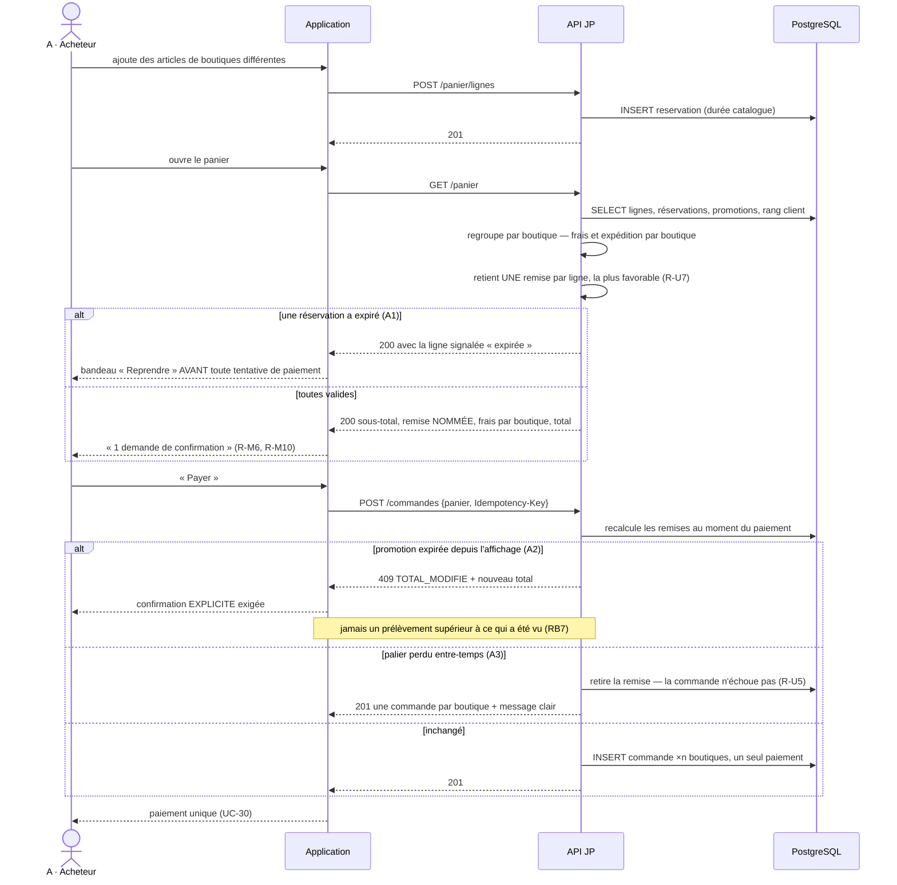
```mermaid
sequenceDiagram
    actor A as A · Acheteur
    participant APP as Application
    participant API as API JP
    participant DB as PostgreSQL
    A->>APP: ajoute des articles de boutiques différentes
    APP->>API: POST /panier/lignes
    API->>DB: INSERT reservation (durée catalogue)
    API-->>APP: 201
    A->>APP: ouvre le panier
    APP->>API: GET /panier
    API->>DB: SELECT lignes, réservations, promotions, rang client
    API->>API: regroupe par boutique — frais et expédition par boutique
    API->>API: retient UNE remise par ligne, la plus favorable (R-U7)
    alt une réservation a expiré (A1)
        API-->>APP: 200 avec la ligne signalée « expirée »
        APP-->>A: bandeau « Reprendre » AVANT toute tentative de paiement
    else toutes valides
        API-->>APP: 200 sous-total, remise NOMMÉE, frais par boutique, total
        APP-->>A: « 1 demande de confirmation » (R-M6, R-M10)
    end
    A->>APP: « Payer »
    APP->>API: POST /commandes {panier, Idempotency-Key}
    API->>DB: recalcule les remises au moment du paiement
    alt promotion expirée depuis l'affichage (A2)
        API-->>APP: 409 TOTAL_MODIFIE + nouveau total
        APP-->>A: confirmation EXPLICITE exigée
        Note over API,APP: jamais un prélèvement supérieur à ce qui a été vu (RB7)
    else palier perdu entre-temps (A3)
        API->>DB: retire la remise — la commande n'échoue pas (R-U5)
        API-->>APP: 201 une commande par boutique + message clair
    else inchangé
        API->>DB: INSERT commande ×n boutiques, un seul paiement
        API-->>APP: 201
    end
    APP-->>A: paiement unique (UC-30)
```

---

# 5. Paquetage Direct

## UC-20 — Diffuser un direct et vendre ★

| | |
|---|---|
| **Acteur principal** | V |
| **Acteurs secondaires** | A, VID, SYS |
| **Fonctionnalités** | F2.3, F2.4, F2.5, F2.13, F2.14, F2.15 · **Règles** R-D1 à R-D7 |
| **Préconditions** | Boutique **vérifié** *(R-V1)*, articles préparés (facultatif). |
| **Postconditions** | Direct enregistré, bilan produit, marqueurs de replay générés sans saisie *(F2.16)*. |

**Scénario nominal**
1. V saisit un titre et sélectionne ses articles de la soirée.
2. SYS mesure le débit montant et signale une connexion insuffisante.
3. V passe en direct ; SYS obtient des identifiants d'ingest auprès de VID et notifie les abonnés *(F2.2)*.
4. V sélectionne l'article « à l'écran » ; SYS horodate `a_lecran_le` — c'est cette donnée qui produira les marqueurs du replay.
5. SYS diffuse le bandeau : prix, tailles, **stock restant réel** *(R-S2, RB9)*.
6. Les acheteuses achètent *(UC-21)* ; SYS alimente le panneau boutique en temps réel.
7. V arrête. SYS clôt le direct, produit le bilan et récupère l'enregistrement.

**Scénarios alternatifs**
- **A1 — coupure de connexion** *(depuis 5)* : SYS met le direct **en pause**, **suspend toutes les réservations en cours** *(R-S5)*, informe les spectateurs. Reprise sous 2 minutes → même direct, mêmes spectateurs, mêmes réservations, `expire_le` repoussé de la durée écoulée. Au-delà → clôture et bilan.
- **A2 — modification de prix en direct** *(depuis 4)* : autorisée ; **les réservations déjà posées conservent l'ancien prix** *(R-U9)*.
- **A3 — création express d'un article** *(depuis 4)* : trois champs *(R-A4)*.
- **A4 — signalement pendant le direct** *(depuis 5)* : ⚠️ **`SYS` seul** peut couper la diffusion, sur filtre automatique *(`DP-05`, F19.1)*. Il n'y a plus de modérateur humain pour trancher en quelques secondes *(F11.2)*.

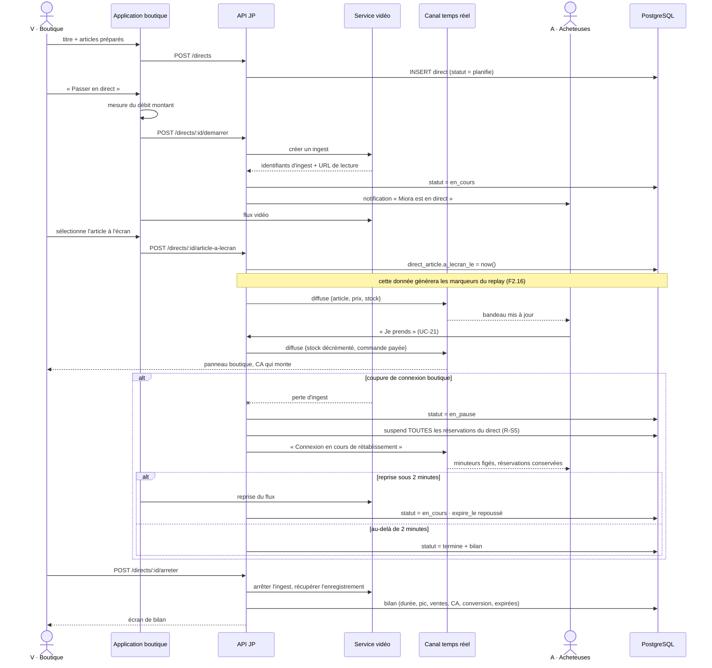
```mermaid
sequenceDiagram
    actor V as V · Boutique
    participant APP as Application boutique
    participant API as API JP
    participant VID as Service vidéo
    participant WS as Canal temps réel
    actor A as A · Acheteuses
    participant DB as PostgreSQL

    V->>APP: titre + articles préparés
    APP->>API: POST /directs
    API->>DB: INSERT direct (statut = planifie)
    V->>APP: « Passer en direct »
    APP->>APP: mesure du débit montant
    APP->>API: POST /directs/:id/demarrer
    API->>VID: créer un ingest
    VID-->>API: identifiants d'ingest + URL de lecture
    API->>DB: statut = en_cours
    API->>A: notification « Miora est en direct »
    APP->>VID: flux vidéo

    V->>APP: sélectionne l'article à l'écran
    APP->>API: POST /directs/:id/article-a-lecran
    API->>DB: direct_article.a_lecran_le = now()
    Note over API,DB: cette donnée générera les marqueurs du replay (F2.16)
    API->>WS: diffuse {article, prix, stock}
    WS-->>A: bandeau mis à jour

    A->>API: « Je prends » (UC-21)
    API->>WS: diffuse {stock décrémenté, commande payée}
    WS-->>V: panneau boutique, CA qui monte

    alt coupure de connexion boutique
        VID--xAPI: perte d'ingest
        API->>DB: statut = en_pause
        API->>DB: suspend TOUTES les réservations du direct (R-S5)
        API->>WS: « Connexion en cours de rétablissement »
        WS-->>A: minuteurs figés, réservations conservées
        alt reprise sous 2 minutes
            APP->>VID: reprise du flux
            API->>DB: statut = en_cours · expire_le repoussé
        else au-delà de 2 minutes
            API->>DB: statut = termine + bilan
        end
    end

    V->>API: POST /directs/:id/arreter
    API->>VID: arrêter l'ingest, récupérer l'enregistrement
    API->>DB: bilan (durée, pic, ventes, CA, conversion, expirées)
    API-->>V: écran de bilan
```

---

## UC-21 — Acheter pendant un direct ★

| | |
|---|---|
| **Acteur principal** | A |
| **Acteurs secondaires** | AN, V, SYS, PSP |
| **Fonctionnalités** | F2.6, F2.7, F2.8, F2.9 · **Règles** R-S1 à R-S7, RB1, RB7 |
| **Préconditions** | Un direct en cours avec un article à l'écran et du stock disponible. |
| **Postconditions** | Réservation puis commande, ou place dans la file d'attente. **Aucune survente possible** *(RB1)*. |

**Description.** Le parcours le plus important du produit. **Il doit tenir sous 30 secondes**, et la vidéo continue de jouer pendant tout le parcours.

**Scénario nominal** — identique à UC-12 étapes 3 à 6, avec trois différences : la vidéo reste visible au-dessus de la feuille, la durée de réservation est **courte** *(R-H3)*, et la boutique voit la commande tomber avec le prénom de l'acheteuse.

**Scénarios alternatifs**
- **A1 — deux acheteuses sur la dernière pièce** : **l'horodatage serveur tranche** *(R-S7)*. La seconde est placée 2ᵉ dans la file et sera notifiée si la première ne paie pas.
- **A2 — ajouter au panier** : la réservation est maintenue, A continue le direct et paie tout à la fin — **chemin essentiel**, il augmente le panier et évite cinq paiements mobile money d'affilée.
- **A3 — visiteur non inscrit** : réservation posée **avant** l'inscription.

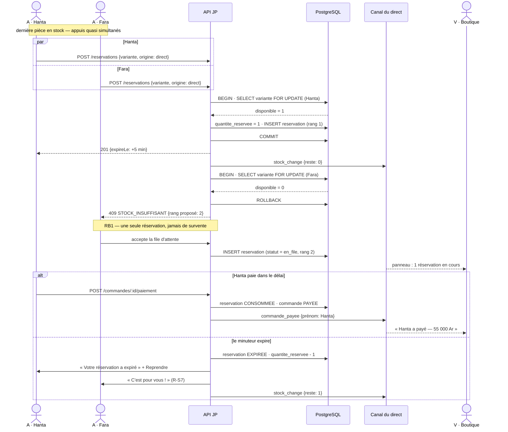
```mermaid
sequenceDiagram
    actor A1 as A · Hanta
    actor A2 as A · Fara
    participant API as API JP
    participant DB as PostgreSQL
    participant WS as Canal du direct
    actor V as V · Boutique

    Note over A1,A2: dernière pièce en stock — appuis quasi simultanés

    par Hanta
        A1->>API: POST /reservations {variante, origine: direct}
    and Fara
        A2->>API: POST /reservations {variante, origine: direct}
    end

    API->>DB: BEGIN · SELECT variante FOR UPDATE (Hanta)
    DB-->>API: disponible = 1
    API->>DB: quantite_reservee = 1 · INSERT reservation (rang 1)
    API->>DB: COMMIT
    API-->>A1: 201 {expireLe: +5 min}
    API->>WS: stock_change {reste: 0}

    API->>DB: BEGIN · SELECT variante FOR UPDATE (Fara)
    DB-->>API: disponible = 0
    API->>DB: ROLLBACK
    API-->>A2: 409 STOCK_INSUFFISANT {rang proposé: 2}
    Note over API,A2: RB1 — une seule réservation, jamais de survente
    A2->>API: accepte la file d'attente
    API->>DB: INSERT reservation (statut = en_file, rang 2)

    WS-->>V: panneau : 1 réservation en cours

    alt Hanta paie dans le délai
        A1->>API: POST /commandes/:id/paiement
        API->>DB: reservation CONSOMMEE · commande PAYEE
        API->>WS: commande_payee {prénom: Hanta}
        WS-->>V: « Hanta a payé — 55 000 Ar »
    else le minuteur expire
        API->>DB: reservation EXPIREE · quantite_reservee - 1
        API->>A1: « Votre réservation a expiré » + Reprendre
        API->>A2: « C'est pour vous ! » (R-S7)
        API->>WS: stock_change {reste: 1}
    end
```

---

# 6. Paquetage Paiement et argent

## UC-30 — Payer une commande en mobile money ★

| | |
|---|---|
| **Acteur principal** | A |
| **Acteurs secondaires** | PSP, B, C, SYS |
| **Fonctionnalités** | F4.1, F4.14, F4.10, F4.11 · **Règles** R-M1 à R-M7, R-M9, R-M10 · **Recette** RB2, RB10, RB11 · **Décisions** `DP-07`, `DP-15`, `DP-16` |
| **Préconditions** | Une commande en `EN_ATTENTE_PAIEMENT` avec une réservation active. |
| **Postconditions** | Commande `PAYEE`, facture émise, **crédits partis directement aux bénéficiaires**. **JP ne détient aucun fonds.** |

**Description.** Le point critique n'a pas changé : pendant l'attente de
confirmation opérateur (jusqu'à 60 s), l'écran ne doit **jamais** paraître figé.

**Ce que `DP-16` établit** : **un débit, une confirmation, deux ou trois
crédits** — la boutique, la commission JP, la créatrice. **L'acheteuse ne voit
jamais la répartition.**

**Scénario nominal**
1. `SYS` calcule les parts : net de la boutique, commission JP *(si mode commission)*, part créatrice *(si affiliée)*.
2. `SYS` annonce **le nombre de confirmations** *(`R-M6`)* — **1** en éclatement atomique *(`R-M10`)*.
3. `A` choisit son opérateur — **le sien est présélectionné**.
4. `SYS` crée le paiement avec une **clé d'idempotence** *(R-M2)* et **suspend le minuteur**.
5. `PSP` envoie une demande de validation ; `SYS` affiche un écran d'attente **animé**.
6. `A` saisit son code. `PSP` confirme, **par rappel asynchrone et/ou réponse synchrone**.
7. **`[T]`** `SYS` : consomme la réservation, passe la commande en `PAYEE`, journalise **chaque crédit**.
8. `SYS` émet la facture, notifie `A` et notifie `B` **avec le net reçu**.

**Scénarios alternatifs**
- **A1 — rappel reçu deux fois** : traité **une seule fois** *(R-M2)*.
- **A2 — rappel avant la réponse synchrone** : l'ordre d'arrivée n'a pas d'importance.
- **A3 — éclatement atomique refusé** : **tout ou rien**, la commande n'est pas créée.
- **A4 — coupure réseau** : ni double prélèvement, ni commande perdue *(RB10)*.
- **A5 — en repli, patte pivot échouée** : **aucune commande, aucune autre patte** *(`R-M4`)*.
- **A6 — en repli, patte secondaire échouée** : **l'acheteuse ne voit rien**. La patte est **rejouée après interrogation** *(`R-M5`, `R-M7`)*.

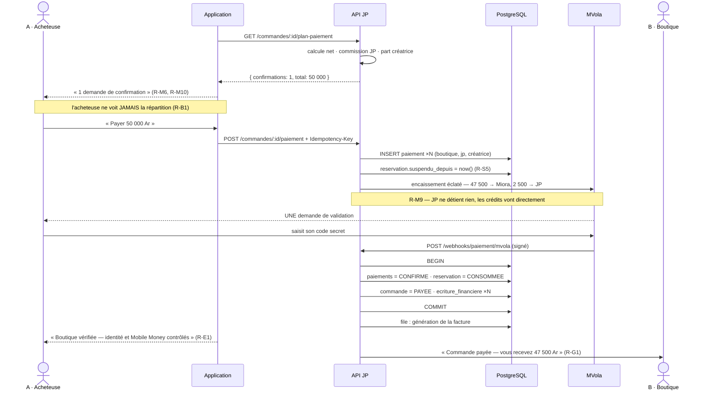
```mermaid
sequenceDiagram
    actor A as A · Acheteuse
    participant APP as Application
    participant API as API JP
    participant DB as PostgreSQL
    participant PSP as MVola
    actor B as B · Boutique

    APP->>API: GET /commandes/:id/plan-paiement
    API->>API: calcule net · commission JP · part créatrice
    API-->>APP: { confirmations: 1, total: 50 000 }
    APP-->>A: « 1 demande de confirmation » (R-M6, R-M10)
    Note over APP,A: l'acheteuse ne voit JAMAIS la répartition (R-B1)

    A->>APP: « Payer 50 000 Ar »
    APP->>API: POST /commandes/:id/paiement + Idempotency-Key
    API->>DB: INSERT paiement ×N (boutique, jp, créatrice)
    API->>DB: reservation.suspendu_depuis = now() (R-S5)
    API->>PSP: encaissement éclaté — 47 500 → Miora, 2 500 → JP
    Note over API,PSP: R-M9 — JP ne détient rien, les crédits vont directement

    PSP-->>A: UNE demande de validation
    A->>PSP: saisit son code secret
    PSP->>API: POST /webhooks/paiement/mvola (signé)

    API->>DB: BEGIN
    API->>DB: paiements = CONFIRME · reservation = CONSOMMEE
    API->>DB: commande = PAYEE · ecriture_financiere ×N
    API->>DB: COMMIT

    API->>DB: file : génération de la facture
    APP-->>A: « Boutique vérifiée — identité et Mobile Money contrôlés » (R-E1)
    API->>B: « Commande payée — vous recevez 47 500 Ar » (R-G1)
```

---

## UC-31 — Confirmer la réception ★

| | |
|---|---|
| **Acteur principal** | A |
| **Acteurs secondaires** | B, SYS |
| **Fonctionnalités** | F4.5, F6.1 · **Règles** R-E3, R-E4, R-R11 · **Décisions** `DP-04`, `DP-07`, `DP-17` |
| **Préconditions** | Commande en statut `LIVREE`. |
| **Postconditions** | Commande `CONFIRMEE`, **score de la boutique alimenté**. **Aucun mouvement d'argent.** |

**Description.** **La confirmation ne libère plus d'argent** — la boutique a été
payée au moment du paiement *(`DP-07`)*. Elle **clôt la commande et alimente la
réputation**, devenue la seule protection de l'acheteuse.

**Ce que ça change dans la conception.** L'étape 5 — le journal des ventes
confirmées — était un confort de fidélisation à activer en phase 2. **Elle est
devenue le mécanisme de protection lui-même.**

**Scénario nominal**
1. SYS notifie A : « Avez-vous bien reçu ? »
2. A répond « Oui, tout va bien ».
3. SYS clôt la commande et enregistre la réception. **Aucune écriture de solde : il n'y a pas de solde.**
4. SYS invite A à laisser un avis *(F6.1)* et fait entrer l'article dans son dressing *(F17.10)*.
5. SYS écrit au **journal des ventes confirmées** *(R-R11)*, qui alimente le rang client **et le score de confiance de la boutique**.

**Scénarios alternatifs**
- **A1 — aucune réponse** *(depuis 2)* : au terme du délai *(R-E4, hypothèse 3 jours)*, SYS clôt **automatiquement**. **Cela ne coûte rien à personne** — l'argent est déjà parti.
- **A2 — problème** *(depuis 2)* : A signale *(UC-50)*. **Rien n'est bloqué** — il n'y a plus de fonds à bloquer. Le signalement **pèse sur le score** de la boutique *(R-T8)*.

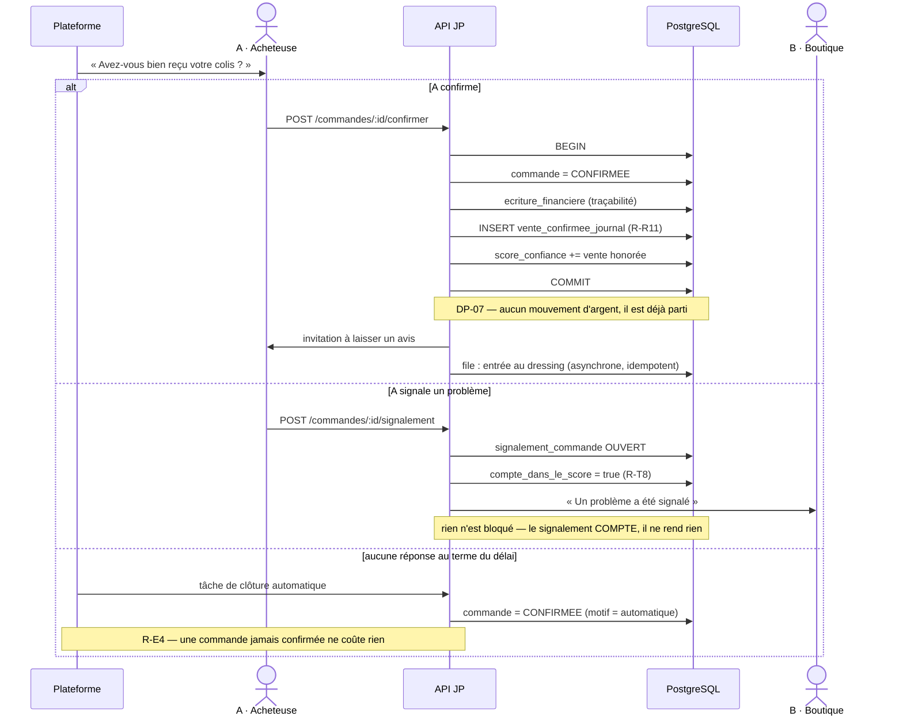
```mermaid
sequenceDiagram
    participant SYS as Plateforme
    actor A as A · Acheteuse
    participant API as API JP
    participant DB as PostgreSQL
    actor B as B · Boutique

    SYS->>A: « Avez-vous bien reçu votre colis ? »

    alt A confirme
        A->>API: POST /commandes/:id/confirmer
        API->>DB: BEGIN
        API->>DB: commande = CONFIRMEE
        API->>DB: ecriture_financiere (traçabilité)
        API->>DB: INSERT vente_confirmee_journal (R-R11)
        API->>DB: score_confiance += vente honorée
        API->>DB: COMMIT
        Note over API,DB: DP-07 — aucun mouvement d'argent, il est déjà parti
        API->>A: invitation à laisser un avis
        API->>DB: file : entrée au dressing (asynchrone, idempotent)
    else A signale un problème
        A->>API: POST /commandes/:id/signalement
        API->>DB: signalement_commande OUVERT
        API->>DB: compte_dans_le_score = true (R-T8)
        API->>B: « Un problème a été signalé »
        Note over API,DB: rien n'est bloqué — le signalement COMPTE, il ne rend rien
    else aucune réponse au terme du délai
        SYS->>API: tâche de clôture automatique
        API->>DB: commande = CONFIRMEE (motif = automatique)
        Note over SYS,API: R-E4 — une commande jamais confirmée ne coûte rien
    end
```

> ### Ce que la confirmation ne fait plus
>
> **`RB2` change de sens.** Il vérifiait que « les fonds sont correctement
> séquestrés et libérés dans tous les cas ». Il vérifie désormais que **le
> paiement atteint le bon compte, sans double prélèvement** — y compris sur une
> crédit atteint le bon compte, sans double versement, et qu'aucun ne reste en
> souffrance *(`R-M4`, `R-M5`, `R-M7`)*.

---

## UC-33 — Gérer son abonnement 🆕

| | |
|---|---|
| **Acteur principal** | B |
| **Acteurs secondaires** | PSP, SYS |
| **Fonctionnalités** | F10.3 · **Règles** R-B1 à R-B4 · **Décision** `DP-08` |
| **Préconditions** | Compte boutique vérifié. |
| **Postconditions** | Palier actif, quotas connus, échéance affichée. |

**Description.** **JP ne prélève rien sur les ventes** *(`DP-08`)*. La boutique
fixe son prix, encaisse 100 %, et paie **un abonnement mensuel**. C'est le seul
flux d'argent entre une boutique et JP.

**Scénario nominal**
1. B ouvre « Mon abonnement » : palier en cours, **ventes du mois / quota**, **directs du mois / quota**, échéance.
2. B choisit un palier. Le **palier gratuit** est actif par défaut *(R-B3)*.
3. B règle par mobile money. SYS enregistre l'échéance.

**Scénarios alternatifs**
- **A1 — quota atteint** : **la mise en vente et le lancement d'un direct sont bloqués** jusqu'au cycle suivant ou au changement de palier. **Le compte n'est jamais suspendu** : le catalogue reste visible, les commandes en cours vont à leur terme *(R-B4)*.
- **A2 — abonnement impayé** : même traitement qu'`A1`. Jamais de coupure d'accès aux commandes ni à l'historique.
- **A3 — première inscription** : palier gratuit, sans carte, sans engagement. ⚠️ Sans lui, la boutique paie avant d'avoir gagné, et l'acquisition se ferme *(R-B3)*.

> ### L'effet de bord qui vaut la décision
>
> Le risque n° 1 du modèle était : *« à partir de quel taux la boutique
> cherche-t-elle à contourner la plateforme ? »* **Sans commission par vente,
> elle n'a plus aucun intérêt à conclure ailleurs.** Le contournement cesse
> d'être un risque.
>
> ⚠️ **Montants et quotas non arrêtés** *(`PO-6`)*. Ils bloquent l'ouverture des
> inscriptions boutique **et** la migration 20.

---

# 7. Paquetage Livraison

## UC-40 — Préparer et expédier une commande

| | |
|---|---|
| **Acteur principal** | B |
| **Fonctionnalités** | F5.1, F5.2 · **Règles** R-L3, R-L9, R-H8 · **Décision** `DP-04` |
| **Préconditions** | Commande `PAYEE`, point de remise convenu *(UC-43)*. |
| **Postconditions** | Expédition `EXPEDIEE`, statut visible **des deux côtés** *(R-L3)*. |

**Description.** **JP n'opère aucune logistique** *(`DP-04`)*. La boutique choisit
son moyen — son coursier, un transporteur, une remise en main propre. JP fournit
**la frise de statuts**, et c'est la boutique qui la fait avancer.

**Scénario nominal**
1. B ouvre « À préparer » : une **file unique**, triée par échéance, avec un marqueur d'origine *(R-H2)*.
2. B ouvre le bordereau : articles, tailles, destinataire, **point de remise convenu** *(UC-43)*, note de l'acheteuse.
3. B prépare le colis et marque « Expédiée ».
4. SYS met le statut à jour des deux côtés et notifie A.
5. B marque « Livrée » à la remise ; A confirme *(UC-31)*.

**Scénarios alternatifs**
- **A1 — refus par la boutique** *(depuis 3)* : motif **obligatoire**. ⚠️ **Le remboursement n'est plus automatique** *(`DP-07`)* : JP n'a rien à rendre. **C'est la boutique qui rembourse**, depuis son compte, et son refus de le faire pèse sur son score *(R-T8)*.
- **A2 — délai d'acceptation dépassé** *(depuis 3)* : A est notifiée, et l'absence de réponse **pèse sur le score de confiance** *(R-H8, F6.2)*.
- **A3 — plusieurs commandes pour la même acheteuse** *(depuis 3)* : la boutique regroupe si elle le souhaite. **JP ne l'organise pas** *(`DP-04`)*.

> ### Le point faible assumé
>
> **La déclaration d'expédition n'est vérifiée par personne** *(`R-L9`)*. Aucun
> tiers neutre ne constate la remise. Une boutique qui marque « Expédiée » sans
> expédier n'est arrêtée que par le signalement de l'acheteuse *(UC-50)* et par
> l'effet de ce signalement sur son score.

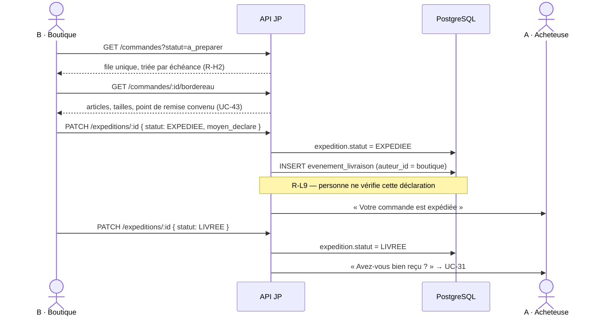
```mermaid
sequenceDiagram
    actor B as B · Boutique
    participant API as API JP
    participant DB as PostgreSQL
    actor A as A · Acheteuse

    B->>API: GET /commandes?statut=a_preparer
    API-->>B: file unique, triée par échéance (R-H2)
    B->>API: GET /commandes/:id/bordereau
    API-->>B: articles, tailles, point de remise convenu (UC-43)

    B->>API: PATCH /expeditions/:id { statut: EXPEDIEE, moyen_declare }
    API->>DB: expedition.statut = EXPEDIEE
    API->>DB: INSERT evenement_livraison (auteur_id = boutique)
    Note over API,DB: R-L9 — personne ne vérifie cette déclaration
    API->>A: « Votre commande est expédiée »

    B->>API: PATCH /expeditions/:id { statut: LIVREE }
    API->>DB: expedition.statut = LIVREE
    API->>A: « Avez-vous bien reçu ? » → UC-31
```

---

## UC-43 — Convenir du point de remise 🆕

| | |
|---|---|
| **Acteur principal** | A *(ou le bénéficiaire dans le cas du cadeau)* + B |
| **Fonctionnalités** | *(neuve)* · **Règles** R-L1, R-G1, R-G7 · **Décisions** `DP-04`, `DP-10` |
| **Préconditions** | Commande créée. |
| **Postconditions** | `fil_remise.point_convenu` et `accord_le` renseignés ; le point figure sur le bordereau *(UC-40)*. |

**Scénario nominal**
1. SYS ouvre un fil entre A et B à la création de la commande.
2. A et B conviennent du lieu et du moment de la remise.
3. B enregistre le point convenu ; il apparaît sur le bordereau.

**Scénarios alternatifs**
- **A1 — commande-cadeau** *(`DP-10`)* : l'échange a lieu entre **la boutique et le bénéficiaire**, jamais le donateur, qui **ne voit jamais l'adresse** *(`RB8`, `R-G1`)*. **C'est `accord_le` qui débloque alors le paiement.**
- **A2 — pas d'accord** : la commande ne peut pas avancer. ⚠️ **L'article doit être tenu pendant tout l'échange** — 30 minutes ne suffisent pas entre deux fuseaux horaires *(`PO-10`)*.

> **`RB8` devient structurel.** Il fallait cacher activement l'adresse au
> donateur ; désormais **il ne la manipule jamais** — elle se négocie entre deux
> personnes dont il ne fait pas partie.

---

# 8. Paquetage Confiance

## UC-50 — Signaler un problème sur une commande ★

| | |
|---|---|
| **Acteur principal** | A |
| **Acteurs secondaires** | B, SYS |
| **Fonctionnalités** | F6.3, F6.4, F6.8 · **Règles** R-T1, R-T2, R-T4, R-T8, R-T9 · **Recette** RB4 · **Décisions** `DP-05`, `DP-07` |
| **Préconditions** | Une commande livrée ou en cours. |
| **Postconditions** | Dossier ouvert, **inscrit au compteur de la boutique**. **Aucun fonds bloqué : il n'y en a plus.** |

**Description.** Le point culturel ne change pas : **le problème se signale à JP,
jamais en face à face avec la boutique.** La confrontation directe est socialement
coûteuse et conduit les gens à abandonner plutôt qu'à réclamer.

**Mais JP ne tranche plus** *(`DP-05`)* **et ne détient plus l'argent**
*(`DP-07`)*. **Le signalement ne rend rien : il compte.**

**Scénario nominal**
1. A ouvre sa commande et choisit « Il y a un problème ».
2. A choisit un motif — non reçu, abîmé, pas conforme, mauvaise taille, autre — ajoute des photos et une description.
3. SYS ouvre le dossier, attribue un numéro, et **l'inscrit immédiatement au compteur de la boutique** *(R-T8)*.
4. SYS notifie B, qui voit le motif et les photos, et répond **dans le même fil**. Le fil présente **l'historique complet aux deux parties** *(R-T1)* : ce qui était assemblé pour l'arbitre l'est désormais pour les parties elles-mêmes — c'est ce qui rend l'accord possible sans tiers.
5. B propose une solution : renvoi, remboursement de sa propre initiative, geste commercial. **SYS n'exécute aucun mouvement d'argent.**
6. A confirme que c'est réglé : le dossier se clôt et **le compteur est décrémenté**.

**Scénarios alternatifs**
- **A1 — pas d'accord** *(depuis 5)* : **il n'y a pas d'escalade, il n'y a plus d'arbitre.** Le dossier reste ouvert et **pèse durablement sur le score**.
- **A2 — seuil de signalements non résolus atteint** : SYS **suspend automatiquement la mise en vente** de la boutique *(R-T8, F6.8)*. ⚠️ Seuil non arrêté *(`PO-12`)*.
- **A3 — commande hors direct** : parcours **identique** *(R-H1)*.
- **A4 — la boutique n'a jamais expédié** : aucune preuve n'existe *(`R-L9`, `DP-04`)*. **Le signalement est le seul recours**, et il n'ouvre droit à aucun remboursement par JP *(`R-E5`)*.

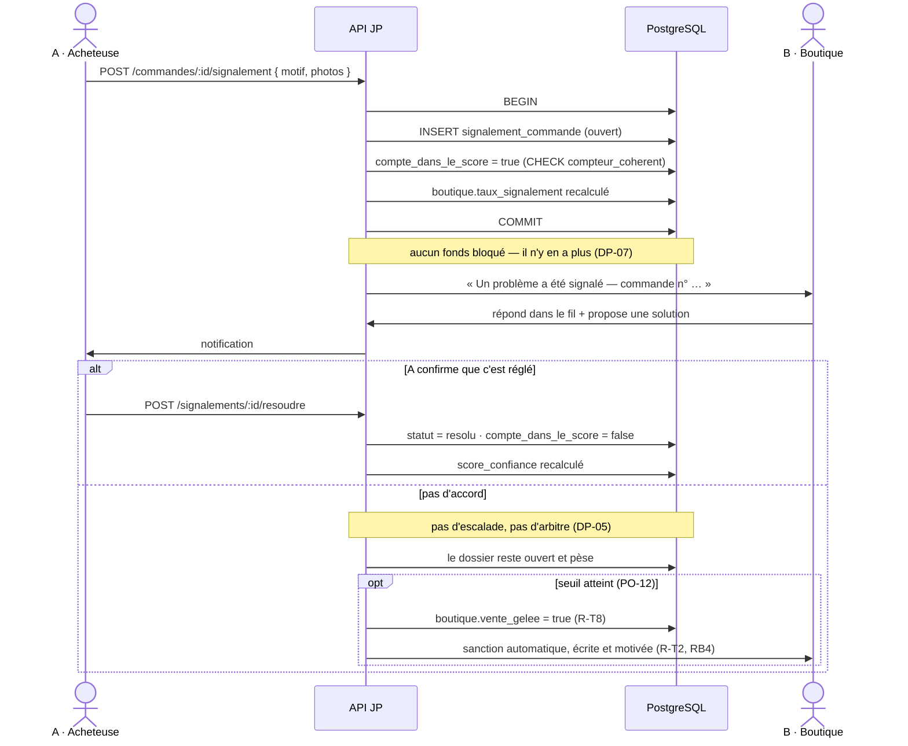
```mermaid
sequenceDiagram
    actor A as A · Acheteuse
    participant API as API JP
    participant DB as PostgreSQL
    actor B as B · Boutique

    A->>API: POST /commandes/:id/signalement { motif, photos }
    API->>DB: BEGIN
    API->>DB: INSERT signalement_commande (ouvert)
    API->>DB: compte_dans_le_score = true (CHECK compteur_coherent)
    API->>DB: boutique.taux_signalement recalculé
    API->>DB: COMMIT
    Note over API,DB: aucun fonds bloqué — il n'y en a plus (DP-07)
    API->>B: « Un problème a été signalé — commande n° … »

    B->>API: répond dans le fil + propose une solution
    API->>A: notification

    alt A confirme que c'est réglé
        A->>API: POST /signalements/:id/resoudre
        API->>DB: statut = resolu · compte_dans_le_score = false
        API->>DB: score_confiance recalculé
    else pas d'accord
        Note over API,DB: pas d'escalade, pas d'arbitre (DP-05)
        API->>DB: le dossier reste ouvert et pèse
        opt seuil atteint (PO-12)
            API->>DB: boutique.vente_gelee = true (R-T8)
            API->>B: sanction automatique, écrite et motivée (R-T2, RB4)
        end
    end
```

> ### Ce que l'acheteuse doit savoir **avant** de payer
>
> **JP ne rembourse pas** *(`R-E5`)*. Cette phrase doit être lisible à l'écran de
> paiement, là où figurait l'ancienne phrase de séquestre *(`RB12`)*. **La
> protection est en amont** — boutique vérifiée, historique visible, avis — jamais
> en aval.

---

## UC-52 — Se faire vérifier

| | |
|---|---|
| **Acteur principal** | B ou C |
| **Acteurs secondaires** | PSP, SYS |
| **Fonctionnalités** | F0.6, F15.1 · **Règles** R-V1 à R-V7 · **Recette RB6** · **Décisions** `DP-05`, `DP-07` |
| **Préconditions** | Dossier soumis : pièce d'identité recto/verso ou NIF/STAT, selfie, numéro mobile money. |
| **Postconditions** | **Mise en vente débloquée** et badge attribué, ou refus **motivé et précis sur ce qui manque** *(R-V3, R-V7)*. |

**Description.** **Il n'y a plus de file humaine** *(`DP-05`)* : la vérification
est exécutée par `SYS` et le prestataire. Et **ce qu'elle débloque a changé** —
elle ouvrait l'encaissement, elle ouvre désormais **la mise en vente**
*(`DP-07`)* : l'argent partant directement à la boutique au moment du paiement,
vérifier après la vente n'aurait plus de sens.

**Scénario nominal**
1. B dépose sa pièce d'identité et son selfie. → `document_identite` *(chiffré)*
2. SYS transmet au prestataire, qui compare **pièce, selfie et titulaire du compte mobile money** *(R-V2)* — **les trois points séparément**, jamais une validation globale.
3. SYS **journalise tout accès aux documents** *(R-V5, N3.1)*.
4. SYS décide, **motif écrit obligatoire**, et débloque la mise en vente + le badge *(F0.7)*.

**Scénarios alternatifs**
- **A1 — discordance de noms** *(depuis 2)* : refus *(R-V2)*.
- **A2 — pièce illisible** *(depuis 2)* : demande de pièce complémentaire, statut intermédiaire, notification.
- **A3 — mineur** *(depuis 2)* : refus **définitif** *(R-V6, RB6)*.
- **A4 — pendant l'instruction** : la boutique **peut** préparer son catalogue, elle ne peut ni publier, ni diffuser, ni mettre en vente *(R-V1)*.
- **A5 — refus à tort** : ⚠️ **il n'existe plus d'instance de recours** *(`DP-05`, `R-V7`)*. Le motif écrit est la **seule** voie de correction : il doit nommer la pièce ou le point de contrôle en défaut, jamais « document non conforme ».

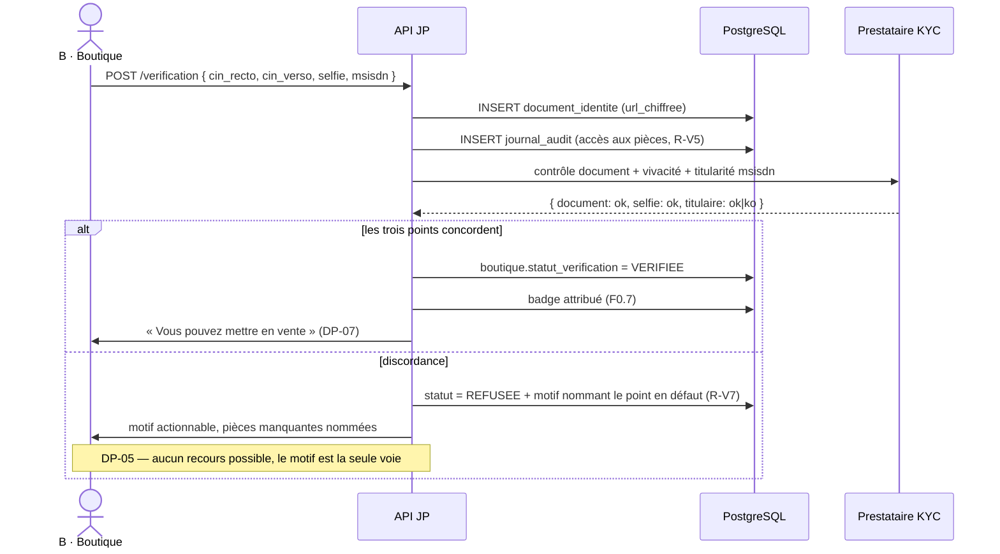
```mermaid
sequenceDiagram
    actor B as B · Boutique
    participant API as API JP
    participant DB as PostgreSQL
    participant PSP as Prestataire KYC

    B->>API: POST /verification { cin_recto, cin_verso, selfie, msisdn }
    API->>DB: INSERT document_identite (url_chiffree)
    API->>DB: INSERT journal_audit (accès aux pièces, R-V5)
    API->>PSP: contrôle document + vivacité + titularité msisdn
    PSP-->>API: { document: ok, selfie: ok, titulaire: ok|ko }

    alt les trois points concordent
        API->>DB: boutique.statut_verification = VERIFIEE
        API->>DB: badge attribué (F0.7)
        API->>B: « Vous pouvez mettre en vente » (DP-07)
    else discordance
        API->>DB: statut = REFUSEE + motif nommant le point en défaut (R-V7)
        API->>B: motif actionnable, pièces manquantes nommées
        Note over API,B: DP-05 — aucun recours possible, le motif est la seule voie
    end
```

> **La journalisation reste obligatoire même sans lecteur humain.** Elle ne
> protège plus des employés de JP — il n'y en a plus — mais reste **la seule
> preuve de ce que la plateforme a consulté et décidé**.

---

# 9. Paquetage Social, fidélité et contenu

## UC-60 — Suivre une boutique et recevoir ses nouveautés

| | |
|---|---|
| **Acteur principal** | A |
| **Fonctionnalités** | F7.1, F7.15, F7.17 · **Stories** US-SOCIAL-01, 02, 05 · **Règles** R-Q1 à R-Q6 |
| **Préconditions** | Aucune pour consulter ; un compte pour suivre. |
| **Postconditions** | Abonnement enregistré, fil « Abonnements » alimenté, réglage de notification par boutique disponible. |

**Scénario nominal**
1. A appuie sur « Suivre » depuis une vitrine, une fiche, un direct, un clip ou une story — **un seul appui, aucune confirmation** *(R-Q1)*.
2. SYS enregistre l'abonnement et met à jour le compteur public *(R-Q2)*.
3. Le fil « Abonnements » de A contient désormais les directs, **les nouveautés catalogue**, les promotions et les événements de cette boutique *(R-Q5)*.
4. A peut **couper les notifications de promotion** de cette boutique sans se désabonner *(R-Q6)*.

**Scénarios alternatifs**
- **A1 — non connectée** *(depuis 1)* : l'inscription est déclenchée et **l'abonnement est posé après connexion**.
- **A2 — hors ligne** *(depuis 1)* : l'état s'affiche localement, se synchronise à la reconnexion, **sans doublon** (clé primaire composite).
- **A3 — boutique suspendue** *(depuis 1)* : action indisponible, état expliqué.

**Diagramme de séquence**

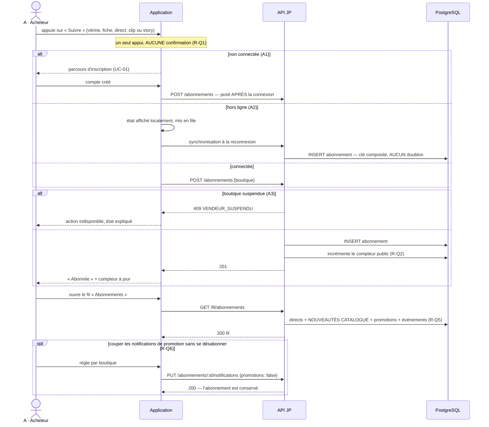
```mermaid
sequenceDiagram
    actor A as A · Acheteur
    participant APP as Application
    participant API as API JP
    participant DB as PostgreSQL
    A->>APP: appuie sur « Suivre » (vitrine, fiche, direct, clip ou story)
    Note over APP: un seul appui, AUCUNE confirmation (R-Q1)
    alt non connectée (A1)
        APP-->>A: parcours d'inscription (UC-01)
        A->>APP: compte créé
        APP->>API: POST /abonnements — posé APRÈS la connexion
    else hors ligne (A2)
        APP->>APP: état affiché localement, mis en file
        APP->>API: synchronisation à la reconnexion
        API->>DB: INSERT abonnement — clé composite, AUCUN doublon
    else connectée
        APP->>API: POST /abonnements {boutique}
    end
    alt boutique suspendue (A3)
        API-->>APP: 409 VENDEUR_SUSPENDU
        APP-->>A: action indisponible, état expliqué
    else
        API->>DB: INSERT abonnement
        API->>DB: incrémente le compteur public (R-Q2)
        API-->>APP: 201
        APP-->>A: « Abonnée » + compteur à jour
    end
    A->>APP: ouvre le fil « Abonnements »
    APP->>API: GET /fil/abonnements
    API->>DB: directs + NOUVEAUTÉS CATALOGUE + promotions + événements (R-Q5)
    API-->>APP: 200 fil
    opt couper les notifications de promotion sans se désabonner (R-Q6)
        A->>APP: règle par boutique
        APP->>API: PUT /abonnements/:id/notifications {promotions: false}
        API-->>APP: 200 — l'abonnement est conservé
    end
```

---

## UC-62 — Consulter ses clientes et leur rang

| | |
|---|---|
| **Acteur principal** | V |
| **Acteurs secondaires** | SYS |
| **Fonctionnalités** | F7.5, F7.6, F7.18, F7.19 · **Stories** US-FID-01 à 05 · **Règles** R-R1 à R-R11 |
| **Préconditions** | Au moins une commande confirmée. Fidélisation activée pour les paliers. |
| **Postconditions** | Liste ordonnée et **actionnable** : offrir une promo, envoyer un code. |

**Description.** Ce que la boutique veut savoir : **à qui faire un geste**. Pas un tableau de bord analytique — une liste de noms, ordonnée, avec une action à côté de chaque ligne *(R-R7)*.

**Scénario nominal**
1. SYS recalcule le rang à chaque commande confirmée, **en asynchrone**, sur quatre composantes : montant cumulé, fréquence, récence avec décote, fiabilité *(R-R3)*.
2. V ouvre « Mes clientes » : liste ordonnée par rang, filtrable par palier et par inactivité.
3. V ouvre une fiche : historique, tailles achetées, articles préférés, litiges, **note privée**.
4. V agit : « Offrir une promo » *(UC-71)* ou « Envoyer un code » *(F7.9)*.

**Scénarios alternatifs**
- **A1 — moins de 5 clientes** *(depuis 2)* : la liste s'affiche **sans palmarès** *(R-R6)*. Un classement à trois lignes décrédibilise la fonctionnalité.
- **A2 — employé** *(depuis 2)* : lecture seule, **montants absents de la réponse** *(R-R8)*.
- **A3 — cliente ayant supprimé son compte** : ligne **anonymisée**, agrégats conservés pour la comptabilité.
- **A4 — cliente perdant un palier par décote** : elle est **informée avant** la bascule *(R-R10)*.

**Règle non négociable** *(R-R1)* : le rang est **par boutique**, jamais global. Une boutique n'a aucune raison de connaître les dépenses de sa cliente ailleurs — et **la garantie est structurelle** : aucun index, aucune vue ne permet l'agrégation inter-boutiques.

**Diagramme de séquence**

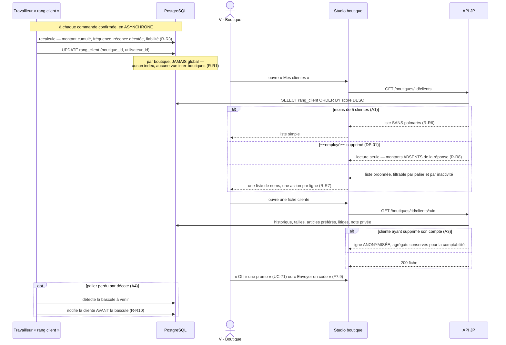
```mermaid
sequenceDiagram
    participant JOB as Travailleur « rang client »
    participant DB as PostgreSQL
    actor V as V · Boutique
    participant APP as Studio boutique
    participant API as API JP
    Note over JOB,DB: à chaque commande confirmée, en ASYNCHRONE
    JOB->>DB: recalcule — montant cumulé, fréquence, récence décotée, fiabilité (R-R3)
    JOB->>DB: UPDATE rang_client (boutique_id, utilisateur_id)
    Note over DB: par boutique, JAMAIS global —<br/>aucun index, aucune vue inter-boutiques (R-R1)
    V->>APP: ouvre « Mes clientes »
    APP->>API: GET /boutiques/:id/clients
    API->>DB: SELECT rang_client ORDER BY score DESC
    alt moins de 5 clientes (A1)
        API-->>APP: liste SANS palmarès (R-R6)
        APP-->>V: liste simple
    else ~~employé~~ supprimé (DP-01)
        API-->>APP: lecture seule — montants ABSENTS de la réponse (R-R8)
    else
        API-->>APP: liste ordonnée, filtrable par palier et par inactivité
        APP-->>V: une liste de noms, une action par ligne (R-R7)
    end
    V->>APP: ouvre une fiche cliente
    APP->>API: GET /boutiques/:id/clients/:uid
    API->>DB: historique, tailles, articles préférés, litiges, note privée
    alt cliente ayant supprimé son compte (A3)
        API-->>APP: ligne ANONYMISÉE, agrégats conservés pour la comptabilité
    else
        API-->>APP: 200 fiche
    end
    V->>APP: « Offrir une promo » (UC-71) ou « Envoyer un code » (F7.9)
    opt palier perdu par décote (A4)
        JOB->>DB: détecte la bascule à venir
        JOB->>DB: notifie la cliente AVANT la bascule (R-R10)
    end
```

---

## UC-92 — Publier un contenu avec articles attachés

| | |
|---|---|
| **Acteur principal** | C, V ou A selon le type |
| **Fonctionnalités** | F14.5, F14.1, F14.2, F14.6 · **Règles** R-K1 · **Recette RB5** |
| **Préconditions** | Selon le rôle : son catalogue pour V, tout catalogue autorisant l'affiliation pour C, **ses achats confirmés** pour A. |
| **Postconditions** | Contenu publié avec **au moins un article achetable**. |

**Scénario nominal**
1. L'acteur choisit un média et rédige une légende.
2. L'acteur attache un ou plusieurs articles, **selon le catalogue autorisé pour son rôle**.
3. SYS refuse la publication si aucun article n'est attaché — **côté client, côté API, et par contrainte différée en base** *(RB5)*.
4. SYS publie ; le contenu porte l'identifiant de la créatrice le cas échéant, ce qui rattache la vente *(F15.4)*.

**Scénarios alternatifs**
- **A1 — aucun article attaché** : `422 CONTENU_SANS_ARTICLE`. Le bouton est déjà inactif côté client, mais **le client n'est pas la garantie**.
- **A2 — créatrice, boutique refusant l'affiliation** : attachement refusé *(R-N3)*.
- **A3 — acheteuse, article non acheté** : attachement refusé — impossible d'attacher ce qu'on n'a pas reçu.
- **A4 — contenu sponsorisé** : l'étiquette « Partenariat rémunéré » est **automatique et non retirable** *(F18.8)*.

**Diagramme de séquence**

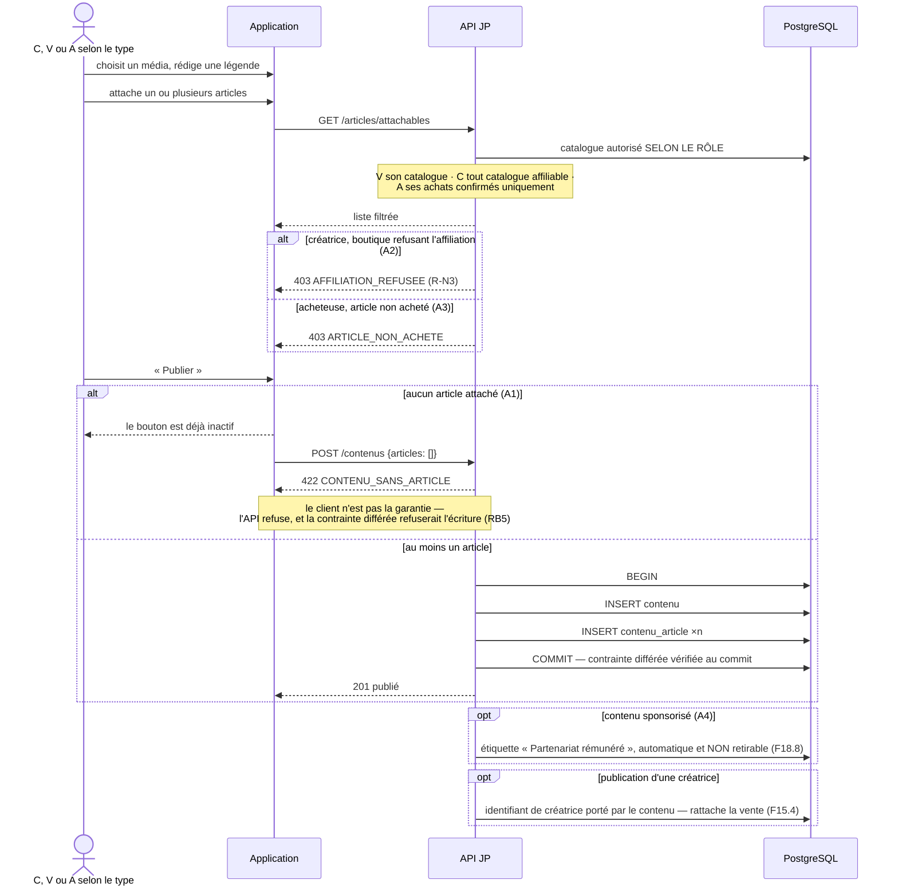
```mermaid
sequenceDiagram
    actor U as C, V ou A selon le type
    participant APP as Application
    participant API as API JP
    participant DB as PostgreSQL
    U->>APP: choisit un média, rédige une légende
    U->>APP: attache un ou plusieurs articles
    APP->>API: GET /articles/attachables
    API->>DB: catalogue autorisé SELON LE RÔLE
    Note over API: V son catalogue · C tout catalogue affiliable ·<br/>A ses achats confirmés uniquement
    API-->>APP: liste filtrée
    alt créatrice, boutique refusant l'affiliation (A2)
        API-->>APP: 403 AFFILIATION_REFUSEE (R-N3)
    else acheteuse, article non acheté (A3)
        API-->>APP: 403 ARTICLE_NON_ACHETE
    end
    U->>APP: « Publier »
    alt aucun article attaché (A1)
        APP-->>U: le bouton est déjà inactif
        APP->>API: POST /contenus {articles: []}
        API-->>APP: 422 CONTENU_SANS_ARTICLE
        Note over APP,API: le client n'est pas la garantie —<br/>l'API refuse, et la contrainte différée refuserait l'écriture (RB5)
    else au moins un article
        API->>DB: BEGIN
        API->>DB: INSERT contenu
        API->>DB: INSERT contenu_article ×n
        API->>DB: COMMIT — contrainte différée vérifiée au commit
        API-->>APP: 201 publié
    end
    opt contenu sponsorisé (A4)
        API->>DB: étiquette « Partenariat rémunéré », automatique et NON retirable (F18.8)
    end
    opt publication d'une créatrice
        API->>DB: identifiant de créatrice porté par le contenu — rattache la vente (F15.4)
    end
```

---

## UC-63 — Partager un lien d'affiliation 🆕

| | |
|---|---|
| **Acteur principal** | C |
| **Acteurs secondaires** | B, A, SYS |
| **Fonctionnalités** | F15.3, F15.4, F15.5 · **Règles** R-N1 à R-N6, R-N13 · **Décision** `DP-09` |
| **Préconditions** | Créatrice vérifiée ; la boutique autorise l'affiliation *(R-N3)*. |
| **Postconditions** | Lien porteur de l'identifiant de créatrice, attribution armée pour la fenêtre glissante. |

**Description.** **La créatrice ne vend pas, elle apporte.** Elle partage un
article — sur son profil JP, ou **hors JP, sur son compte Facebook où son
audience est déjà**. Le lien renvoie vers la fiche article ; l'acheteur voit le
détail et achète normalement. **Il ne voit aucune complexité supplémentaire**
*(R-N5)*.

**Scénario nominal**
1. C attache un article à « Ma sélection » *(R-N13)*. SYS affiche **le taux offert par la boutique, avant l'attachement** *(R-N4)*.
2. SYS génère un lien portant l'identifiant de créatrice, **valable y compris hors application** *(R-N1)*.
3. C partage le lien sur son réseau.
4. A clique, voit la fiche, achète *(UC-12 ou UC-21)*.
5. **Au paiement**, la part de C est **créditée directement** par l'éclatement, en même temps que celle de la boutique *(`DP-16`, R-N6)*.

**Scénarios alternatifs**
- **A1 — deux créatrices cliquées** : attribution à **la dernière cliquée** dans la fenêtre glissante ⚠️ *(R-N2, hypothèse 7 jours)*.
- **A2 — la boutique refuse l'affiliation** *(R-N3, R-K4)* : ses articles sont inattachables.
- **A3 — le versement à C échoue** : **la commande existe, la boutique est payée, l'expédition suit.** La part de C est enregistrée et **rejouée après vérification** *(R-M5, R-M7)*.
- **A4 — la boutique n'expédie jamais** : ⚠️ **C a déjà été payée** *(R-N6)*. Incohérent avec l'ancien modèle, **cohérent avec le nouveau** : plus personne n'attend la livraison pour être payé. Une créatrice qui recommande des boutiques qui n'expédient pas **perd son audience** — c'est là que la sanction se produit.

> **`R-N4` a changé de payeur.** La commission d'affiliation était prélevée sur
> la commission JP ; JP n'en prend plus *(`DP-08`)*. **C'est désormais la
> boutique qui paie**, sur son prix, à un taux qu'elle fixe et que la créatrice
> connaît d'avance.
>
> **`F15.10` — portefeuille et retrait créatrice — est supprimée** *(`DP-07`)* :
> l'argent arrive sur son mobile money, JP n'a pas de solde à lui montrer.

---

# 10. Paquetage Promotions et événements

## UC-70 — Lancer une promotion et notifier ses abonnés ★

| | |
|---|---|
| **Acteur principal** | V |
| **Acteurs secondaires** | A (abonnés), NOT, SYS |
| **Fonctionnalités** | F7.22, F7.23, F7.26, F7.8 · **Stories** US-PROMO-01, 02, 03, 07 |
| **Règles** | R-U1 à R-U4, R-U10 à R-U12 |
| **Préconditions** | Boutique avec un catalogue. **L'employé n'y a pas accès** *(matrice §3.2)*. |
| **Postconditions** | Promotion active, prix barrés affichés, abonnés notifiés **dans la limite des plafonds**. |

**Scénario nominal**
1. V choisit type, valeur, période, périmètre et cible.
2. SYS détecte un éventuel **chevauchement** avec une promotion existante et rappelle la règle de non-cumul *(R-U7)*.
3. SYS affiche **le net qui restera à la boutique** sur un article représentatif, commission déduite *(R-U10)*.
4. SYS annonce le nombre d'abonnés qui seront notifiés, avec un interrupteur pour ne pas notifier.
5. V lance. SYS active la promotion, applique les prix barrés, et déclenche le fan-out de notification.
6. NOT applique, **pour chaque abonné** : réglage individuel, plafond par boutique et par 24 h, seuil de regroupement *(R-U4)*.
7. SYS marque `notifiee_le` — **verrou d'idempotence** : après un incident, la promotion ne renotifie pas *(R-U3)*.
8. À la date de fin, SYS **rétablit automatiquement** les prix d'origine *(R-U11)*.

**Scénarios alternatifs**
- **A1 — programmée** *(depuis 5)* : statut `programmee`, bascule automatique à la date, notification **une seule fois**.
- **A2 — valeur rendant le prix nul ou négatif** *(depuis 1)* : refus *(R-U12)*. Au-delà d'un seuil élevé, confirmation explicite.
- **A3 — modification après le début** : **refusée**, sauf annulation *(machine à états)*. Les commandes passées conservent leur prix figé *(R-U9)*.
- **A4 — seconde promotion dans les 24 h** *(depuis 6)* : **aucune seconde notification**, et V est averti **avant** de valider.

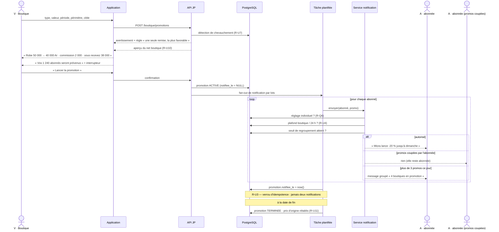
```mermaid
sequenceDiagram
    actor V as V · Boutique
    participant APP as Application
    participant API as API JP
    participant DB as PostgreSQL
    participant JOB as Tâche planifiée
    participant NOT as Service notification
    actor A1 as A · abonnée
    actor A2 as A · abonnée (promos coupées)

    V->>APP: type, valeur, période, périmètre, cible
    APP->>API: POST /boutique/promotions
    API->>DB: détection de chevauchement (R-U7)
    API-->>APP: avertissement + règle « une seule remise, la plus favorable »
    API-->>APP: aperçu du net boutique (R-U10)
    APP-->>V: « Robe 50 000 → 40 000 Ar · commission 2 000 · vous recevez 38 000 »
    APP-->>V: « Vos 1 240 abonnés seront prévenus » + interrupteur
    V->>APP: « Lancer la promotion »
    APP->>API: confirmation
    API->>DB: promotion ACTIVE (notifiee_le = NULL)

    API->>JOB: fan-out de notification par lots
    loop pour chaque abonné
        JOB->>NOT: envoyer(abonné, promo)
        NOT->>DB: réglage individuel ? (R-Q6)
        NOT->>DB: plafond boutique / 24 h ? (R-U4)
        NOT->>DB: seuil de regroupement atteint ?
        alt autorisé
            NOT-->>A1: « Miora lance -20 % jusqu'à dimanche »
        else promos coupées par l'abonnée
            NOT--xA2: rien (elle reste abonnée)
        else plus de 3 promos ce jour
            NOT-->>A1: message groupé « 4 boutiques en promotion »
        end
    end
    JOB->>DB: promotion.notifiee_le = now()
    Note over JOB,DB: R-U3 — verrou d'idempotence : jamais deux notifications

    Note over JOB,DB: à la date de fin
    JOB->>DB: promotion TERMINEE · prix d'origine rétablis (R-U11)
```

---

## UC-71 — Offrir une promotion réservée aux clientes VIP

| | |
|---|---|
| **Acteur principal** | V |
| **Fonctionnalités** | F7.24, F7.9, F7.25 · **Story** US-PROMO-04 · **Règles** R-U5, R-R9 |
| **Préconditions** | Fidélisation activée, paliers définis, au moins une cliente au palier visé. |
| **Postconditions** | Promotion visible et applicable **seulement** par les clientes éligibles ; visible mais **grisée** pour les autres. |

**Scénario nominal**
1. V sélectionne un palier depuis « Mes clientes » *(UC-62)*.
2. V crée une promotion réservée à ce palier et aux palier supérieurs.
3. Les clientes éligibles la voient nommément : *« Offre réservée aux clientes VIP de Miora »*.
4. SYS vérifie l'éligibilité **côté serveur** au calcul du panier *(R-U5)*.

**Scénarios alternatifs**
- **A1 — cliente non éligible** : la promotion est **visible mais grisée**, avec la progression nécessaire *(décision F7.24)*. Un palier ne motive que si l'on sait ce qu'on y gagne.
- **A2 — perte du palier entre la réservation et le paiement** : la remise est retirée avec un message clair, **la commande n'échoue pas** *(R-U5)*.
- **A3 — code nominatif** : usage unique, refusé pour une autre personne ; **restitué si la commande est annulée** *(R-U6)*.

**Diagramme de séquence**

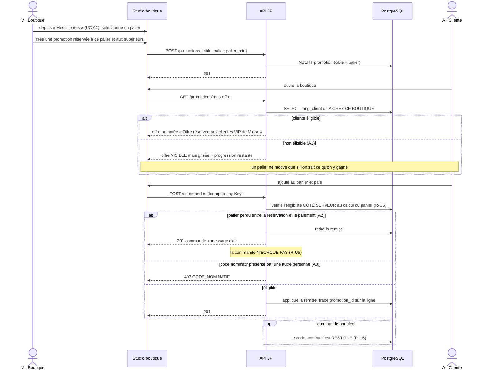
```mermaid
sequenceDiagram
    actor V as V · Boutique
    participant APP as Studio boutique
    participant API as API JP
    participant DB as PostgreSQL
    actor A as A · Cliente
    V->>APP: depuis « Mes clientes » (UC-62), sélectionne un palier
    V->>APP: crée une promotion réservée à ce palier et aux supérieurs
    APP->>API: POST /promotions {cible: palier, palier_min}
    API->>DB: INSERT promotion (cible = palier)
    API-->>APP: 201
    A->>APP: ouvre la boutique
    APP->>API: GET /promotions/mes-offres
    API->>DB: SELECT rang_client de A CHEZ CE BOUTIQUE
    alt cliente éligible
        API-->>APP: offre nommée « Offre réservée aux clientes VIP de Miora »
    else non éligible (A1)
        API-->>APP: offre VISIBLE mais grisée + progression restante
        Note over APP,A: un palier ne motive que si l'on sait ce qu'on y gagne
    end
    A->>APP: ajoute au panier et paie
    APP->>API: POST /commandes {Idempotency-Key}
    API->>DB: vérifie l'éligibilité CÔTÉ SERVEUR au calcul du panier (R-U5)
    alt palier perdu entre la réservation et le paiement (A2)
        API->>DB: retire la remise
        API-->>APP: 201 commande + message clair
        Note over API: la commande N'ÉCHOUE PAS (R-U5)
    else code nominatif présenté par une autre personne (A3)
        API-->>APP: 403 CODE_NOMINATIF
    else éligible
        API->>DB: applique la remise, trace promotion_id sur la ligne
        API-->>APP: 201
    end
    opt commande annulée
        API->>DB: le code nominatif est RESTITUÉ (R-U6)
    end
```

---

## UC-72 — Créer un événement thématique

| | |
|---|---|
| **Acteur principal** | B ou C *(organisateur)* |
| **Fonctionnalités** | F20.1, F20.4 · **Story** US-EVT-01 · **Règles** R-W1, R-W2, R-W12 |
| **Préconditions** | Aucune. |
| **Postconditions** | Événement en `brouillon` puis `annonce`, adresse publique partageable, transitions pilotées par les dates. |

**Scénario nominal**
1. **L'organisateur** renseigne nom, thème, dates, visuel, couleur, mot-dièse, présentation, règles de participation. *(L'événement de portée JP disparaît avec l'opérateur — `DP-05`.)*
2. SYS génère un `slug` unique et enregistre en `brouillon`.
3. **L'organisateur annonce** l'événement — action humaine, volontairement.
4. SYS le rend visible dans le calendrier *(F20.9)* avec un compte à rebours et un bouton « Me prévenir ».
5. À la date de début, SYS passe en `en_cours` **et refuse automatiquement** les candidatures restées en attente, avec notification *(R-W4)*.
6. À la date de fin, SYS clôt et produit le bilan *(F20.8)*.

**Scénarios alternatifs**
- **A1 — dates incohérentes** *(depuis 1)* : refus avant enregistrement.
- **A2 — événement de boutique** : créé par V **sans validation**, portée limitée à sa vitrine et à ses abonnés, **absent du calendrier général** *(R-W8)*.
- **A3 — annulation** : possible depuis tout statut sauf `termine`.

**Diagramme de séquence**

```mermaid
sequenceDiagram
    actor B as B · Organisateur
    participant BO as Back-office
    participant API as API JP
    participant DB as PostgreSQL
    participant JOB as Ordonnanceur
    participant NOT as Notifications
    B->>API: nom, thème, dates, visuel, couleur, mot-dièse, règles de participation
    BO->>API: POST /evenements
    alt dates incohérentes (A1)
        API-->>BO: 422 DATES_INVALIDES — refus AVANT enregistrement
    else valide
        API->>DB: génère un slug unique, INSERT evenement (brouillon)
        API-->>BO: 201 brouillon
    end
    B->>API: « Annoncer » — action humaine, volontaire
    BO->>API: POST /evenements/:id/annonce
    API->>DB: statut → annonce
    API-->>BO: 200 adresse publique partageable
    Note over API,DB: visible au calendrier (F20.9), compte à rebours, « Me prévenir »
    JOB->>DB: à la date de début — statut → en_cours
    JOB->>DB: refuse AUTOMATIQUEMENT les candidatures restées en attente (R-W4)
    JOB->>NOT: notifie les candidats refusés
    NOT-->>B: récapitulatif
    JOB->>DB: à la date de fin — statut → termine
    JOB->>DB: produit le bilan (F20.8)
    opt mini-événement de boutique (A2)
        Note over API,DB: créé par V SANS validation · portée limitée à sa vitrine<br/>et à ses abonnés · ABSENT du calendrier général (R-W8)
    end
    opt annulation (A3)
        B->>API: annule — possible depuis tout statut sauf termine
    end
```

---

## UC-73 — Participer à un événement ★

| | |
|---|---|
| **Acteur principal** | V, ou C |
| **Acteurs secondaires** | A, SYS |
| **Fonctionnalités** | F20.2, F20.3, F20.4, F20.7 · **Story** US-EVT-02, 03 · **Règles** R-W3 à R-W7 |
| **Préconditions** | Boutique **vérifié**, événement ouvert aux candidatures. |
| **Postconditions** | Articles et promotions visibles sur la page de l'événement, pastille sur les vignettes. |

**Description.** **La validation est ce qui fait la valeur de l'événement** *(R-W3)*. Sans elle, le premier événement de Noël se remplit de 400 articles hors sujet et la page ne vaut plus rien.

**Scénario nominal**
1. V voit les événements ouverts dans son studio.
2. V candidate en choisissant les articles et la promotion qu'il engage.
3. **L'organisateur** examine et accepte.
4. V rattache ses éléments : articles, promotion, clips avec le mot-dièse, direct programmé.
5. À l'ouverture, les éléments apparaissent sur la page publique, accessible **sans compte** *(R-W6)*.
6. Les vignettes des articles portent une **pastille** aux couleurs de l'événement, sans coût de données supplémentaire *(R-W7)*.

**Scénarios alternatifs**
- **A1 — boutique non vérifiée** *(depuis 2)* : refus **avec la condition manquante** et un lien vers la vérification.
- **A2 — refus éditorial** *(depuis 3)* : motif écrit **obligatoire**.
- **A3 — candidature sans réponse à l'ouverture** *(depuis 3)* : **refus automatique avec notification** *(R-W4)*. Le silence est le pire traitement.
- **A4 — article dans deux événements simultanés** *(depuis 4)* : autorisé, mais **une seule remise** *(R-U7)* et **une seule pastille**, celle de l'événement qui finit le plus tôt *(R-W7)*.
- **A5 — article épuisé pendant l'événement** : affiché **épuisé** avec l'alerte de retour en stock, pas masqué — la page doit rester crédible.

```mermaid
sequenceDiagram
    actor V as V · Boutique
    participant APP as Studio
    participant API as API JP
    participant DB as PostgreSQL
    actor B as B · Organisateur
    participant JOB as Tâche planifiée
    actor AN as AN · Visiteur

    V->>APP: « Participer à Noël JP »
    APP->>API: POST /evenements/:id/participations {articles, promotion}
    API->>DB: vérifie statut_verification de la boutique
    alt boutique non vérifiée
        API-->>APP: 403 + condition manquante + lien vers la vérification
    else boutique vérifiée
        API->>DB: participation = CANDIDATE
        API-->>V: « Candidature envoyée · réponse sous 48 h »

        B->>API: GET /admin/evenements/:id/candidatures
        API-->>B: articles engagés, avec vignettes
        alt acceptée
            B->>API: POST .../decision {acceptee}
            API->>DB: participation = ACCEPTEE
            API-->>V: « Candidature acceptée »
            V->>API: POST /evenements/:id/elements {articles, promo, clips, direct}
            API->>DB: INSERT evenement_element
        else refusée
            B->>API: POST .../decision {refusee, motif}
            API-->>V: refus + motif écrit (R-W4)
        end
    end

    Note over JOB,DB: à la date d'ouverture
    JOB->>DB: evenement = EN_COURS
    JOB->>DB: candidatures restées CANDIDATE → REFUSEE_SANS_REPONSE
    JOB->>V: notification aux non-répondus (R-W4)

    AN->>API: GET /evenements/noel-2026 (public, sans compte)
    API->>DB: compose la page : directs, articles en promo, clips, boutiques
    API-->>AN: page événement + filtres (taille pré-remplie si connectée)
    Note over API,AN: R-W6 — page d'acquisition, accessible sans compte
```

---

# 11. Paquetage Cadeau

## UC-80 — Demander un panier en cadeau

| | |
|---|---|
| **Acteur principal** | A |
| **Fonctionnalités** | F16.1, F16.2 · **Règles** R-L8, RB8 |
| **Préconditions** | Un panier non vide. |
| **Postconditions** | Un lien public, à durée limitée, révocable, **portant un panier figé**. |

**Scénario nominal**
1. A compose son panier et choisit « Demander en cadeau ».
2. SYS **fige le panier** et génère un jeton opaque à durée limitée.
3. SYS présente un aperçu de ce que verra le destinataire, et rappelle que **son adresse ne sera jamais visible** *(RB8)*.
4. A partage le lien sur WhatsApp ou Messenger.

**Scénarios alternatifs**
- **A1 — panier modifié après création du lien** : **le lien reflète le panier figé**, pas le panier courant. Sinon le donateur paierait autre chose que ce qu'il a vu.
- **A2 — lien expiré ou révoqué** : page d'état explicite, jamais une erreur brute.

**Diagramme de séquence**

```mermaid
sequenceDiagram
    actor A as A · Acheteur
    participant APP as Application
    participant API as API JP
    participant DB as PostgreSQL
    actor D as D · Donateur
    A->>APP: compose son panier
    A->>APP: « Demander en cadeau »
    APP->>API: POST /cadeaux {panier}
    API->>DB: FIGE le panier — copie des lignes, des prix et des frais
    API->>DB: génère un jeton opaque à durée limitée, révocable
    API-->>APP: 201 lien public
    APP-->>A: aperçu de ce que verra le destinataire
    Note over APP,A: rappel — l'adresse de A ne sera JAMAIS visible (RB8)
    A->>APP: partage sur WhatsApp ou Messenger
    A-->>D: lien
    D->>API: GET /cadeaux/:jeton
    alt lien expiré ou révoqué (A2)
        API-->>D: page d'état explicite, JAMAIS une erreur brute
    else valide
        API->>DB: SELECT le panier FIGÉ
        API-->>D: articles, montant total — aucune adresse, aucun nom de rue
    end
    opt A modifie son panier après coup (A1)
        A->>APP: ajoute un article
        APP->>API: PUT /panier
        API->>DB: le cadeau reste sur la COPIE FIGÉE
        Note over API,D: sinon le donateur paierait autre chose que ce qu'il a vu
    end
```

---

## UC-81 — Offrir un panier depuis l'étranger ★

| | |
|---|---|
| **Acteur principal** | D — donateur, **sans compte et sans application** |
| **Acteurs secondaires** | A, PSP, SYS |
| **Fonctionnalités** | F16.3, F16.4, F16.10, F16.5, F16.6 · **Règles** RB7, RB8 |
| **Préconditions** | Un lien de panier cadeau valide. |
| **Postconditions** | Commande payée, parcours normal, **adresse jamais exposée au donateur**, suivi et preuve de remise accessibles par le lien. |

**Description.** Ce qui manque à un transfert d'argent classique : celui qui envoie ne sait jamais ce qui en est fait. Ici il choisit l'objet, voit la boutique vérifiée, suit la livraison et obtient une preuve.

**Scénario nominal**
1. D ouvre le lien dans son navigateur, **sans installer l'application**.
2. SYS détecte le pays, affiche le montant en Ariary **et une conversion indicative**, propose la **carte en premier**, et annonce **les frais de conversion à l'avance** *(RB7)*.
3. SYS affiche les articles, le total, les frais de livraison, le **badge de boutique vérifiée**, et le mode de livraison **agrégé** — sans quartier, sans repère, sans nom de relais, sans téléphone *(RB8)*.
4. D laisse un message et paie.
5. **L'accord sur le point de remise constaté** *(UC-43)*, D confirme le paiement ; SYS crée la commande et notifie le bénéficiaire : *« Naina vous a offert votre panier »* avec le message.
6. La commande suit le parcours normal *(UC-40)*.
7. D suit la livraison **depuis son lien, sans compte**, et voit la preuve de remise.
8. À la réception, A **confirme avoir reçu** *(UC-31)*, en un appui. **D en est notifié.**

**Scénarios alternatifs**
- **A1 — double paiement du même lien** : un seul encaissement *(idempotence)*.
- **A2 — taux de change indisponible** *(depuis 2)* : montant affiché en Ariary seul, **jamais un taux périmé sans mention**.
- **A3 — donateur local** : mobile money proposé en premier, aucune conversion affichée.

```mermaid
sequenceDiagram
    actor A as A · Hanta (Antananarivo)
    actor D as D · Naina (France, sans compte)
    participant WEB as Page web cadeau
    participant API as API JP
    participant DB as PostgreSQL
    participant PSP as Agrégateur carte

    A->>API: POST /commandes/:id/cadeau
    API->>DB: panier FIGÉ + jeton opaque à durée limitée
    API-->>A: lien partageable
    A->>D: envoie le lien par WhatsApp

    D->>WEB: ouvre le lien (navigateur, aucun compte)
    WEB->>API: GET /cadeau/:jeton
    API->>DB: projectionDonateur()
    Note over API,DB: RB8 — la projection NE CONTIENT AUCUN champ d'adresse
    API-->>WEB: articles, total, frais, boutique vérifiée,<br/>AUCUNE information de livraison (RB8)
    WEB-->>D: 135 000 Ar ≈ 28,90 € · frais de conversion annoncés (RB7)

    D->>WEB: message + paiement par carte
    WEB->>API: POST /cadeau/:jeton/paiement + Idempotency-Key
    API->>PSP: débit carte
    PSP-->>API: confirmé
    API->>DB: commande PAYEE + sequestre RETENU + donateur_ref
    API->>A: « Naina vous a offert votre panier » + message

    Note over API,DB: la commande suit le parcours normal (UC-40)

    D->>WEB: suit la livraison depuis son lien
    WEB->>API: GET /cadeau/:jeton/suivi
    API-->>WEB: frise + preuve de remise, TOUJOURS sans adresse
    WEB-->>D: « Remis le 16 août à 14 h 20 » + photo du colis

    A->>API: confirme la réception en un appui (UC-31)
    API->>D: « Hanta a reçu votre cadeau »
    Note over A,D: DP-17 — un appui, aucune vidéo demandée
```

---

# 12. Paquetage Modération

## UC-90 — Signaler un contenu ou une personne

| | |
|---|---|
| **Acteur principal** | A, C, V |
| **Fonctionnalités** | F19.3, F19.12, F6.7 · **Règles** R-X4, R-X5 |
| **Préconditions** | Un contenu, un commentaire, un message ou un profil visible. |
| **Postconditions** | Signalement enregistré, **anonyme pour la personne signalée**, avec un numéro et un délai d'engagement. |

**Scénario nominal**
1. L'acteur fait un appui long et choisit « Signaler ».
2. L'acteur choisit un motif dans une liste courte.
3. SYS enregistre, attribue un numéro et affiche le délai d'engagement.

**Scénarios alternatifs**
- **A1 — signalement d'urgence** *(depuis 2)* — harcèlement, menace, contenu sexuel non consenti, mineur : SYS le place **en tête de file**, alerte l'équipe, annonce un délai court, **et propose immédiatement de bloquer ou de masquer** *(F19.4)*. La personne doit pouvoir se protéger **sans attendre** la décision.
- **A2 — plusieurs signalements sur la même cible** : **regroupés** dans la file.

**Diagramme de séquence**

```mermaid
sequenceDiagram
    actor U as A, C ou V
    participant APP as Application
    participant API as API JP
    participant DB as PostgreSQL
    participant NOT as Notifications
    participant SYS as SYS · Filtre automatique
    U->>APP: appui long sur un contenu, un commentaire, un message ou un profil
    APP-->>U: « Signaler »
    U->>APP: choisit un motif dans une liste courte
    APP->>API: POST /signalements {cible, motif}
    API->>DB: INSERT signalement — ANONYME pour la personne signalée (R-X4)
    alt motif d'urgence (A1)
        Note over API: harcèlement, menace, contenu sexuel non consenti, mineur
        API->>DB: place le dossier EN TÊTE de file
        API->>NOT: alerte l'équipe
        NOT-->>SYS: traitement automatique prioritaire (DP-05)
        API-->>APP: 201 + délai court annoncé
        APP-->>U: propose immédiatement « Bloquer » ou « Masquer » (F19.4)
        Note over APP,U: se protéger SANS ATTENDRE la décision
    else motif ordinaire
        API->>DB: file normale
        API-->>APP: 201 numéro de dossier + délai d'engagement
    end
    opt plusieurs signalements sur la même cible (A2)
        API->>DB: regroupe les signalements dans la file
    end
    APP-->>U: « Signalement n° 4821 · réponse sous 48 h »
```

---

# 13. Matrice cas d'utilisation × acteurs

| Cas d'utilisation | AN | A | B | C | D |
|---|:-:|:-:|:-:|:-:|:-:|
| UC-01 Créer un compte | ● | | | | |
| UC-02 Se connecter | | ● | ● | ● | |
| UC-03 Récupérer son compte | | ● | ● | ● | |
| UC-10 Publier un article | | | ● | | |
| UC-12 Acheter hors direct | ○ | ● | ○ | ○ | |
| UC-13 Remplir un panier | | ● | ○ | ○ | |
| UC-20 Diffuser un direct | | | ● | | |
| UC-21 Acheter en direct | ○ | ● | ○ | ○ | |
| UC-30 Payer une commande | | ● | | | ○ |
| UC-31 Confirmer la réception | | ● | ○ | | |
| **UC-33 Gérer son abonnement** 🆕 | | | ● | | |
| UC-40 Préparer et expédier | | | ● | | |
| **UC-43 Convenir du point de remise** 🆕 | | ● | ● | | |
| UC-50 Signaler un problème | | ● | ○ | | |
| UC-52 Se faire vérifier | | | ● | ● | |
| UC-60 Suivre une boutique | | ● | ○ | ○ | |
| UC-62 Consulter ses clientes | | ○ | ● | | |
| **UC-63 Partager un lien d'affiliation** 🆕 | | | ○ | ● | |
| UC-70 Lancer une promotion | | ○ | ● | | |
| UC-71 Promo VIP | | ○ | ● | | |
| UC-72 Créer un événement de boutique | | | ● | ● | |
| UC-73 Participer à un événement | | | ● | ● | |
| UC-80 Demander un cadeau | | ● | | | ○ |
| UC-81 Offrir un article | | ○ | | | ● |
| UC-90 Signaler | ○ | ● | ● | ● | |
| UC-92 Publier un contenu | | ● | ● | ● | |

● acteur principal · ○ acteur secondaire ou destinataire

---

# 14. Cas d'utilisation et critères de recette bloquants

Chaque critère bloquant du cahier des charges est couvert par au moins un cas d'utilisation, ce qui donne le plan de recette.

| Critère | Cas d'utilisation à jouer | Vérification |
|---|---|---|
| **RB1** Aucune survente | UC-21 *(A1)*, UC-12 *(A2)* | Appuis simultanés sur `stock = 1`, **inter-canaux** |
| **RB2** Chaque crédit atteint le bon compte, aucun ne reste en souffrance | UC-30 *(A5, A6)*, UC-31 | Jeu de scénarios complet, réconciliation à 100 % |
| **RB3** Remboursement automatique si seuil non atteint | Précommande *(F15.8)* | Bout en bout, **sans intervention humaine** |
| **RB4** 100 % des sanctions automatiques écrites et motivées | UC-50 *(A2)*, UC-52 *(A5)* | Contrainte de base + revue des dossiers |
| **RB5** Aucun contenu sans article attaché | UC-92 *(A1)* | Tentative sur chaque type de contenu |
| **RB6** Aucune publication vidéo par un mineur | UC-52 *(A3)* | Compte déclaré mineur **et** compte vérifié mineur |
| **RB7** Aucun frais découvert après l'engagement | UC-12 *(4)*, UC-13 *(A2)*, UC-81 *(2)* | Revue de tous les parcours d'achat |
| **RB8** Adresse jamais exposée au donateur | UC-81 *(3, 7)* | Assertion récursive sur les clés de la réponse |
| **RB9** Aucun affichage de rareté non réel | UC-20 *(5)*, UC-21 | Revue de tous les compteurs et minuteurs |
| **RB10** Paiement interrompu sans double prélèvement | UC-30 *(A1, A2, A4)* | Coupure provoquée à chaque étape |

---

*Conception de la base de données : `JP_CONCEPTION_BDD.md` · Conception de l'application : `JP_CONCEPTION_APP.md` · Plans de réalisation : `plan/`.*
