# JP — Conception de la base de données

| | |
|---|---|
| **Objet** | Modèle de données de la plateforme : entités, relations, contraintes, index, ordre des migrations |
| **Public** | Équipe de développement |
| **Version** | 1.0 · Août 2026 |
| **SGBD** | **PostgreSQL 16** — non négociable *(CDC technique §2.2)* |
| **Amont** | `JP_CDC_TECHNIQUE.md` §3 · `JP_CAHIER_DES_CHARGES.md` (règles `R-xx`) · `JP_CAS_UTILISATION.md` |

> Les diagrammes sont en **Mermaid** et s'affichent directement dans GitHub.
>
> **113 tables**, réparties en 12 domaines. Ce document donne la vue d'ensemble et les décisions de modélisation ; le détail colonne par colonne est dans `JP_CDC_TECHNIQUE.md` §3 et dans `prisma/schema.prisma`.

---

# 1. Les huit décisions de modélisation qui gouvernent tout

Avant les diagrammes, les choix dont découle le reste. Chacun répond à une contrainte du produit, pas à une préférence.

### D1 — PostgreSQL, et pas autre chose

Deux exigences l'imposent : **l'intégrité du stock** *(C3)*, qui demande des transactions strictes avec verrouillage de ligne, et **l'argent conservé pour compte de tiers** *(C4)*, qui demande un journal inaltérable et une réconciliation exacte. Aucune base sans transactions sérialisables ne peut tenir `RB1` et `RB2`.

### D2 — Le stock est la seule vérité, Redis n'est jamais autorité

`variante.quantite_stock` et `variante.quantite_reservee` sont la vérité. Redis diffuse le compteur pour l'affichage en direct et **peut diverger**. La base tranche, toujours *(CDC §5.2)*.

```sql
disponible(variante) = quantite_stock − quantite_reservee
```

Deux contraintes `CHECK` sont le **dernier filet** contre la survente, même en cas de bogue applicatif :

```sql
CHECK (quantite_reservee >= 0)
CHECK (quantite_reservee <= quantite_stock)
```

### D3 — Le journal financier est `append only`, appliqué par les droits

`ecriture_financiere` et `journal_audit` n'acceptent **que des insertions**. Toute correction est une écriture inverse *(C4)*. La garantie n'est pas une convention d'équipe, c'est une révocation de droits :

```sql
REVOKE UPDATE, DELETE ON ecriture_financiere FROM app_role;
REVOKE UPDATE, DELETE ON journal_audit FROM app_role;
```

Les soldes de `portefeuille` sont **dérivés du journal**, jamais saisis. Un test recalcule les soldes par relecture et compare.

### D4 — Une seule remise par ligne, garantie par la structure

`ligne_commande.promotion_id` est une **colonne scalaire**, pas une table de liaison. Le cumul de remises est donc **impossible par construction**, pas seulement interdit par convention *(R-U7)*. Une table `ligne_promotion` aurait rendu le cumul possible par erreur.

### D5 — Le rang client est par vendeur, et l'absence de chemin d'accès est la garantie

`rang_client` porte `UNIQUE(vendeur_id, utilisateur_id)`. Il n'existe **volontairement aucun** index sur `utilisateur_id` seul dans `vente_confirmee_journal`, et **aucune vue** agrégeant un client tous vendeurs confondus *(R-R1)*.

Un contrôle d'autorisation se contourne par une nouvelle requête ; **l'absence de chemin d'accès ne se contourne pas**. Cette absence est documentée dans la migration, pour qu'un futur développeur cherchant à « optimiser » comprenne qu'elle est intentionnelle.

### D6 — Les montants sont des entiers en Ariary, sans exception

`int` partout. **Aucun flottant, ni en base, ni en transport, ni en calcul** *(CDC §6.2)*. Les taux de commission sont exprimés **en pour mille** (`25` = 2,5 %) pour la même raison. Les pourcentages de remise sont des entiers, et l'arrondi se fait une fois, à l'entier inférieur, en faveur de l'acheteur.

### D7 — Le panier n'existe pas comme table

Une ligne de panier **est** une réservation active *(F1.16)*. Une table `panier` créerait une **seconde source de vérité** sur ce qui est réservé, donc un risque de survente. Le panier est la projection des réservations de l'utilisateur, groupées par vendeur.

### D8 — Ce qui est dénormalisé, et pourquoi

Cinq dénormalisations assumées, chacune avec son mécanisme de maintien et sa tâche de réconciliation :

| Colonne | Raison | Maintien |
|---|---|---|
| `profil_vendeur.nb_abonnes` | compter 200 000 lignes à chaque vitrine est exclu *(C1, C2)* | déclencheur + réconciliation quotidienne |
| `profil_vendeur.delai_expedition_moyen` | affiché avant achat *(F5.9)* | tâche quotidienne |
| `article.a_mesures` | tri par pertinence *(R-H4)* | déclencheur |
| `statistique_contenu.*` | entonnoir affiché sans agrégation à la volée | agrégation asynchrone |
| `point_relais.nb_colis_en_stock` | saturation du relais *(F11.4)* | déclencheur |

Toute dénormalisation doit être **recalculable** : un compteur qu'on ne sait pas réparer est une dette.

---

### D9 — L'univers est une entité de premier rang, pas une colonne de catégorie

**Décision du 20/08/2026.** JP est une place de marché **par univers** : `JP Mode`
et `JP Beauté` ouverts, `JP Tech` déclaré et fermé. **Trois, et pas d'autre.**

**Un univers n'est pas un filtre de catégorie, c'est un jeu de règles.** Entre une robe et un téléphone, ce qui change n'est pas l'étagère : c'est la fiche article, le mode de livraison, les motifs de litige recevables, le taux de commission et la vérification exigée du vendeur.

Le taux suffit à le démontrer : un revendeur de téléphones gagne ~5 % sur un appareil ; lui en prendre 8 rendrait `JP Tech` vide.

**Où vit chaque règle** — et ce partage est la décision :

| Règle | Où | Pourquoi là |
|---|---|---|
| commission | **base** *(`univers.commission_pour_mille`)* | levier économique du pilote, doit bouger sans déploiement |
| livraisons, champs de fiche, motifs de litige, provenance | **code** *(`packages/contracts/src/univers.ts`)* | change le produit, donc passe par une revue et un test |

**`article.univers_cle` est immuable** *(R-Y1)*. Changer l'univers d'un article changerait ses règles de litige et sa commission **après** qu'une commande a été passée. Un déclencheur l'interdit — une contrainte `CHECK` ne peut pas comparer l'ancienne et la nouvelle valeur.

**`commande` fige son univers et son taux** *(R-Y3)*, comme le barème historisé de `R-G3`. Un changement de taux ne rétroagit jamais.

**Trois univers fermés existent en base.** L'abstraction se construit maintenant ; la rétrofitter après le lancement voudrait dire migrer chaque article, chaque commande et chaque promotion sur des données réelles.

---

# 2. Carte des domaines

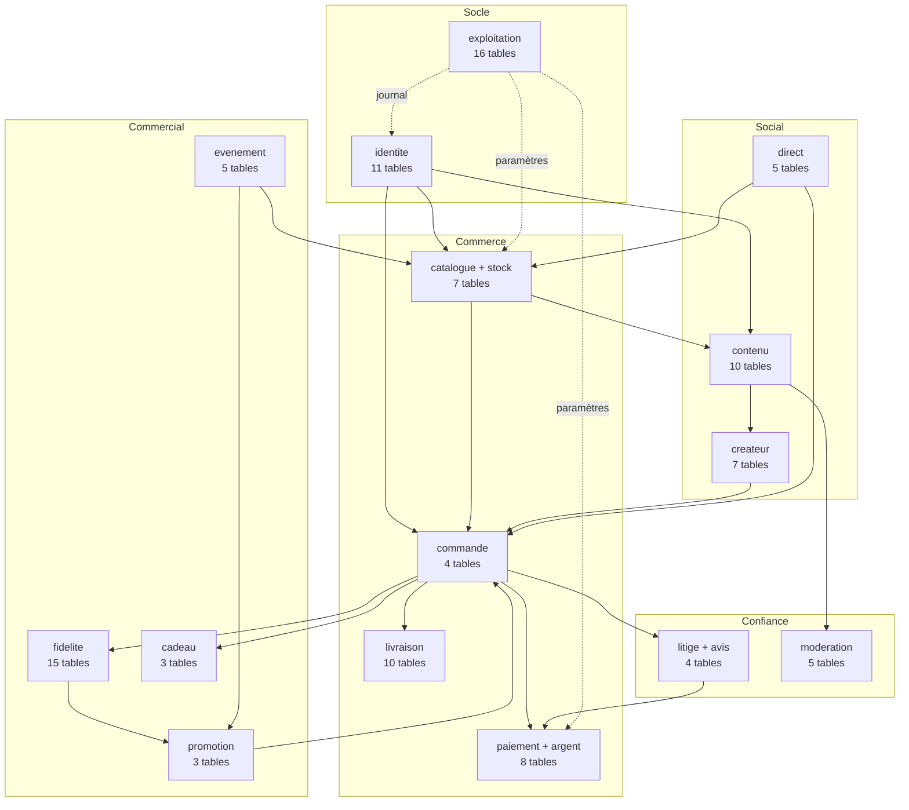

**Lecture des dépendances** : `commande` est le carrefour — c'est le seul domaine où l'argent et le stock se rencontrent. `stock` ne dépend de rien, ce qui est délibéré : c'est le plus critique *(RB1)* et le plus isolé. `exploitation` est transverse : paramètres et journal d'audit, lus et écrits par tous.

---

# 3. Domaine Identité

```mermaid
erDiagram
    UTILISATEUR ||--o| PROFIL_ACHETEUR : "a"
    UTILISATEUR ||--o| PROFIL_VENDEUR : "a"
    UTILISATEUR ||--o| PROFIL_CREATEUR : "a"
    UTILISATEUR ||--o{ IDENTITE_EXTERNE : "rattache"
    UTILISATEUR ||--o{ SESSION : "ouvre"
    UTILISATEUR ||--o{ DOCUMENT_IDENTITE : "fournit"
    UTILISATEUR ||--o{ ADRESSE : "enregistre"
    PROFIL_VENDEUR ||--o{ MEMBRE_EQUIPE : "invite"
    UTILISATEUR ||--o{ MEMBRE_EQUIPE : "est membre de"
    UTILISATEUR ||--o{ DEMANDE_RECUPERATION : "demande"
    UTILISATEUR ||--o{ DEMANDE_CHANGEMENT_EMAIL : "demande"

    UTILISATEUR {
        uuid id PK
        string email UK "identifiant du compte (R-C1)"
        timestamp email_verifie_le
        string telephone "NULL · contact de livraison (R-C15)"
        timestamp telephone_verifie_le
        string prenom
        string photo_url
        enum langue "mg | fr"
        date date_naissance "requis pour publier (RB6)"
        enum statut "actif | suspendu | supprime"
        bool classements_publics
        timestamp cree_le
    }
    CODE_OTP {
        uuid id PK
        string email "IDX(email, expire_le)"
        string code_empreinte "HACHÉ, jamais en clair (R-C6)"
        int tentatives
        timestamp expire_le
        timestamp consomme_le
        string adresse_ip
    }
    IDENTITE_EXTERNE {
        uuid id PK
        uuid utilisateur_id FK
        enum fournisseur "google"
        string sujet_externe "UK(fournisseur, sujet) · stable (R-C12)"
        bool email_verifie
    }
    PROFIL_VENDEUR {
        uuid id PK
        uuid utilisateur_id FK "UK"
        enum type_vendeur "boutique | particulier (R-H5)"
        string nom_boutique "NULL si particulier"
        string slug UK
        enum statut_verification
        string msisdn_mobile_money
        bool affiliation_autorisee "R-N3"
        bool encaissement_gele "F6.8"
        numeric score_confiance
        int delai_expedition_moyen "dénormalisé"
        int nb_abonnes "dénormalisé (R-Q2)"
        bool fidelite_activee
    }
    PROFIL_ACHETEUR {
        uuid utilisateur_id PK
        string taille_haut
        string taille_bas
        string taille_chaussure
        string morphologie
        int budget_min
        int budget_max
        json styles
        json couleurs
    }
    PROFIL_CREATEUR {
        uuid id PK
        uuid utilisateur_id FK "UK"
        string nom_public
        string slug UK
        json reseaux
        enum statut_verification
        int palier
        bool badge_verifie
        int nb_abonnes
        int nb_ventes_generees
    }
    MEMBRE_EQUIPE {
        uuid id PK
        uuid vendeur_id FK
        uuid utilisateur_id FK
        json permissions "jamais : portefeuille, retrait, prix, promotion"
        timestamp revoque_le "UK partiel si NULL"
    }
    DOCUMENT_IDENTITE {
        uuid id PK
        uuid utilisateur_id FK
        enum type "cin_recto | cin_verso | selfie | nif_stat"
        string url_chiffree "chiffré au repos (R-V5)"
        string empreinte
    }
    SESSION {
        uuid id PK
        uuid utilisateur_id FK
        uuid famille_id "rotation, détection de réutilisation"
        string empreinte_rafraichissement
        string appareil_libelle
        timestamp revoquee_le
    }
    DEMANDE_RECUPERATION {
        uuid id PK
        string numero UK
        uuid utilisateur_cible_id FK
        string email_ancien
        string email_nouveau
        enum statut
        string motif_decision
        uuid decide_par_id
    }
    DEMANDE_CHANGEMENT_EMAIL {
        uuid id PK
        uuid utilisateur_id FK
        string nouvel_email
        enum etape "ancienne_verifiee | terminee"
        timestamp expire_le
    }
    ADRESSE {
        uuid id PK
        uuid utilisateur_id FK
        string libelle
        string quartier
        string reperes "pas de code postal (R-L3)"
        string telephone_destinataire
    }
```

**Deux points d'attention.**

`utilisateur.telephone` **n'est plus unique ni obligatoire** : un foyer partage un numéro de livraison, et l'unicité serait une contrainte inventée qui casserait des cas réels. L'unicité porte sur `email` seul *(R-C1, R-C3)*.

`code_otp.code_empreinte` est **haché** : une fuite de cette table ne doit pas être une fuite de comptes *(R-C6)*. Même raisonnement pour `colis.code_retrait`.

---

# 4. Domaine Catalogue et stock

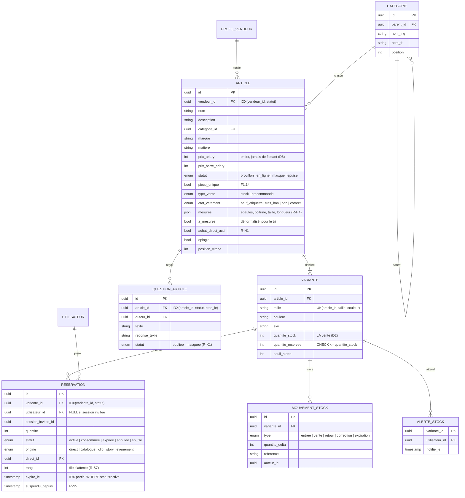

**`reservation` est la table la plus sensible du schéma.** Elle porte `RB1`. Trois éléments la protègent : le verrou `FOR UPDATE` sur `variante` dans la transaction, les deux contraintes `CHECK`, et l'index partiel qui rend l'expiration bon marché.

**Un seul moteur de réservation pour tous les canaux** *(R-H1)* : `origine` change la valeur de `expire_le` à la création *(R-H3)*, et rien d'autre. Un second chemin de réservation serait un défaut d'architecture.

**Toute variation de `quantite_stock` produit un `mouvement_stock`.** C'est la seule façon d'expliquer un écart trois semaines plus tard.

---

# 5. Domaine Commande, paiement et argent

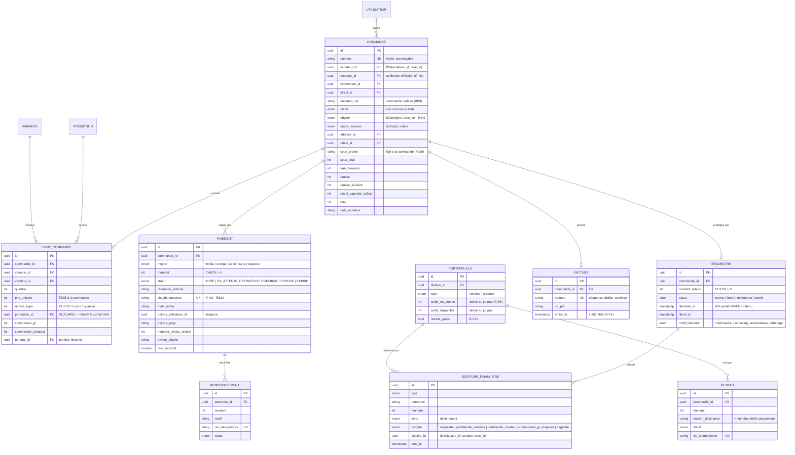

**`ecriture_financiere` est le cœur de la conformité** *(C4)*. `append only`, appliqué par révocation de droits *(D3)*. Les soldes de `portefeuille` en sont **dérivés** : un test recalcule les soldes par relecture du journal sur 10 000 écritures et compare.

**`ligne_commande.promotion_id` scalaire** est la traduction structurelle de `R-U7` *(D4)*. C'est la décision de modélisation la plus importante du domaine commercial.

**`paiement.cle_idempotence`** porte `RB10`. Un rejeu renvoie le résultat initial sans nouveau prélèvement.

---

# 6. Domaine Livraison

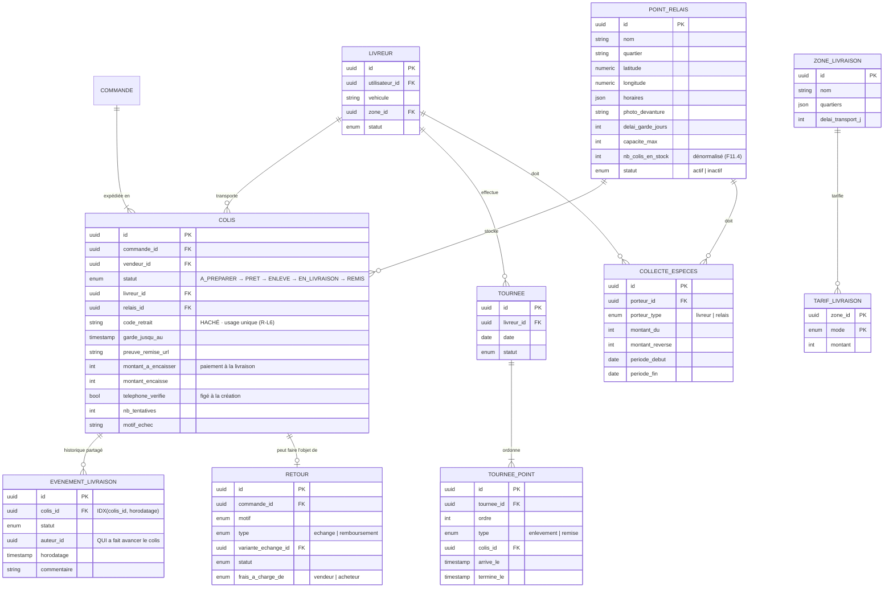

**`evenement_livraison` porte l'auteur de chaque transition.** Savoir *qui* a fait avancer le colis réduit les contestations et rend l'arbitrage possible *(UC-51)*.

**`colis.code_retrait` est haché**, comme un OTP. Les six chiffres ne sont en clair que dans la notification et le SMS.

**`colis.montant_encaisse` distinct de `montant_a_encaisser`** : l'écart est **signalé**, jamais absorbé silencieusement *(F11.5)*.

---

# 7. Domaine Contenu, direct et créatrices

```mermaid
erDiagram
    UTILISATEUR ||--o{ CONTENU : "publie"
    CONTENU ||--|{ CONTENU_ARTICLE : "OBLIGATOIRE >= 1 (RB5)"
    ARTICLE ||--o{ CONTENU_ARTICLE : "attaché"
    CONTENU ||--o| STATISTIQUE_CONTENU : "mesuré par"
    CONTENU ||--o{ INTERACTION : "reçoit"
    CONTENU ||--o{ CONTENU_HASHTAG : "porte"
    HASHTAG ||--o{ CONTENU_HASHTAG : "rassemble"
    COMMANDE ||--o| CONTENU : "source d'unboxing (R-K2)"
    UTILISATEUR ||--o{ ABONNEMENT : "suit"
    PROFIL_VENDEUR ||--o{ DIRECT : "diffuse"
    DIRECT ||--o{ DIRECT_ARTICLE : "prépare"
    DIRECT ||--o{ MESSAGE_DIRECT : "chat"
    DIRECT ||--o| DIRECT_BILAN : "conclut"
    PROFIL_CREATEUR ||--o{ SELECTION : "compose"
    SELECTION ||--o{ SELECTION_ARTICLE : "contient"
    PROFIL_CREATEUR ||--o{ CLIC_AFFILIATION : "génère"
    PROFIL_CREATEUR ||--o{ PRECOMMANDE : "ouvre"
    PRECOMMANDE ||--o{ PRECOMMANDE_ENGAGEMENT : "collecte"

    CONTENU {
        uuid id PK
        uuid auteur_id FK "IDX(auteur_id, publie_le)"
        enum type "story | clip | photo | unboxing"
        string media_url
        string miniature_url
        int duree_s
        enum statut "brouillon | publie | retire"
        uuid commande_source_id FK "CHECK obligatoire si unboxing"
        enum commentaires_ouverts "tous | abonnes | aucun (R-X2)"
        timestamp publie_le
        timestamp expire_le "story : +24 h"
        string empreinte_video "détection de republication (R-X7)"
        uuid partenariat_id FK "étiquette automatique (F18.8)"
        uuid campagne_id FK
        bool sponsorise_declare
        bool auteur_majeur "CHECK pour RB6"
    }
    CONTENU_ARTICLE {
        uuid contenu_id PK
        uuid article_id PK
        uuid createur_id FK "porte l'affiliation (R-N1)"
        int position
    }
    STATISTIQUE_CONTENU {
        uuid contenu_id PK
        int vues
        int duree_moyenne_s
        int clics_article
        int je_prends
        int ventes
        int gains "le chiffre le plus important (R-K15)"
    }
    INTERACTION {
        uuid id PK
        uuid contenu_id FK
        uuid utilisateur_id FK
        enum type "vue | reaction | commentaire | partage | favori"
        string texte
        enum statut "publie | masque_auto | masque_autrice"
    }
    ABONNEMENT {
        uuid suiveur_id PK
        uuid suivi_id PK "IDX(suivi_id, cree_le)"
        enum type "vendeur | createur"
        bool notifications_promo "réglage par vendeur (R-Q6)"
    }
    DIRECT {
        uuid id PK
        uuid vendeur_id FK
        string titre
        string affiche_url
        enum statut "planifie | en_cours | en_pause | termine"
        timestamp debut_prevu_le
        timestamp debut_le
        string ingest_ref
        string lecture_url
        string enregistrement_url
        uuid article_a_lecran_id FK
        int nb_spectateurs_pic
        bool rediffusion_facebook
    }
    DIRECT_ARTICLE {
        uuid direct_id PK
        uuid article_id PK
        int position
        timestamp a_lecran_le "génère les marqueurs de replay"
    }
    MESSAGE_DIRECT {
        uuid id PK
        uuid direct_id FK
        uuid auteur_id FK
        string texte
        enum statut "publie | masque"
        bool epingle
        bool automatique "F12.2"
    }
    DIRECT_BILAN {
        uuid direct_id PK
        int duree_s
        int spectateurs_uniques
        int pic_audience
        int nb_vendus
        int ca
        numeric taux_conversion
        int nb_expirees
        json articles_sans_vente "signal de prix trop haut"
    }
    SELECTION {
        uuid id PK
        uuid createur_id FK
        string nom_theme
        int position
    }
    SELECTION_ARTICLE {
        uuid selection_id PK
        uuid article_id PK
        int position
    }
    CLIC_AFFILIATION {
        uuid id PK
        uuid createur_id FK
        uuid article_id FK
        uuid utilisateur_id FK
        timestamp expire_le "IDX(utilisateur, article, expire_le) · fenêtre R-N2"
    }
    PRECOMMANDE {
        uuid id PK
        uuid article_id FK "UK"
        uuid organisateur_id FK
        int seuil "CHECK > 0"
        timestamp date_limite "IDX partiel WHERE ouverte"
        int compteur_actuel
        enum statut "ouverte | seuil_atteint | expiree | remboursee | livree"
        int avance_liberee "R-N9, paramétré"
        timestamp date_expedition_max "RB3"
    }
    PRECOMMANDE_ENGAGEMENT {
        uuid id PK
        uuid precommande_id FK
        uuid commande_id FK
        enum statut
    }
```

**`contenu_article` porte la règle d'or** *(R-K1, RB5)* : un contenu publié **doit** avoir au moins une ligne. Appliqué par transaction **et** par déclencheur de contrainte **différé** — ce qui permet d'insérer le contenu puis ses articles dans le même bloc :

```sql
CREATE CONSTRAINT TRIGGER contenu_doit_avoir_article
  AFTER INSERT OR UPDATE ON contenu
  DEFERRABLE INITIALLY DEFERRED
  FOR EACH ROW EXECUTE FUNCTION verifier_contenu_a_article();
```

**`direct_article.a_lecran_le` rend le replay achetable gratuit** *(F2.16)* : les marqueurs à la minute sont produits par l'usage, sans aucune saisie manuelle.

**`contenu.partenariat_id` et `campagne_id` rendent l'étiquette de sponsoring automatique** *(F18.8)* : elle est **calculée**, jamais saisie, donc non retirable par l'autrice.

---

# 8. Domaine Fidélité, promotions et événements

```mermaid
erDiagram
    PROFIL_VENDEUR ||--o{ PALIER_FIDELITE : "définit"
    PROFIL_VENDEUR ||--o{ RANG_CLIENT : "classe"
    UTILISATEUR ||--o{ RANG_CLIENT : "est classé"
    PALIER_FIDELITE ||--o{ RANG_CLIENT : "attribue"
    PROFIL_VENDEUR ||--o{ NOTE_CLIENT : "annote"
    COMMANDE ||--o| VENTE_CONFIRMEE_JOURNAL : "journalise (R-R11)"
    PROFIL_VENDEUR ||--o{ PROMOTION : "lance"
    PROMOTION ||--o{ PROMOTION_ARTICLE : "cible"
    PROMOTION ||--o{ PROMOTION_BENEFICIAIRE : "nomme"
    PALIER_FIDELITE ||--o{ PROMOTION : "réserve à"
    EVENEMENT ||--o{ PROMOTION : "rassemble"
    EVENEMENT ||--o{ EVENEMENT_PARTICIPATION : "accueille"
    EVENEMENT ||--o{ EVENEMENT_ELEMENT : "expose"
    EVENEMENT ||--o{ EVENEMENT_RAPPEL : "notifie"
    EVENEMENT ||--o{ EVENEMENT_BILAN : "mesure"
    UTILISATEUR ||--o| CAGNOTTE : "cumule"
    CAGNOTTE ||--o{ MOUVEMENT_CAGNOTTE : "trace"
    UTILISATEUR ||--o{ PIECE_DRESSING : "possède"
    PIECE_DRESSING ||--o{ LOOK_PIECE : "compose"
    LOOK ||--|{ LOOK_PIECE : "assemble"

    PALIER_FIDELITE {
        uuid id PK
        uuid vendeur_id FK
        string nom
        int rang_ordre "UK(vendeur_id, rang_ordre)"
        int seuil_montant
        int seuil_commandes
        string avantage_texte
    }
    RANG_CLIENT {
        uuid id PK
        uuid vendeur_id FK "UK(vendeur_id, utilisateur_id)"
        uuid utilisateur_id FK
        uuid palier_id FK
        int score "IDX(vendeur_id, score DESC)"
        int montant_cumule
        int nb_commandes
        timestamp derniere_commande_le "IDX pour « inactives depuis »"
        int nb_litiges_perdus
        int nb_annulations
        timestamp calcule_le
    }
    VENTE_CONFIRMEE_JOURNAL {
        uuid id PK
        uuid vendeur_id FK
        uuid utilisateur_id FK
        uuid commande_id FK "UK → rattrapage idempotent"
        int montant_confirme
        timestamp confirme_le
    }
    NOTE_CLIENT {
        uuid vendeur_id PK
        uuid utilisateur_id PK
        string texte "jamais visible du client"
    }
    PROMOTION {
        uuid id PK
        uuid vendeur_id FK "IDX(vendeur_id, statut, debut_le)"
        uuid evenement_id FK
        enum type "pourcentage | montant | livraison_offerte"
        int valeur "CHECK > 0"
        enum perimetre "boutique | categorie | selection"
        uuid categorie_id FK
        enum cible "tous | abonnes | palier | clients_nommes"
        uuid palier_min_id FK
        string code UK
        int plafond_utilisation
        int utilisations
        timestamp debut_le "CHECK fin_le > debut_le"
        timestamp fin_le
        enum statut "brouillon | programmee | active | terminee | annulee"
        bool notifier_abonnes
        timestamp notifiee_le "VERROU d'idempotence (R-U3)"
    }
    PROMOTION_ARTICLE {
        uuid promotion_id PK
        uuid article_id PK
    }
    PROMOTION_BENEFICIAIRE {
        uuid promotion_id PK
        uuid utilisateur_id PK
        string code_personnel UK "nominatif + usage unique (R-U6)"
        timestamp utilise_le
        uuid commande_id FK
    }
    EVENEMENT {
        uuid id PK
        enum portee "jp | vendeur (R-W8)"
        uuid proprietaire_id FK "NULL si portee=jp"
        string nom
        string theme
        string slug UK
        string visuel_url
        string couleur_accent
        string hashtag
        timestamp debut_le "IDX partiel WHERE annonce"
        timestamp fin_le
        enum statut "brouillon | annonce | en_cours | termine | annule"
        bool candidatures_ouvertes
    }
    EVENEMENT_PARTICIPATION {
        uuid id PK
        uuid evenement_id FK "UK(evenement_id, participant_id)"
        uuid participant_id FK
        enum role "vendeur | createur"
        enum statut "candidate | acceptee | refusee | refusee_sans_reponse"
        string motif_refus
        uuid decide_par_id
    }
    EVENEMENT_ELEMENT {
        uuid evenement_id PK
        string cible_type PK "article | promotion | contenu | direct"
        uuid cible_id PK "IDX(cible_type, cible_id)"
        uuid participation_id FK
        int position
    }
    EVENEMENT_RAPPEL {
        uuid evenement_id PK
        uuid utilisateur_id PK
        int notifications_envoyees "plafond 3 (R-W9)"
    }
    EVENEMENT_BILAN {
        uuid evenement_id PK
        uuid participant_id PK "NULL = bilan global"
        int nb_articles_vendus
        int ca_ariary
        int ca_reference_ariary "période équivalente"
        int nouveaux_abonnes
        int trafic_page
    }
    CAGNOTTE {
        uuid utilisateur_id PK
        int solde "dérivé des mouvements"
    }
    MOUVEMENT_CAGNOTTE {
        uuid id PK
        uuid utilisateur_id FK
        enum type "credit_unboxing | credit_parrainage | utilisation | reprise"
        int montant
        string reference "UK partiel pour credit_unboxing"
    }
    PIECE_DRESSING {
        uuid id PK
        uuid utilisateur_id FK "IDX(utilisateur_id, categorie)"
        enum origine "achat_jp | ajout_manuel"
        uuid commande_id FK
        uuid article_id FK "rend la pièce ACHETABLE dans un look"
        string photo_url
        string categorie
    }
    LOOK {
        uuid id PK
        uuid utilisateur_id FK
        string nom
        uuid contenu_id FK
    }
    LOOK_PIECE {
        uuid look_id PK
        uuid piece_id PK
        json position
    }
```

**`vente_confirmee_journal` doit exister dès la phase 1**, même si la fidélisation n'est activée qu'en phase 2 *(R-R11)*. Sans elle, il faudra reconstituer l'historique à la main — ou effacer la fidélité des premières clientes, qui sont précisément les plus fidèles. Son `UNIQUE(commande_id)` rend le rattrapage **idempotent**.

**`promotion.notifiee_le` est un verrou d'idempotence**, pas une donnée d'affichage : après un incident du planificateur, la promotion démarre en retard mais **ne renotifie jamais** *(R-U3)*.

**`evenement_element` est polymorphe, et c'est assumé** : quatre types de cibles pour une même page. L'intégrité référentielle est applicative. L'alternative — quatre tables de liaison — donnerait une intégrité en base mais quatre requêtes pour composer la page, sur un réseau lent.

---

# 9. Domaine Confiance et modération

```mermaid
erDiagram
    COMMANDE ||--o{ LITIGE : "peut faire l'objet de"
    LITIGE ||--o{ MESSAGE_LITIGE : "fil"
    COMMANDE ||--o| AVIS : "permet"
    CONTENU ||--o| AVIS : "généré par unboxing (R-T7)"
    UTILISATEUR ||--o{ SIGNALEMENT : "émet"
    UTILISATEUR ||--o{ SANCTION : "subit"
    UTILISATEUR ||--o{ BLOCAGE : "bloque"
    UTILISATEUR ||--o{ MOT_BLOQUE_PERSONNEL : "définit"
    CONTENU ||--o{ REPUBLICATION_SUSPECTEE : "suspectée"
    PROFIL_VENDEUR ||--o| SCORE_CONFIANCE : "noté par"

    LITIGE {
        uuid id PK
        uuid commande_id FK "IDX(commande_id)"
        uuid ouvert_par_id FK
        enum motif "non_recu | abime | non_conforme | mauvaise_taille | autre"
        enum statut "ouvert | en_discussion | arbitrage | resolu | clos"
        string decision_texte "CHECK obligatoire si resolu (RB4)"
        uuid decide_par_id
        timestamp decide_le
        uuid affecte_a_id "affectation exclusive"
    }
    MESSAGE_LITIGE {
        uuid id PK
        uuid litige_id FK
        uuid auteur_id FK
        string texte
        json pieces_jointes
    }
    AVIS {
        uuid id PK
        uuid commande_id FK "UK — un seul avis par commande"
        uuid auteur_id FK
        uuid vendeur_id FK "IDX(vendeur_id, cree_le)"
        uuid article_id FK
        int note "CHECK 1..5"
        string texte
        string photo_url
        enum conformite_taille "conforme | petit | grand"
        json morphologie_autrice "FIGÉE au moment de l'avis"
        uuid contenu_id FK
        string reponse_texte "une seule fois (F6.9)"
    }
    SCORE_CONFIANCE {
        uuid vendeur_id PK
        numeric score
        int nb_ventes_honorees
        int delai_expedition_reel_h
        numeric taux_annulation
        numeric taux_litige
        json decomposition "contribution par composante (R-T10)"
        timestamp calcule_le
    }
    SIGNALEMENT {
        uuid id PK
        string cible_type "contenu | commentaire | utilisateur"
        uuid cible_id
        uuid signale_par_id FK
        string motif
        enum niveau "ordinaire | urgence (R-X4)"
        enum statut "nouveau | en_cours | traite | classe"
        uuid affecte_a_id
        uuid traite_par_id
        string decision
    }
    SANCTION {
        uuid id PK
        uuid utilisateur_id FK
        enum type "avertissement | retrait | restriction | suspension | exclusion"
        string motif_texte
        int duree
        uuid applique_par_id
        bool conteste
        string resultat_contestation "instruit par une AUTRE personne"
    }
    BLOCAGE {
        uuid bloqueur_id PK
        uuid bloque_id PK "IDX(bloque_id)"
    }
    MOT_BLOQUE_PERSONNEL {
        uuid utilisateur_id PK
        string mot PK
    }
    REPUBLICATION_SUSPECTEE {
        uuid id PK
        uuid contenu_id FK
        uuid contenu_origine_id FK
        numeric proximite "IDX(statut, proximite DESC)"
        enum statut "a_examiner | confirmee | ecartee"
    }
```

**La contrainte qui traduit `RB4` en base** — un litige ne peut pas être marqué résolu sans décision écrite et sans décideur identifié. La clôture silencieuse est **impossible** :

```sql
ALTER TABLE litige ADD CONSTRAINT decision_motivee
  CHECK (statut <> 'resolu'
     OR (decision_texte IS NOT NULL AND decide_par_id IS NOT NULL));
```

**`avis.morphologie_autrice` est figée** au moment de l'avis : sinon un changement de profil réécrirait le sens d'un avis passé *(F6.10)*.

**`signalement.niveau` avec `IDX(niveau, statut, cree_le)`** met l'urgence en tête de file *(R-X4)*. Un signalement de menace traité comme le reste est un échec du produit, pas un retard.

---

# 10. Domaine Exploitation

| Table | Rôle | Particularité |
|---|---|---|
| `parametre` | tous les réglages économiques *(R-O1)* | modifiable sans déploiement |
| `parametre_modification` | double validation | proposé par l'un, confirmé par l'autre |
| `journal_audit` | toutes les actions du back-office | **append only** *(D3)* |
| `evenement_usage` | événements d'usage bruts | rétention 90 j, puis agrégés |
| `agregat_quotidien` | les 4 mesures fondatrices *(F11.7)* | précalculé |
| `agregat_vendeur` | statistiques vendeur par jour et par origine | précalculé |
| `notification` | toutes les notifications émises | rétention 180 j |
| `notification_compteur` | **les plafonds** *(R-U4, R-W9)* | PK(utilisateur, émetteur, type, jour) |
| `preference_notification` | réglages par type | critiques non désactivables |
| `notification_sms` | envois SMS et **leur coût** | ligne de dépense à suivre |
| `reconciliation` / `ecart` | rapprochement quotidien *(R-O3)* | écart résolu par écriture inverse |
| `bareme_commission` | taux **en pour mille**, historisé | une commande garde son taux |
| `mise_en_avant` | emplacements payés | mention « Sponsorisé » obligatoire |
| `abonnement_vendeur` | paliers d'abonnement | palier gratuit fonctionnel |
| `adhesion_club` | JP Club acheteuse | livraison offerte au-dessus du seuil |
| `lien_partage` | liens courts et attribution | canal d'acquisition principal |
| `taux_change` | conversion indicative | jamais un taux périmé sans mention |

**Les paramètres sont la clé de l'apprentissage du pilote.** Durée de réservation, taux de commission, délai de libération, plafonds de notification, poids du score de rang, seuils de bascule : si chaque essai demandait un déploiement, aucun essai n'aurait lieu. Bornes minimale et maximale **codées** pour chaque paramètre — une durée de réservation à 0 seconde doit être impossible à saisir, pas seulement déconseillée.

---

# 11. Machines à états

Toute transition non listée est **interdite** et lève une erreur *(CDC §13.1)*.

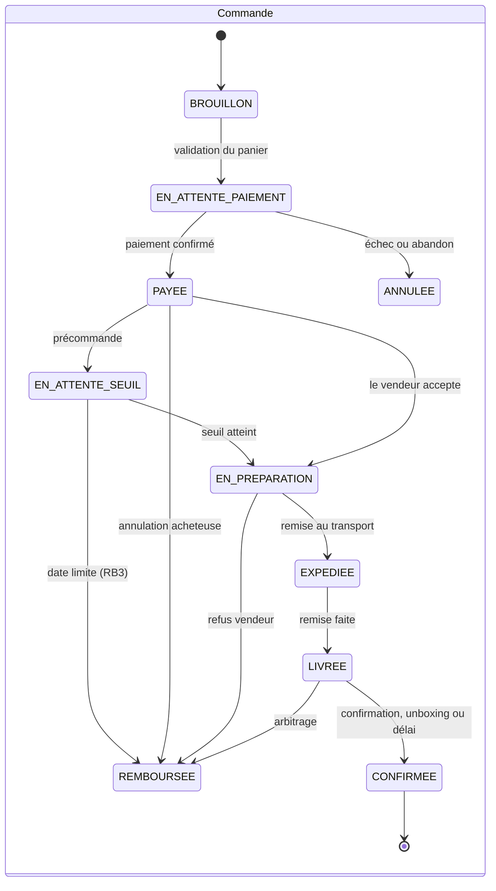

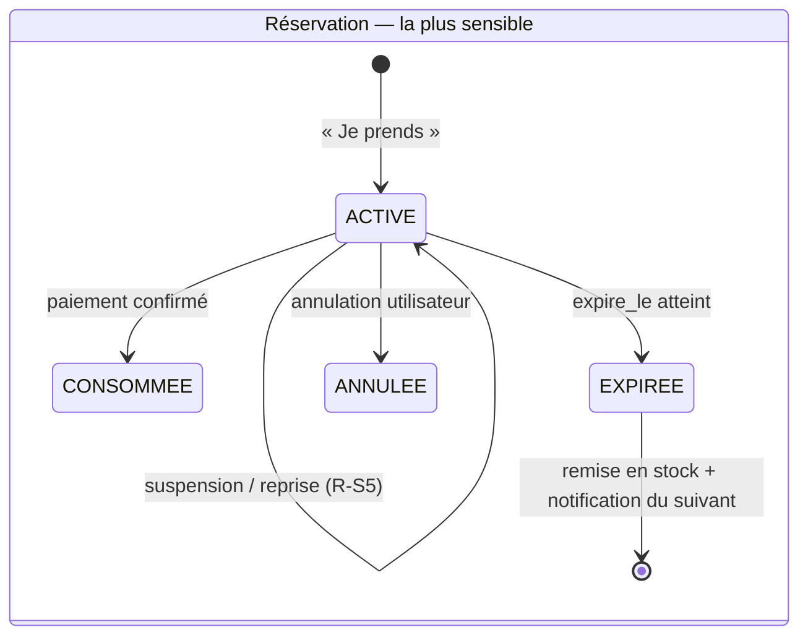

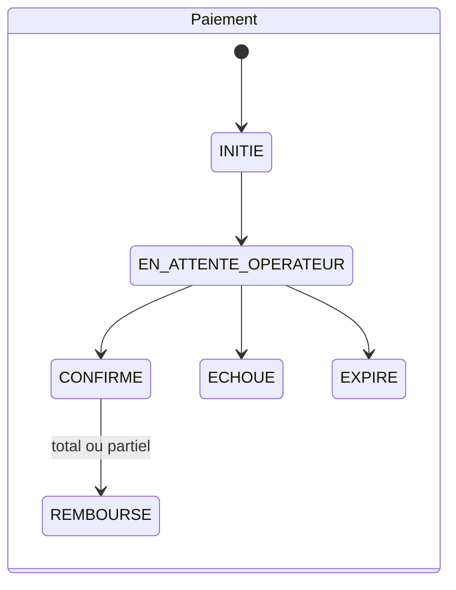

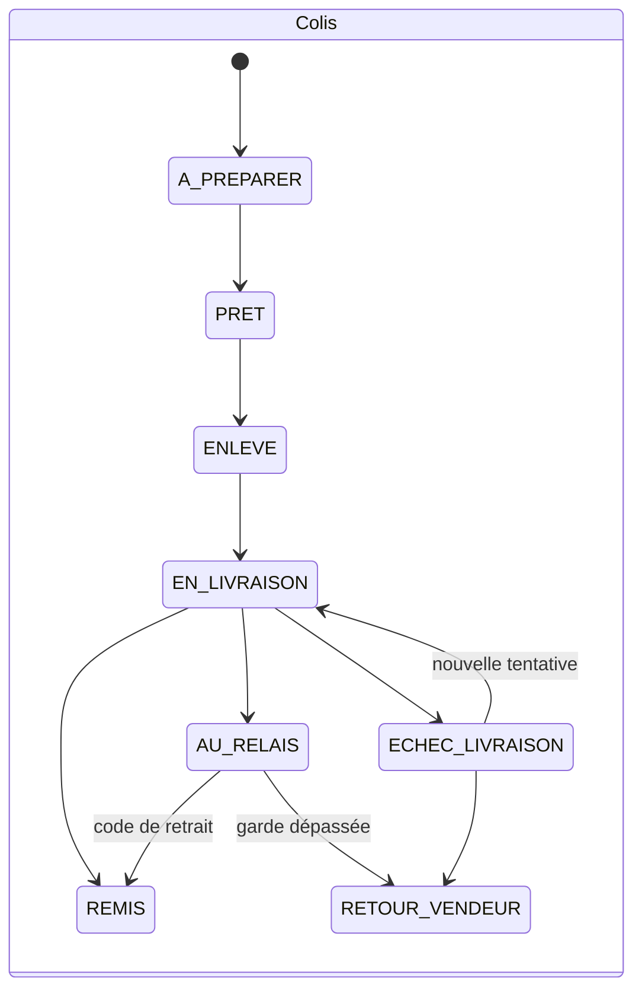

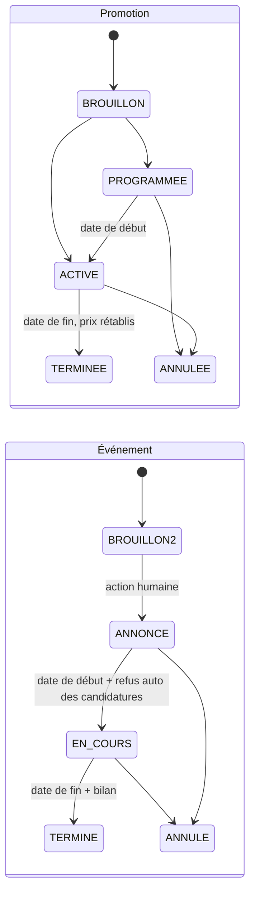

---

# 12. Ordre des migrations

L'ordre suit les dépendances de clés étrangères. Chaque migration est nommée `<horodatage>_<fxx_y>_<intitule>`, réversible, jouée automatiquement au déploiement.

| # | Migration | Contenu | Bloque |
|---|---|---|---|
| 1 | `socle` | extensions (`pg_trgm`, `earthdistance`), rôles, `REVOKE` sur les journaux | tout |
| 2 | `f0_1_auth_email_otp` | `utilisateur`, `code_otp`, `session` | tout |
| 3 | `f0_13_identite_externe` | `identite_externe` | — |
| 4 | `f0_4_profils` | `profil_acheteur`, `profil_vendeur`, `profil_createur`, `membre_equipe` | catalogue |
| 5 | `f0_6_verification` | `document_identite`, `demande_verification` | encaissement |
| 5b | **`univers`** | `univers` — 5 lignes, 2 ouvertes ✅ **appliquée** | **articles, commande, litige** |
| 6 | `f1_4_categories` | `categorie` | articles |
| 7 | `f1_1_article_variante` | `article` *(+ `univers_cle` immuable, `attributs jsonb`, `peremption_le` générée)*, `variante`, `mouvement_stock` | **stock** |
| 8 | `f1_10_reservation` | `reservation` + les deux `CHECK` + index partiel | **RB1** |
| 9 | `f3_3_livraison_zones` | `adresse`, `zone_livraison`, `tarif_livraison`, `point_relais` | frais |
| 10 | `f3_7_commande` | `commande` *(+ `univers_cle`, `taux_commission_pour_mille` figés)*, `ligne_commande` | paiement |
| 11 | `f4_1_paiement` | `paiement` + `cle_idempotence` | **RB10** |
| 12 | `f4_4_sequestre` | `sequestre`, `ecriture_financiere`, `portefeuille`, `retrait` | **RB2** |
| 13 | `f4_11_facture` | `facture`, séquence de numérotation | — |
| 14 | `f5_2_colis` | `colis`, `evenement_livraison` | livraison |
| 15 | `f5_5_tournee` | `livreur`, `tournee`, `tournee_point`, `collecte_especes` | app terrain |
| 16 | `f7_1_abonnement` | `abonnement` + déclencheurs de compteur | fil, promos |
| 17 | `f7_26_remise_ligne` | `remise_ligne`, `promotion_id` scalaire + `CHECK` | **R-U7** |
| 18 | `f7_22_promotion` | `promotion`, `promotion_article`, `promotion_beneficiaire` | promos |
| 19 | `f7_23_notifications` | `notification`, `notification_compteur`, `preference_notification` | plafonds |
| 20 | `f10_1_bareme` | `bareme_commission` historisé | commission |
| 21 | `f6_3_litige` | `litige` *(+ `univers_cle`, `prioritaire`)*, `message_litige` + `CHECK decision_motivee` | **RB4** |
| 22 | `f19_1_moderation` | `signalement`, `sanction`, `blocage`, `mot_bloque_personnel` | modération |
| 23 | `f14_5_contenu` | `contenu`, `contenu_article` + **déclencheur différé** | **RB5** |
| 24 | `f2_3_direct` | `direct`, `direct_article`, `message_direct`, `direct_bilan` | direct |
| 25 | `f15_4_affiliation` | `selection`, `clic_affiliation` | créatrices |
| 26 | `f15_8_precommande` | `precommande`, `precommande_engagement` | **RB3** |
| 27 | `f16_1_cadeau` | `panier_cadeau` | diaspora |
| 28 | `f7_18_rang_client` | **`vente_confirmee_journal`** + `rang_client` | fidélité |
| 29 | `f7_6_paliers` | `palier_fidelite`, `note_client` | promos VIP |
| 30 | `f20_1_evenement` | `evenement`, `evenement_participation`, **`evenement_element`** | événements |
| 31 | `f11_7_mesures` | `evenement_usage`, `agregat_quotidien` | pilote |
| 32 | `f11_6_parametres` | `parametre`, `parametre_modification`, `journal_audit` | tout réglage |

**Trois migrations doivent être jouées en phase 1 même si la fonctionnalité est en phase 2** *(voir `JP_BACKLOG.md`, périmètre)* :

- **n° 28**, `vente_confirmee_journal` — sinon l'historique du rang client est perdu *(R-R11)* ;
- **n° 17 et 18**, la table des promotions et la règle de cumul — une remise rétro-appliquée à des factures émises est ingérable *(R-U7)* ;
- **n° 30**, `evenement_element` — un simple champ qui évite une migration lourde le jour où l'événement de Noël sera décidé trois semaines avant Noël.

---

# 13. Ce que la base garantit toute seule

Les huit garanties structurelles, indépendantes du code applicatif. Ce sont elles qu'un test de recette doit vérifier en écrivant directement en base.

| # | Garantie | Mécanisme |
|---|---|---|
| 1 | Pas de survente | `CHECK (quantite_reservee <= quantite_stock)` |
| 2 | Pas de réservation négative | `CHECK (quantite_reservee >= 0)` |
| 3 | Journal financier inaltérable | `REVOKE UPDATE, DELETE` |
| 4 | Journal d'audit inaltérable | `REVOKE UPDATE, DELETE` |
| 5 | Pas de cumul de remises | `promotion_id` **scalaire** |
| 6 | Pas de remise supérieure au prix | `CHECK (remise_ligne <= prix_unitaire * quantite)` |
| 7 | Pas de litige clos sans décision motivée | `CHECK decision_motivee` |
| 8 | Pas de contenu publié sans article | **déclencheur de contrainte différé** |
| 9 | Pas d'unboxing sans commande source | `CHECK (type <> 'unboxing' OR commande_source_id IS NOT NULL)` |
| 10 | Pas de publication vidéo par un mineur | `CHECK (type NOT IN (...) OR auteur_majeur)` |
| 11 | Pas de rang client global | **absence** d'index et de vue inter-vendeurs |
| 12 | Pas de double usage d'un code personnel | `UNIQUE(code_personnel)` + contrôle transactionnel |
| 13 | **Pas de changement d'univers après coup** | **déclencheur** sur `article.univers_cle` *(R-Y1)* |
| 14 | **Pas de commission rétroactive** | `commande.taux_commission_pour_mille` **figé** à la création *(R-Y3)* |
| 15 | **Pas de cosmétique périmé vendu** | colonne générée `peremption_le` + index partiel, vérifié à la publication **et** à l'achat *(R-Y13)* |

**La ligne 11 est la seule garantie « par absence »**, et c'est la plus fragile : elle demande d'être documentée dans la migration, sinon quelqu'un ajoutera l'index « pour optimiser ».

---

*Cas d'utilisation : `JP_CAS_UTILISATION.md` · Conception de l'application : `JP_CONCEPTION_APP.md` · Détail colonne par colonne : `JP_CDC_TECHNIQUE.md` §3 · Plans de réalisation : `plan/`.*
