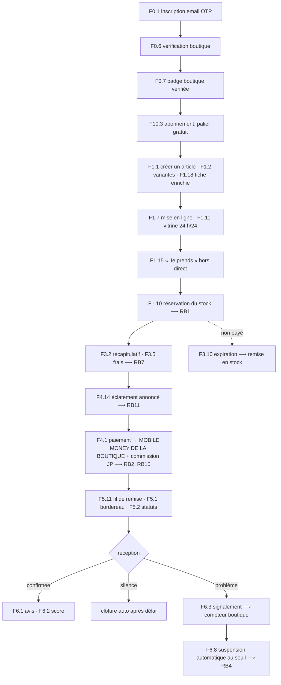

# TRANCHE 1 — la première vente réelle

> **La cible.** Une boutique s'inscrit, se fait vérifier, publie un article. Une acheteuse le trouve, l'achète — **un débit, une confirmation**, et l'argent va **directement sur le mobile money de la boutique** *(`DP-16`)*. Elles conviennent d'un point de remise, le colis arrive, l'acheteuse confirme la réception et **laisse un avis qui compte**. Et si ça se passe mal, elle signale — **le signalement pèse sur la note publique de la boutique, et la suspend au-delà d'un seuil**.
>
> Tout le reste attend.

---

## Pourquoi une tranche, et pas la phase 1

La phase 1 du backlog, c'est **841 issues**. Réalisée d'un bloc, elle représente huit à douze mois avant qu'un seul ariary change de main. C'est le mode d'échec le plus courant et le plus coûteux : on découvre en une fois, très tard, que le paiement mobile money ne se comporte pas comme prévu, que les points relais ne suivent pas le protocole, et que la promesse de séquestre est plus difficile à tenir qu'à écrire.

La tranche 1 est le **plus court chemin où de l'argent réel circule**. Elle fait **73 fonctionnalités**, environ **350 issues** — le tiers de la phase 1.

Ce qu'elle prouve, et qu'aucune maquette ne prouvera :

| Critère | Ce que la tranche 1 met à l'épreuve |
|---|---|
| **RB1** | Aucune survente — deux acheteuses sur la dernière pièce, en conditions réelles |
| **RB2** | **Chaque crédit atteint le bon compte, aucun ne reste en souffrance** — boutique, commission JP, créatrice *(`DP-16`, `R-M4`, `R-M5`, `R-M7`)* |
| **RB4** | 100 % des **sanctions automatiques** sont écrites, motivées et notifiées aux deux parties *(`R-T2`)* |
| **RB7** | Aucun frais découvert après l'engagement |
| **RB10** | Paiement interrompu : ni double prélèvement, ni commande perdue |
| **RB11** | **Le nombre de confirmations est annoncé avant l'écran de paiement** *(`R-M6`)*, et il vaut 1 en éclatement atomique *(`R-M10`)* |
| **RB12** | **Aucun écran ne laisse croire que JP garde l'argent ou rembourse** *(`R-E1`, `R-E5`)* |

Cinq des dix critères bloquants, et **les cinq plus difficiles**. Les cinq autres relèvent du contenu, du direct et du cadeau — qui ne sont pas dans cette tranche.

---

## Les cinq décisions de périmètre

Elles sont assumées et documentées ici pour qu'on ne les redécouvre pas en cours de route.

**1. Remise convenue de gré à gré, pas de logistique JP.** *(`DP-04`)* La boutique fait parvenir le colis par le moyen de son choix ; JP fournit la frise de statuts et le fil de remise *(`F5.11`)*. **Ce n'est plus une décision de périmètre, c'est le produit.**

**2. Achat immédiat, pas de panier.** « Je prends » depuis la fiche article suffit à faire circuler de l'argent. Le panier multi-boutiques *(F3.1)* attend — **et il attend d'autant plus volontiers qu'il multiplie les crédits à éclater** *(`DP-16`)*.

**3. Pas de direct.** C'est le différenciateur du produit, et le morceau technique le plus dur. Il ne prouve rien que la vente hors direct ne prouve déjà sur le plan de l'argent.

**4. Mobile money seulement.** Ni carte bancaire *(F4.2)*. *(Le paiement à la livraison `F4.3` n'est plus une option de périmètre : il est supprimé — `DP-04`.)*

**5. 🔴 Les avis et le score entrent dans la tranche, ils n'en sortent plus.** L'ancienne rédaction les écartait : *« `F6.1` et `F6.2` sont déjà en P2, ils n'ont d'ailleurs aucune matière au premier mois »*. **C'est devenu impossible** *(`DP-07`)* : il n'y a plus de séquestre, plus d'arbitre, plus de preuve de remise. **Les avis, le score et la suspension automatique sont désormais la seule protection de l'acheteuse.** Lancer sans eux, c'est lancer sans protection du tout.

> ### Ce que la tranche 1 doit assumer explicitement
>
> Elle met de l'argent réel en circulation **sans aucun filet** : JP ne garde
> rien, n'arbitre rien, ne rembourse rien. **Le seul rempart est la vérification
> d'identité en amont et la réputation en aval.**
>
> C'est défendable — le point de comparaison est le direct Facebook, où
> l'acheteuse envoie de l'argent à un numéro inconnu — **mais cela doit être dit
> aux dix premières boutiques et aux cinquante premières acheteuses**, pas
> découvert par elles.

Ce qui **n'est pas** négociable et reste dans la tranche : la vérification de la boutique, **l'éclatement du paiement** *(`F4.14`)*, le signalement, **les avis et le score** *(`F6.1`, `F6.2`)*, la **suspension automatique** *(`F6.8`)*, et **l'abonnement** *(`F10.3`)* — sans lui, JP n'a aucun revenu.

---

## Le parcours, de bout en bout

---

## Les 73 fonctionnalités

### Identité et confiance — 7

| ID | Fonctionnalité | Prio |
|---|---|---|
| F0.1 | Inscription et connexion par email + code OTP | M |
| F0.2 | Connexion, session longue, multi-appareil | M |
| F0.6 | Vérification boutique — CIN ou NIF/STAT, selfie, mobile money, adresse | M |
| F0.7 | Badge « boutique vérifiée » affiché partout | M |
| F0.10 | Consultation en invité, sans compte | S |
| F0.14 | Renvoi de code, limitation de débit, anti-énumération | M |
| F0.16 | Téléphone en contact de livraison, vérifié à la première commande | S |

### Catalogue et stock — 9

| ID | Fonctionnalité | Prio |
|---|---|---|
| F1.1 | Créer un article (photos, nom, prix, description) | M |
| F1.2 | Variantes taille / couleur, stock par variante | M |
| F1.6 | Gestion de stock : entrée, sortie, alerte de rupture | M |
| F1.7 | États d'un article : brouillon, en ligne, masqué, épuisé | M |
| F1.10 | **Réservation temporaire du stock** — le cœur de RB1 | M |
| F1.11 | Vitrine publique de la boutique, ouverte 24 h/24 | M |
| F1.15 | **Achat immédiat depuis la fiche article, hors direct** | M |
| F1.18 | Fiche enrichie : état, mesures réelles, photos multiples | M |
| F1.19 | Vitrine « catalogue d'abord » | M |

### Commande — 8

| ID | Fonctionnalité | Prio |
|---|---|---|
| F3.2 | Récapitulatif : sous-total, livraison, remise, total | M |
| F3.3 | Carnet d'adresses de livraison | M |
| F3.5 | Calcul des frais de livraison par zone | M |
| F3.7 | Création de commande et numéro de commande | M |
| F3.8 | Annulation par l'acheteuse avant expédition | S |
| F3.9 | Annulation / refus par la boutique | S |
| F3.10 | **Expiration de réservation → remise en stock automatique** | M |
| F3.14 | **Commande hors direct — parcours complet** | M |

### Paiement et argent — 9

| ID | Fonctionnalité | Prio |
|---|---|---|
| F4.1 | Paiement MVola / Orange Money / Airtel Money ⚠️ | M |
| **F4.14** | **Éclatement du paiement** *(`DP-16`)* — RB2, RB11 | M |
| **F10.1** | ♻️ **Commission créditée par l'éclatement** *(`DP-15`)* | M |
| **F10.2** | ♻️ **Barème historisé, figé à la commande** | M |
| F4.10 | **Reprise après échec, et rejeu des pattes secondaires** — RB10 | M |
| F4.11 | Facture PDF horodatée, des deux côtés | M |
| F4.13 | Historique de tous les mouvements | S |

### Livraison — 6

| ID | Fonctionnalité | Prio |
|---|---|---|
| F5.1 | Bordereau de préparation / étiquette colis | M |
| F5.2 | Statuts de livraison partagés des deux côtés | M |
| **F5.11** | 🆕 **Fil de remise, point convenu** *(`DP-10`)* | M |
| F5.9 | Estimation du délai affichée avant l'achat | S |

### Litige — 4

| ID | Fonctionnalité | Prio |
|---|---|---|
| F6.3 | Signalement d'un problème sur une commande | M |
| F6.4 | Fil de discussion avec pièces jointes (photos) | M |
| F6.6 | Historique et preuves consultables **des deux côtés** | M |
| **F6.1** | **Avis vérifiés** — *entrée dans la tranche, `DP-07`* | M |
| **F6.2** | **Score de confiance public** — *entrée dans la tranche, `DP-07`* | M |
| **F6.8** | **Sanctions automatiques, suspension au seuil** — RB4 | M |
| **F10.3** | **Abonnement boutique, palier gratuit** *(`DP-08`)* — *sans lui, aucun revenu* | M |

### Tableau de bord interne — 1

**Sept fonctionnalités de back-office ont disparu** *(`DP-05`)* : vérification, arbitrage, relais, réconciliation espèces, paramètres, recherche, journal d'audit *(la table reste, l'écran non)*. Il n'y a plus d'agent JP.

| ID | Fonctionnalité | Prio |
|---|---|---|
| F11.7 | Tableau de bord des 4 indicateurs du pilote | M |

### Les univers — 8

**Ajouté le 20/08/2026.** JP ouvre avec **deux univers** : `JP Mode` et
`JP Beauté`. Ils partagent la même logistique — **la boutique livre, JP suit** *(`DP-04`)* — et
souvent la même boutique. Un seul modèle de livraison à roder, deux marchés
validés.

| ID | Fonctionnalité | Prio |
|---|---|---|
| F21.1 | **Sélecteur d'univers**, univers mémorisé | M |
| F21.2 | **Règles par univers** — champs de fiche, motifs de signalement *(plus de commission — `DP-08`)* | M |
| F21.3 | **Fiche article adaptée à l'univers** | M |
| F21.4 | **Motifs de litige filtrés par univers** | M |
| F21.5 | **Commission par univers** | M |
| F21.6 | Un lien profond impose son univers | S |
| F21.10 | Boutique multi-univers | S |
| F21.12 | Signature à la première visite | C |

### Ce que JP Beauté ajoute — 7

| ID | Fonctionnalité | Prio |
|---|---|---|
| F1.21 | **Fiche beauté** : péremption, contenance, scellé | M |
| F1.22 | **Refus de publication et d'achat d'un produit périmé** | M |
| F1.23 | Déclaration de provenance | S |
| F6.11 | **Litige « réaction cutanée »**, traité en priorité | S |
| F6.12 | **Pas de retour sur un cosmétique entamé**, sauf défaut | M |
| F6.13 | Signalement de contrefaçon | S |
| F21.11 | **Ventilation des 4 indicateurs du pilote par univers** | S |

**Pourquoi ces sept sont dans la tranche 1 et pas plus tard.** Un cosmétique
périmé ou contrefait ne déçoit pas : **il blesse**. Ouvrir `JP Beauté` sans le
contrôle de péremption et sans le litige « réaction cutanée » serait lancer un
univers en sachant qu'il peut faire du mal.

### Socle non fonctionnel — 7

| ID | Fonctionnalité | Prio |
|---|---|---|
| F13.1 | Fonctionnement sur Android bas de gamme, APK léger | M |
| F13.2 | Tolérance aux connexions lentes et intermittentes | M |
| F13.3 | Notifications push + repli SMS pour les messages critiques | M |
| F13.4 | Interface bilingue malgache / français, montants en Ariary | M |
| F13.6 | Sécurité : chiffrement des pièces d'identité, accès tracés | M |
| F13.8 | Journalisation complète des transactions (preuve en litige) | M |
| F13.9 | Mesure d'usage et entonnoirs, dès le premier jour | M |

---

## Les deux décisions à trancher avant de coder

Elles bloquent la tranche 1, pas une fonctionnalité lointaine.

**🔴 Les montants et quotas des paliers d'abonnement** *(`PO-6`)*. Il n'y a plus de taux de commission à trancher *(`DP-08`)* — mais **sans palier arrêté, JP n'a aucun revenu et les inscriptions boutique ne peuvent pas ouvrir.** C'est devenu la décision économique la plus urgente. Ancienne rédaction : `F11.6` les rend paramétrables, ce qui n'exonère pas de fixer la valeur de départ : elle apparaît dans le récapitulatif d'achat *(RB7)* et dans la première facture. Une facture émise ne se corrige pas.

**La durée de réservation hors direct** *(`F1.10`, décision ouverte du backlog)*. Trop courte, l'acheteuse perd son article pendant qu'elle cherche son téléphone mobile money. Trop longue, le stock se bloque. Hypothèse de travail : **30 minutes**, à confronter au temps réel d'un paiement MVola au premier essai.

**🔴 Le seuil de signalements qui suspend une boutique** *(`PO-12`)*. **C'est la seule sanction du produit** depuis `DP-07`. Trop bas, une boutique honnête est coupée par deux clientes mécontentes ; trop haut, la protection est décorative.

**🔴 L'opérateur sait-il éclater un encaissement vers plusieurs bénéficiaires, en une opération et un seul code ?** *(`PO-11`)* **C'est la question la plus importante du projet.** Si non, il faut le repli en N requêtes *(`R-M4` à `R-M7`)* ; si aucun bénéficiaire tiers n'est possible, **l'argent doit transiter par JP et le risque juridique revient**.

**🔴 Le taux de commission** *(`DP-15`)*. Il redevient la décision économique n° 1 — *à partir de quel taux la boutique cherche-t-elle à contourner ?* Réglé côté Admin *(`F11.6`)*, mais il faut une valeur de départ.

Une autre décision du backlog — le cumul des remises `R-U7` — **ne bloquent pas la tranche 1** : ni les promotions ni le statut particulier n'en font partie. Elles reviendront pour la tranche 3.

---

## Le critère de sortie

La tranche 1 est terminée non pas quand les 280 issues sont fermées, mais quand :

1. **Dix vraies boutiques** ont été vérifiées et ont publié un catalogue.
2. **Cinquante vraies commandes** sont allées jusqu'à la confirmation de réception, **et l'argent est arrivé sur le bon compte à chaque fois** *(`RB2`)*.
3. **Zéro écart** entre le journal de traçabilité et les relevés mobile money des boutiques.
4. Au moins **un signalement** est allé de bout en bout : dépôt, réponse de la boutique, accord, décrémentation du compteur. **Et au moins une suspension automatique** a été déclenchée, écrite et motivée *(`RB4`)*.
5. **Au moins une boutique a payé son abonnement** *(`F10.3`)*. Sans cela, le modèle économique n'est pas prouvé.
6. Les quatre indicateurs du pilote *(F11.7)* sont mesurés, pas estimés.

Tant que le point 3 n'est pas atteint, rien d'autre ne commence. Un écart de réconciliation n'est pas un défaut d'affichage : c'est de l'argent qui n'est pas là où on croit.

---

## Ce qui vient ensuite

| Tranche | Contenu | Ce qu'elle ajoute |
|---|---|---|
| **2** | Le direct — épique 2, `F3.x` en session, notifications d'ouverture | Le différenciateur, sur une base financière éprouvée |
| **3** | Panier, promotions, abonnements, fidélisation — épiques 3 et 7 | La récurrence d'achat |
| **4** | Contenu et fil social, créatrices — épiques 14 et 15 | L'acquisition |
| **5** | Carte bancaire, panier multi-boutiques | L'élargissement de la couverture |
| **6** | Événements, cadeau et diaspora, gamification — épiques 20, 16, 17 | La saisonnalité et le hors-frontières |

Les issues restent toutes créées et étiquetées : la tranche 1 est un **filtre de board**, pas une amputation du plan.
