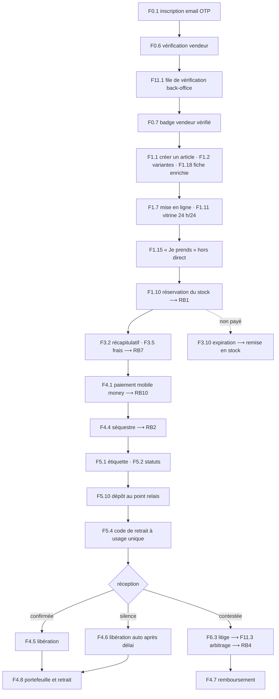

# TRANCHE 1 — la première vente réelle

> **La cible.** Une vendeuse s'inscrit, se fait vérifier, publie un article. Une acheteuse le trouve, l'achète, paie en mobile money. **JP garde l'argent.** Le colis part au point relais, l'acheteuse le retire, confirme la réception. **Les fonds sont libérés, la commission prélevée, la vendeuse retire son argent.** Et si ça se passe mal, elle ouvre un litige et JP tranche.
>
> Tout le reste attend.

---

## Pourquoi une tranche, et pas la phase 1

La phase 1 du backlog, c'est **841 issues**. Réalisée d'un bloc, elle représente huit à douze mois avant qu'un seul ariary change de main. C'est le mode d'échec le plus courant et le plus coûteux : on découvre en une fois, très tard, que le paiement mobile money ne se comporte pas comme prévu, que les points relais ne suivent pas le protocole, et que la promesse de séquestre est plus difficile à tenir qu'à écrire.

La tranche 1 est le **plus court chemin où de l'argent réel circule**. Elle fait **73 fonctionnalités**, environ **350 issues** — le tiers de la phase 1.

Ce qu'elle prouve, et qu'aucune maquette ne prouvera :

| Critère | Ce que la tranche 1 met à l'épreuve |
|---|---|
| **RB1** | Aucune survente — deux acheteuses sur la dernière pièce, en conditions réelles |
| **RB2** | Fonds séquestrés et libérés correctement, dans les quatre chemins de sortie |
| **RB4** | 100 % des litiges reçoivent une décision motivée dans le délai |
| **RB7** | Aucun frais découvert après l'engagement |
| **RB10** | Paiement interrompu : ni double prélèvement, ni commande perdue |

Cinq des dix critères bloquants, et **les cinq plus difficiles**. Les cinq autres relèvent du contenu, du direct et du cadeau — qui ne sont pas dans cette tranche.

---

## Les cinq décisions de périmètre

Elles sont assumées et documentées ici pour qu'on ne les redécouvre pas en cours de route.

**1. Point relais uniquement, pas de livraison à domicile.** La livraison à domicile suppose une flotte de livreurs — un problème d'exploitation, pas de logiciel. Le relais permet de lancer sans recruter. `F3.4` *(choix domicile / relais)* et `F5.5` *(application livreur)* sortent de la tranche.

**2. Achat immédiat, pas de panier.** « Je prends » depuis la fiche article suffit à faire circuler de l'argent. Le panier multi-vendeurs *(F3.1)* impose le fractionnement de commande, de paiement et de livraison entre plusieurs vendeurs : c'est un multiplicateur de complexité sur toute la chaîne, pour un gain nul au moment de valider le modèle.

**3. Pas de direct.** C'est le différenciateur du produit, et c'est aussi le morceau technique le plus dur. Il ne prouve rien tant que le paiement et le séquestre ne sont pas fiables — il ne ferait qu'ajouter du bruit au diagnostic. Le direct est la **tranche 2**.

**4. Mobile money seulement.** Ni carte bancaire *(F4.2)*, ni paiement à la livraison *(F4.3)*. Le paiement à la livraison contourne entièrement le séquestre : c'est un second parcours financier complet, pas une option de paiement. Il mérite sa propre tranche.

**5. Pas d'avis, pas de score de confiance.** `F6.1` et `F6.2` sont déjà en P2 dans le backlog. Ils n'ont d'ailleurs aucune matière tant qu'il n'y a pas d'historique.

Ce qui **n'est pas** négociable et reste dans la tranche : la vérification vendeur, le séquestre complet, le litige avec arbitrage, le journal d'audit, la facture. Ce sont les fondations de la promesse ; les enlever, c'est lancer un autre produit.

---

## Le parcours, de bout en bout

---

## Les 73 fonctionnalités

### Identité et confiance — 7

| ID | Fonctionnalité | Prio |
|---|---|---|
| F0.1 | Inscription et connexion par email + code OTP | M |
| F0.2 | Connexion, session longue, multi-appareil | M |
| F0.6 | Vérification vendeur — CIN ou NIF/STAT, selfie, mobile money, adresse | M |
| F0.7 | Badge « vendeur vérifié » affiché partout | M |
| F0.10 | Consultation en invité, sans compte | S |
| F0.14 | Renvoi de code, limitation de débit, anti-énumération | M |
| F0.16 | Téléphone en contact de livraison, vérifié à la première commande | S |

### Catalogue et stock — 9

| ID | Fonctionnalité | Prio |
|---|---|---|
| F1.1 | Créer un article (photos, nom, prix, description) | M |
| F1.2 | Variantes taille / couleur, stock par variante | M |
| F1.6 | Gestion de stock : entrée, sortie, alerte de rupture | M |
| F1.7 | États d'un article : brouillon, en ligne, masqué, épuisé | M |
| F1.10 | **Réservation temporaire du stock** — le cœur de RB1 | M |
| F1.11 | Vitrine publique du vendeur, ouverte 24 h/24 | M |
| F1.15 | **Achat immédiat depuis la fiche article, hors direct** | M |
| F1.18 | Fiche enrichie : état, mesures réelles, photos multiples | M |
| F1.19 | Vitrine « catalogue d'abord » | M |

### Commande — 8

| ID | Fonctionnalité | Prio |
|---|---|---|
| F3.2 | Récapitulatif : sous-total, livraison, remise, total | M |
| F3.3 | Carnet d'adresses de livraison | M |
| F3.5 | Calcul des frais de livraison par zone | M |
| F3.7 | Création de commande et numéro de commande | M |
| F3.8 | Annulation par l'acheteuse avant expédition | S |
| F3.9 | Annulation / refus par le vendeur | S |
| F3.10 | **Expiration de réservation → remise en stock automatique** | M |
| F3.14 | **Commande hors direct — parcours complet** | M |

### Paiement et argent — 9

| ID | Fonctionnalité | Prio |
|---|---|---|
| F4.1 | Paiement MVola / Orange Money / Airtel Money ⚠️ | M |
| F4.4 | **Séquestre : les fonds sont retenus par JP** | M |
| F4.5 | Libération à la confirmation de réception | M |
| F4.6 | Libération automatique après délai sans contestation | M |
| F4.7 | Remboursement total ou partiel | M |
| F4.8 | Portefeuille vendeur et retrait vers mobile money | M |
| F4.10 | **Reprise après échec de paiement** — RB10 | M |
| F4.11 | Facture PDF horodatée, des deux côtés | M |
| F4.13 | Historique de tous les mouvements | S |

### Livraison — 6

| ID | Fonctionnalité | Prio |
|---|---|---|
| F5.1 | Bordereau de préparation / étiquette colis | M |
| F5.2 | Statuts de livraison partagés des deux côtés | M |
| F5.3 | Réseau de points relais : carte, horaires, fiche | M |
| F5.4 | Code de retrait à usage unique | M |
| F5.9 | Estimation du délai affichée avant l'achat | S |
| F5.10 | Application point relais : réception, stock, remise | M |

### Litige — 4

| ID | Fonctionnalité | Prio |
|---|---|---|
| F6.3 | Signalement d'un litige sur une commande | M |
| F6.4 | Fil de litige avec pièces jointes (photos) | M |
| F6.5 | **Arbitrage par l'équipe JP, décision tracée** — RB4 | M |
| F6.6 | Historique complet consultable des deux côtés | M |

### Back-office — 8

Sans lui, personne ne peut vérifier un vendeur ni arbitrer un litige. Il n'est pas optionnel.

| ID | Fonctionnalité | Prio |
|---|---|---|
| F11.1 | File de vérification des vendeurs | M |
| F11.3 | Console d'arbitrage des litiges | M |
| F11.4 | Gestion du réseau de points relais | M |
| F11.5 | Réconciliation des paiements | M |
| F11.6 | Paramètres : commissions, frais, durée de réservation, délais | M |
| F11.7 | Tableau de bord des 4 indicateurs du pilote | M |
| F11.8 | Recherche d'un utilisateur, d'une commande, d'un paiement | M |
| F11.9 | Journal d'audit de toutes les actions du back-office | S |

### Les univers — 8

**Ajouté le 20/08/2026.** JP ouvre avec **deux univers** : `JP Mode` et
`JP Beauté`. Ils partagent la même logistique — léger, point relais — et
souvent la même vendeuse. Un seul modèle de livraison à roder, deux marchés
validés.

| ID | Fonctionnalité | Prio |
|---|---|---|
| F21.1 | **Sélecteur d'univers**, univers mémorisé | M |
| F21.2 | **Règles par univers** — commission, livraison, fiche, litige | M |
| F21.3 | **Fiche article adaptée à l'univers** | M |
| F21.4 | **Motifs de litige filtrés par univers** | M |
| F21.5 | **Commission par univers** | M |
| F21.6 | Un lien profond impose son univers | S |
| F21.10 | Boutique multi-univers | S |
| F21.12 | Signature à la première visite | C |

### Ce que JP Beauté ajoute — 7

| ID | Fonctionnalité | Prio |
|---|---|---|
| F1.21 | **Fiche beauté** : péremption, contenance, scellé | M |
| F1.22 | **Refus de publication et d'achat d'un produit périmé** | M |
| F1.23 | Déclaration de provenance | S |
| F6.11 | **Litige « réaction cutanée »**, traité en priorité | S |
| F6.12 | **Pas de retour sur un cosmétique entamé**, sauf défaut | M |
| F6.13 | Signalement de contrefaçon | S |
| F21.11 | **Ventilation des 4 indicateurs du pilote par univers** | S |

**Pourquoi ces sept sont dans la tranche 1 et pas plus tard.** Un cosmétique
périmé ou contrefait ne déçoit pas : **il blesse**. Ouvrir `JP Beauté` sans le
contrôle de péremption et sans le litige « réaction cutanée » serait lancer un
univers en sachant qu'il peut faire du mal.

### Socle non fonctionnel — 7

| ID | Fonctionnalité | Prio |
|---|---|---|
| F13.1 | Fonctionnement sur Android bas de gamme, APK léger | M |
| F13.2 | Tolérance aux connexions lentes et intermittentes | M |
| F13.3 | Notifications push + repli SMS pour les messages critiques | M |
| F13.4 | Interface bilingue malgache / français, montants en Ariary | M |
| F13.6 | Sécurité : chiffrement des pièces d'identité, accès tracés | M |
| F13.8 | Journalisation complète des transactions (preuve en litige) | M |
| F13.9 | Mesure d'usage et entonnoirs, dès le premier jour | M |

---

## Les deux décisions à trancher avant de coder

Elles bloquent la tranche 1, pas une fonctionnalité lointaine.

**Le taux de commission et les frais.** `F11.6` les rend paramétrables, ce qui n'exonère pas de fixer la valeur de départ : elle apparaît dans le récapitulatif d'achat *(RB7)* et dans la première facture. Une facture émise ne se corrige pas.

**La durée de réservation hors direct** *(`F1.10`, décision ouverte du backlog)*. Trop courte, l'acheteuse perd son article pendant qu'elle cherche son téléphone mobile money. Trop longue, le stock se bloque. Hypothèse de travail : **30 minutes**, à confronter au temps réel d'un paiement MVola au premier essai.

Deux autres décisions du backlog — le cumul des remises `R-U7` et le seuil particulier → professionnel `R-H11` — **ne bloquent pas la tranche 1** : ni les promotions ni le statut particulier n'en font partie. Elles reviendront pour la tranche 3.

---

## Le critère de sortie

La tranche 1 est terminée non pas quand les 280 issues sont fermées, mais quand :

1. **Dix vraies vendeuses** ont été vérifiées et ont publié un catalogue.
2. **Cinquante vraies commandes** sont allées jusqu'à la libération des fonds.
3. **Zéro écart** de réconciliation entre le journal financier et les relevés mobile money.
4. Au moins **un litige** a été arbitré de bout en bout, avec décision motivée dans le délai.
5. Les quatre indicateurs du pilote *(F11.7)* sont mesurés, pas estimés.

Tant que le point 3 n'est pas atteint, rien d'autre ne commence. Un écart de réconciliation n'est pas un défaut d'affichage : c'est de l'argent qui n'est pas là où on croit.

---

## Ce qui vient ensuite

| Tranche | Contenu | Ce qu'elle ajoute |
|---|---|---|
| **2** | Le direct — épique 2, `F3.x` en session, notifications d'ouverture | Le différenciateur, sur une base financière éprouvée |
| **3** | Panier, promotions, abonnements, fidélisation — épiques 3 et 7 | La récurrence d'achat |
| **4** | Contenu et fil social, créatrices — épiques 14 et 15 | L'acquisition |
| **5** | Livraison à domicile, paiement à la livraison, carte bancaire | L'élargissement de la couverture |
| **6** | Événements, cadeau et diaspora, gamification — épiques 20, 16, 17 | La saisonnalité et le hors-frontières |

Les issues restent toutes créées et étiquetées : la tranche 1 est un **filtre de board**, pas une amputation du plan.
