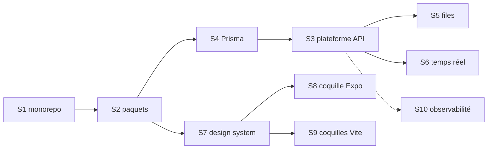

# VAGUE 0 — le socle

> **Rien ne démarre avant.** Les dix éléments `S1` à `S10` de `PLAN_SOCLE §9` sont référencés par les 266 mini-plans et replanifiés nulle part. Ce fichier les découpe en tâches réalisables et leur donne leurs issues.
>
> Amont : `PLAN_SOCLE.md` (pile, arborescence, conventions) · `../docs/JP_CONCEPTION_APP.md` (architecture, modules) · `../docs/JP_CONCEPTION_BDD.md` (ordre des migrations).

**Durée réaliste** : trois à quatre semaines à deux développeurs. C'est le seul moment du projet où l'on construit sans rien livrer de visible. Ne pas l'écourter — chaque raccourci pris ici se paie 266 fois.

**Ordre imposé** : `S1 → S2 → S4 → S3` en série. Ensuite `S5`, `S6`, `S7` en parallèle. Puis `S8`, `S9`. `S10` se greffe en continu.

> **Correction du 18/08/2026.** Ce document plaçait d'abord `S3 → S4`. C'était faux : l'idempotence de `S3` conserve ses clés 24 h **dans une table**, et ses tests ont besoin d'un PostgreSQL réel — c'est-à-dire de `S4`. Écrite avant, elle l'aurait été contre une interface vide, puis réécrite. La base vient donc avant la plateforme.



---

## S1 — Monorepo, TypeScript, intégration continue

### Objectif

Un dépôt où `pnpm install && pnpm build && pnpm test` passe, sur cinq applications et quatre paquets, avec un cache de tâches qui rende le cycle supportable.

### Contenu

- **pnpm workspaces + Turborepo.** `turbo.json` déclare les tâches `build`, `lint`, `test`, `typecheck` et leurs dépendances. Sans cache de tâches, une modification de `packages/contracts` relance tout : à cinq applications, c'est le moment où l'équipe cesse de lancer les tests.
- **TypeScript strict partout.** `strict: true`, `noUncheckedIndexedAccess: true`, `exactOptionalPropertyTypes: true`. Une base de code qui démarre en mode permissif n'y revient jamais.
- **ESLint et Prettier**, une seule configuration à la racine, héritée. Règle non négociable : interdiction d'importer `apps/*` depuis `packages/*`, et interdiction pour un module d'importer le dossier d'un autre module *(PLAN_SOCLE §3)*. Cette règle s'écrit, elle ne se rappelle pas en revue.
- **Intégration continue** GitHub Actions : `typecheck`, `lint`, `test`, `build` sur chaque poussée, avec le cache pnpm et le cache Turborepo.

### Fichiers

```
package.json · pnpm-workspace.yaml · turbo.json
tsconfig.base.json · .eslintrc.cjs · .prettierrc
.github/workflows/ci.yml
```

### Terminé quand

Un poste neuf clone, lance `pnpm install && pnpm turbo test`, et obtient un vert en moins de cinq minutes. Une pull request qui casse le typage est bloquée automatiquement.

```issues
socle: S1
titre: Monorepo, TypeScript strict et intégration continue
taches:
  - "pnpm workspaces + Turborepo : turbo.json, tâches build/lint/test/typecheck, cache"
  - "TypeScript strict à la racine, hérité par les 9 paquets et applications"
  - "ESLint : règle de dépendance entre modules et entre apps/packages, appliquée automatiquement"
  - "GitHub Actions : typecheck, lint, test, build sur chaque poussée, avec cache"
depend: []
```

---

## S2 — `packages/money`, `packages/i18n`, `packages/contracts`

### Objectif

Les trois paquets que tout le reste importe. Écrits en premier parce qu'une erreur ici se propage partout.

### Contenu

**`packages/money`** — l'Ariary en entiers. Aucun flottant, ni en base, ni en transport, ni en calcul *(CDC §6.2)*.

```ts
type Ariary = number & { readonly __ariary: unique symbol };

ariary(n: number): Ariary              // rejette les non-entiers
formater(m: Ariary, langue): string    // « 50 000 Ar »
appliquerPourMille(m: Ariary, taux: number): Ariary   // 25 = 2,5 %
repartir(m: Ariary, parts: number[]): Ariary[]        // somme conservée
```

`appliquerPourMille` arrondit **à l'entier inférieur, en faveur de l'acheteur**, et cet arrondi est testé. `repartir` garantit que la somme des parts égale le montant d'origine — c'est ce qui empêche un ariary de disparaître au partage commission / vendeur.

**`packages/i18n`** — catalogues `mg` et `fr`, pluriels, formats de date et de nombre. Le malgache produit des libellés environ 30 % plus longs que le français : c'est une contrainte de maquette *(PLAN_SOCLE §7)*, pas un détail de traduction.

**`packages/contracts`** — les schémas Zod, source unique du contrat API. Le serveur valide avec, les clients infèrent leurs types depuis. Structure : un fichier par domaine, plus `commun.ts` (pagination par curseur, enveloppe d'erreur, en-têtes).

### Terminé quand

`money` a ses tests de propriété (la somme des parts égale toujours le montant, l'arrondi ne crée jamais d'ariary). Un changement de schéma Zod fait échouer le typage côté mobile — c'est la preuve que le contrat est vraiment partagé.

```issues
socle: S2
titre: Paquets fondamentaux — money, i18n, contracts
taches:
  - "packages/money : type Ariary, formatage, pour-mille, répartition sans perte, tests de propriété"
  - "packages/i18n : catalogues mg/fr, pluriels, formats, contrôle de longueur des libellés"
  - "packages/contracts : structure par domaine, commun.ts (curseur, erreur, en-têtes)"
  - "Vérifier qu'un changement de schéma casse le typage des clients"
depend: [S1]
```

---

## S3 — La plateforme API

### Objectif

Le dossier `apps/api/src/plateforme/`. Tout ce qui est transverse est écrit **une fois** ici et jamais réimplémenté dans un module. C'est l'élément le plus structurant de la vague 0.

### Contenu

| Fichier | Rôle | Règle |
|---|---|---|
| `serveur.ts` | Fastify, greffons, arrêt propre | — |
| `erreurs.ts` | `ErreurMetier` à code stable, enveloppe de réponse, traduction mg/fr | jamais de message générique |
| `auth.ts` | vérification de session, contexte utilisateur, garde de route | `R-C` |
| `permissions.ts` | **deux outils** : garde de route *et* filtre de projection | *(CONCEPTION_APP)* |
| `idempotence.ts` | `Idempotency-Key`, conservation 24 h, rejeu du résultat initial | `R-M2`, **RB10** |
| `pagination.ts` | curseur opaque, jamais de numéro de page | `C2` |
| `debit.ts` | limitation de débit par identité, par adresse, par route | `R-C11` |
| `audit.ts` | écriture dans `journal_audit`, **append only** | `R-O` |
| `contexte.ts` | identifiant de corrélation traversant API, files et WebSocket | — |

**Le piège des permissions.** Une garde de route seule ne suffit pas : elle dit *qui entre*, pas *ce qu'il voit*. Une employée `VE` peut consulter une commande sans voir la marge du vendeur. Il faut donc les deux outils dès le départ, sinon la fuite s'installe dans les premiers modules et se recopie.

**Le piège de l'idempotence.** Si elle n'est pas là avant le premier endpoint d'écriture financière, elle sera ajoutée après coup, par domaine, avec trois comportements différents. **RB10** — « paiement interrompu : ni double prélèvement, ni commande perdue » — se joue ici, pas dans le module paiement.

### Terminé quand

Un endpoint de démonstration montre les huit briques à l'œuvre. Un test rejoue deux fois la même requête avec la même `Idempotency-Key` et obtient exactement la même réponse, sans second effet.

```issues
socle: S3
titre: Plateforme API — le transverse écrit une fois
taches:
  - "Serveur Fastify, greffons, arrêt propre, contexte de corrélation"
  - "Erreurs à code stable, enveloppe de réponse, traduction mg/fr"
  - "Authentification, contexte utilisateur, garde de route"
  - "Permissions : garde de route ET filtre de projection (les deux outils)"
  - "Idempotence : Idempotency-Key, conservation 24 h, rejeu — RB10"
  - "Pagination par curseur et limitation de débit par identité, adresse et route"
  - "Journal d'audit append only"
depend: [S2]
```

---

## S4 — Prisma, base de développement, Testcontainers

### Objectif

Une base PostgreSQL 16 qui se recrée d'une commande, avec les migrations fondatrices et les tests qui tournent sur une **vraie** base.

### Contenu

- **PostgreSQL 16 et Redis 7 en conteneurs**, `docker-compose.yml`, une commande pour repartir de zéro.
- **Les migrations fondatrices** — les étapes 1 à 6 de l'ordre défini dans `../docs/JP_CONCEPTION_BDD.md` : types énumérés, `utilisateur`, `parametre`, `journal_audit`, `ecriture_financiere`. La suite viendra fonctionnalité par fonctionnalité.
- **Les révocations, tout de suite.** `ecriture_financiere` et `journal_audit` sont en ajout seul, imposé par la base :
  ```sql
  REVOKE UPDATE, DELETE ON ecriture_financiere FROM jp_app;
  REVOKE UPDATE, DELETE ON journal_audit       FROM jp_app;
  ```
  Ajouté après coup, on découvre que du code corrigeait des écritures au lieu d'en passer d'inverses.
- **Testcontainers** — les tests d'intégration démarrent un PostgreSQL réel. Un SQLite en mémoire ne reproduit ni `SELECT … FOR UPDATE`, ni les contraintes différées, ni les `CHECK` — c'est-à-dire précisément ce sur quoi reposent **RB1** et **RB5**.
- **Jeu de données de démonstration** reproductible : quelques vendeurs, articles, commandes à chaque état.

### Terminé quand

`pnpm db:reset && pnpm db:seed` reconstruit la base en moins d'une minute. Un test d'intégration passe contre PostgreSQL. Une tentative de `UPDATE` sur `ecriture_financiere` échoue au niveau de la base, pas du code.

```issues
socle: S4
titre: Base de données — Prisma, migrations fondatrices, Testcontainers
taches:
  - "docker-compose PostgreSQL 16 + Redis 7, reconstruction en une commande"
  - "Migrations fondatrices : énumérés, utilisateur, parametre, journal_audit, ecriture_financiere"
  - "REVOKE UPDATE, DELETE sur les tables en ajout seul, avec test de non-régression"
  - "Testcontainers : les tests d'intégration tournent sur un PostgreSQL réel"
  - "Jeu de données de démonstration reproductible"
depend: [S3]
```

---

## S5 — BullMQ, files et reprise sur incident

### Objectif

Le travail asynchrone, avec la garantie qui compte : **un travail rejoué ne produit pas deux fois son effet**.

### Contenu

- Files déclarées : `expiration-reservation`, `notification`, `transcodage`, `reconciliation`, `rang-client`, `promotion-programmee`.
- **Un travailleur de référence** qui montre la convention : idempotence par clé métier, nouvelles tentatives à intervalle croissant, file d'échecs, journalisation corrélée.
- **Le travail le plus critique du projet** est ici : l'expiration de réservation *(F3.10)*. S'il ne tourne pas, le stock se bloque et **RB1** tombe côté disponibilité. Il doit avoir sa métrique et son alerte dès la vague 0.
- Réconciliation au démarrage : après un incident, les travaux perdus sont retrouvés depuis la base, pas depuis Redis. **Redis n'est jamais l'autorité** *(CDC §5.2)*.

### Terminé quand

Un test tue le travailleur au milieu d'un travail, le relance, et vérifie que l'effet ne s'est produit qu'une fois. La file d'échecs est consultable.

```issues
socle: S5
titre: Travail asynchrone — BullMQ, files, idempotence, reprise
taches:
  - "Déclaration des six files et de leur configuration"
  - "Travailleur de référence : idempotence par clé métier, reprises, file d'échecs"
  - "Réconciliation au démarrage depuis la base — Redis n'est jamais l'autorité"
  - "Test de tuerie en cours de travail : l'effet ne se produit qu'une fois"
depend: [S4]
```

---

## S6 — Registre WebSocket, canaux, resynchronisation

### Objectif

Le temps réel du direct, avec la seule propriété qui compte sur un réseau malgache : **une reconnexion ne perd rien**.

### Contenu

- Registre des connexions, authentification à l'ouverture, canaux (`direct:<id>`, `commande:<id>`, `utilisateur:<id>`).
- Diffusion depuis les modules **par événement**, jamais par appel direct au registre.
- **Resynchronisation à la reconnexion** : le client annonce le dernier numéro de séquence reçu, le serveur renvoie le delta. Sans cela, une coupure de dix secondes en plein direct fait disparaître des messages et des annonces de stock — et la vendeuse le voit à l'écran.
- Repli par sondage long quand le WebSocket ne s'établit pas.
- Limitation de débit par connexion.

### Terminé quand

Un test coupe la connexion pendant qu'un message est diffusé, reconnecte, et vérifie que le client rattrape ce qu'il a manqué.

```issues
socle: S6
titre: Temps réel — registre WebSocket, canaux, resynchronisation
taches:
  - "Registre de connexions, authentification à l'ouverture, canaux nommés"
  - "Diffusion par événement depuis les modules, jamais d'appel direct au registre"
  - "Resynchronisation à la reconnexion par numéro de séquence"
  - "Repli par sondage long et limitation de débit par connexion"
depend: [S4]
```

---

## S7 — `packages/ui`, le design system

### Objectif

Les jetons et les primitives partagés, et surtout **les quatre états rendus impossibles à oublier**.

### Contenu

- **Jetons** : couleurs, typographie, espacements, rayons, élévations. Cibles tactiles ≥ 48 dp, contraste ≥ 4,5:1 — vérifiés par un test, pas par une relecture.
- **Les sept primitives partagées** décrites dans `../docs/JP_CONCEPTION_APP.md`, dont `PrixAriary`, `EtatVide`, `BoutonPrincipal` (pleine largeur, ancré en bas), `ImageProgressive` (toujours un substitut basse résolution).
- **`<Etat>`** — le composant qui impose les quatre états : *chargement, vide, erreur, hors ligne*. Un écran qui n'a pas ses quatre états n'est pas fini ; le rendre structurel coûte moins cher que de le rappeler en revue 266 fois.
- **Mode économie de données** — un drapeau lu partout : images dégradées, vidéos non préchargées.

### Terminé quand

Un catalogue de composants montre chaque primitive dans ses quatre états, en `mg` et en `fr`. Un test échoue si un contraste passe sous 4,5:1.

```issues
socle: S7
titre: Design system packages/ui — jetons, primitives, les quatre états
taches:
  - "Jetons : couleurs, typographie, espacements ; tests de contraste et de cible tactile"
  - "Les sept primitives partagées, dont PrixAriary et ImageProgressive"
  - "Composant <Etat> imposant chargement, vide, erreur, hors ligne"
  - "Mode économie de données propagé aux images et aux vidéos"
  - "Catalogue de composants, en mg et en fr"
depend: [S2]
```

---

## S8 — La coquille Expo

### Objectif

L'application mobile qui démarre, s'authentifie, appelle l'API, et **reste utilisable quand le réseau tombe**.

### Contenu

- Navigation : onglets et piles, routes déclarées, liens profonds *(vitrine, article, événement, cadeau)*.
- Session : jeton en stockage sécurisé, rafraîchissement, déconnexion propre, multi-appareil *(F0.2)*.
- **Client API** généré depuis `packages/contracts` : typé de bout en bout, `Idempotency-Key` posé automatiquement sur les écritures, erreurs traduites.
- **Cache et hors ligne** : lecture depuis le cache d'abord, file d'écritures en attente, réconciliation au retour du réseau. Les commandes et le **code de retrait** doivent rester consultables sans réseau *(F13.5)* — c'est ce qui évite qu'une acheteuse reparte du point relais sans son colis.
- Mesure du **poids de l'APK** et de la mémoire au défilement, dès cette étape, en critère d'intégration continue *(C1)*.

### Terminé quand

L'application se lance sur un Android d'entrée de gamme, affiche un écran authentifié, et en mode avion montre les données en cache avec un bandeau explicite au lieu d'une erreur.

```issues
socle: S8
titre: Coquille Expo — navigation, session, client API, hors ligne
taches:
  - "Navigation, onglets et piles, liens profonds"
  - "Session : stockage sécurisé, rafraîchissement, multi-appareil"
  - "Client API typé depuis contracts, Idempotency-Key automatique, erreurs traduites"
  - "Cache, file d'écritures hors ligne, réconciliation au retour du réseau"
  - "Mesure du poids de l'APK et de la mémoire en intégration continue"
depend: [S7]
```

---

## S9 — Les coquilles Vite : `admin` et `web`

### Objectif

Le back-office et les pages publiques, avec la contrainte propre à `web` : **l'aperçu de lien doit fonctionner**.

### Contenu

- **`admin`** — React + Vite, authentification back-office, disposition, navigation, tableau paginé réutilisable, journal d'audit visible. C'est l'outil de l'équipe JP : sans lui, personne ne peut vérifier un vendeur ni arbitrer un litige.
- **`web`** — rendu serveur sur les pages destinées à être partagées : vitrine vendeur, fiche article, page cadeau, page événement. Une vitrine partagée sur Facebook sans titre ni image perd l'essentiel de son intérêt à Madagascar, où le partage passe par là.
- Les deux consomment `packages/ui` et `packages/contracts`.

### Terminé quand

Une URL de vitrine collée dans une conversation affiche un aperçu correct. Le back-office se connecte et affiche une liste paginée réelle.

```issues
socle: S9
titre: Coquilles Vite — back-office admin et pages publiques web
taches:
  - "admin : authentification, disposition, navigation, tableau paginé réutilisable"
  - "web : rendu serveur et métadonnées d'aperçu de lien"
  - "Consommation de packages/ui et packages/contracts par les deux"
depend: [S7]
```

---

## S10 — Observabilité

### Objectif

Savoir ce qui se passe **avant** d'en avoir besoin. Se greffe en continu pendant toute la vague 0.

### Contenu

- Journaux structurés, corrélés de bout en bout : API → file → WebSocket. **L'adresse électronique n'apparaît jamais en clair** *(R-C10)*.
- Métriques techniques : latence par route, taux d'erreur, profondeur des files, âge du travail le plus ancien.
- **Les événements de mesure du CDC §11**, posés dès le premier jour *(F13.9)*. Un entonnoir instrumenté après le lancement du pilote ne dit rien du lancement du pilote.
- Alertes sur les quatre choses qui doivent réveiller quelqu'un : la file d'expiration de réservation est en retard, une écriture financière a échoué, le taux d'erreur de paiement dépasse un seuil, la base est saturée.

### Terminé quand

Un identifiant de corrélation se suit d'une requête mobile jusqu'à l'écriture en base et au travail asynchrone qu'elle a déclenché. Les quatre alertes sont configurées et testées.

```issues
socle: S10
titre: Observabilité — journaux corrélés, métriques, événements de mesure
taches:
  - "Journaux structurés corrélés API / files / WebSocket, sans donnée personnelle en clair"
  - "Métriques : latence, erreurs, profondeur des files, âge du travail le plus ancien"
  - "Les événements de mesure du CDC §11, posés dès le premier jour"
  - "Les quatre alertes qui doivent réveiller quelqu'un, configurées et testées"
depend: [S3]
```

---

## Ce que la vague 0 ne fait pas

Elle ne livre **aucune fonctionnalité visible**. Aucun écran d'inscription, aucun article, aucun paiement. C'est normal et c'est le seul moment du projet où ce sera vrai.

Elle ne crée pas non plus les tables métier au-delà des six fondatrices : chaque fonctionnalité apporte ses migrations, dans l'ordre défini par `../docs/JP_CONCEPTION_BDD.md`.

**La suite** : `TRANCHE1.md`.
